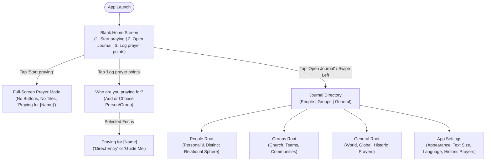
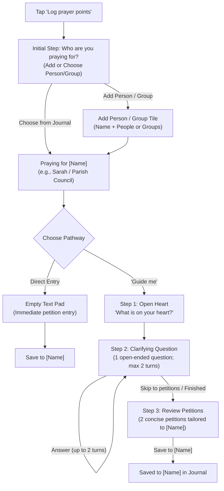

# User Experience (UX) & Product Design Specification

**Document:** `UX.md`  
**Status:** Approved Design Principles & User Journey Map  
**Application Title (Unofficial):** *Pray Without Ceasing* (1 Thessalonians 5:17)  
**Last Updated:** 2026-09-07  
**Target Audience:** Product Owner, Business Stakeholders, Product Designers  
**Platform Focus:** Mobile App (Clean, solemn, distraction-free companion)  

---

## 1. Product Vision & Emotional Tone

The Prayer app is conceived as a quiet, sacred personal vault. Most consumer apps rely on vibrant colors, badges, notifications, and social feeds designed to capture and monetize user attention. In contrast, this app is designed to **give attention back to the user's interior life, personal relationships, and communion with God**.

### 1.1 Core Experience Pillars
- **Radical Simplicity & Blank Entry**: The application opens to a serene, completely uncluttered screen with strictly three options: **Start praying**, **Open Journal**, and **Log prayer points**. There are no distracting dashboards, activity feeds, or cluttered widgets on launch.
- **Strictly Passive Full-Screen Prayer Mode**: When in Prayer mode (*Start praying*), the UI transitions into an immersive, full-screen sanctuary: strictly zero buttons, zero card tiles, and zero grid lines. There are no check-off boxes, editing tools, or progress bars. The view presents exclusively the name of the entity being prayed for preceded by "Praying for" (e.g., *Praying for Sarah*), followed directly by the prayer points in serene typographic whitespace.
- **Zero-Gap Contiguous Geometry**: In navigation, logging, and journal views, every surface, tile, card, and button is strictly adjacent to its neighbors, leaving zero visible gaps, floating margins, or padding gutters between UI elements. Tiles share 1px hairline boundary seams to form a continuous, unified architectural plane. Rounded corners, curved pill shapes, drop shadows, and bubble cards are strictly prohibited.
- **Reverent & Solemn**: The interface feels like an architectural tablet or solemn liturgical folio. Content is communicated through crisp typography, ample whitespace, and subtle hairline dividing rules.
- **Austere Simplicity (Zero Explanatory / Tutorial Text)**: As an unyielding design principle, the application shall never display explanatory, onboarding, or tutorial-like text on its UI elements. Buttons, tiles, and headers present strictly functional labels without descriptive sub-captions or instructional crutches.
- **Strict Prohibition of Ordinal / Sequential Labels ("Point 1", "Point 2")**: As an absolute design principle, the application shall never code, render, or display arbitrary sequential counters, numeric badges, or ordinal enumerations (e.g., *Point 1*, *Point 2*, *Point 1 of N*, *Petition 1*, *Item 1*) anywhere in the UI. Petitions before Almighty God are sacred burdens of prayer, never numbered tickets or items on a bureaucratic checklist. Each petition is recognized and presented exclusively by its meaningful title and descriptive content.
- **Minimal Contextual Data Exposure**: Just because data is stored, calculated, or available in the backend does not mean it has value to show to the user. The interface shall strictly expose only the absolute least amount of data relevant to the immediate devotional context. Progress counters (`Topic 1 of 8`), database tallies (`7 points (5 active)`), entity taxonomy tags, and queue sequence metrics are ruthlessly suppressed from devotional and navigation views.
- **Sequestered Configuration (Zero Clutter)**: The interface is never cluttered with configuration, settings, or display options. All user preferences reside in a dedicated Settings panel navigated to only when needed from the Journal, preserving an austere, quiet devotional space.
- **Zero Emojis & Zero Gamification**: Emojis, streak counters, celebration popups, badges, and animations are strictly excluded to preserve dignity and respect.
- **Uncompromised Privacy**: Zero accounts, zero login, zero public feeds, and zero telemetry. All prayer data resides exclusively on the user's physical device.

---

## 2. Visual Identity: High-Contrast Monochrome & Contiguous Tessellation

The product uses a pure black-and-white visual identity that reflects dignity, simplicity, architectural order, and liturgical focus.

### 2.1 The Two Visual Modes
Users can toggle between two high-contrast modes depending on environment and preference, with **Morning Light** serving as the default:
1. **Morning Light (White & Black) — *(Default)***: Clean white canvas with stark black lettering, subtle soft-gray hairline borders, and subdued gray metadata. Tailored for bright reading conditions, daytime contemplation, and structured readability.
2. **Quiet Night (Black & White)**: Pure black canvas with crisp white typography and subtle charcoal dividers. Tailored for evening devotions, bedside prayer, and low-light environments.

### 2.2 Contiguous Geometric Tiles (Zero Gaps & Zero Curved Edges)
- **Strict Orthogonality**: Every card, button, input box, dialog, sheet, and container adheres to sharp 90-degree right angles (`border-radius: 0`). Curved edges, rounded corners, and pill buttons are strictly forbidden.
- **Planar Flat Tiles**: Surfaces are rendered as completely flat, zero-elevation rectangular tiles (`elevation: 0`, zero drop shadows, zero gradient bevels).
- **Zero Visible Gaps & Direct Adjacency**: All on-screen elements (topic prayer points, navigation buttons, input panes, and suggestion options) are directly adjacent to each other. The layout strictly eliminates margins, gutters, and floating card gaps. Elements share 1px hairline boundary seams to form an edge-to-edge architectural mosaic.
- **Architectural & Liturgical Gravity**: The unyielding rectilinear geometry reinforces solemnity, permanence, and reverence, eschewing the casual, bubbly aesthetics of consumer social apps.

### 2.3 Styling & Typography Rules
- **No Decorative Icons**: Pure typographic hierarchy and delicate hairline rules.
- **Subdued Answered State**: In the Journal, when a prayer is answered, the text softens with a subtle strikethrough, visually signaling gratitude and completion while preserving the historical record.

### 2.4 Lexicon & Devotional Terminology Standard (Translating Functional Concepts to Sacred Language)

The application maintains an intentional, uncompromising distinction between **underlying functional/database concepts** (used by developers and data schemas) and **devotional app language** (experienced by the believer). Raw engineering jargon, military or marketing terms (such as *"target"*), database primitives (*"entity"*, *"record"*, *"row"*), and bureaucratic ticketing nomenclature (*"item"*, *"status"*, *"resolution"*) are strictly translated into reverent, personal, and liturgically grounded terminology:

| Functional / Database Concept | Meaningful App Language | Theological & Liturgical Rationale |
| :--- | :--- | :--- |
| **Target / Target Entity (`entity_id`)** | **`Praying for [Name]`** (in prayer & logging) / **`Person or group`** | Human beings, congregations, and ministries are sacred souls and fellowships held before the Throne of Grace, never clinical "targets" or abstract "entities". |
| **Entity Selection / Step 0 Prompt** | **`Who are you praying for?`** | Replaces clinical selection procedures with a pastoral, relational inquiry. |
| **Create Entity Action** | **`Add a person or group`** $\rightarrow$ **`Add & continue`** | Replaces database object instantiation with natural relational entry. |
| **Picker Source Section** | **`From your journal`** (never *"Or Select Existing"*) | Acknowledges the user's ongoing relational journal rather than a generic database table. |
| **Prayer Point / Record / Row / Item** | **`Petition`** or **`Prayer`** (or unadorned substantive title) | Petitions before God are solemn intercessory burdens, never items on a checklist or tickets in a queue. |
| **Ordinal Numbers (`Point 1`, `Point 2`)** | **Strictly Prohibited** (Pure title & description) | Every petition is a distinct, earnest plea; numbering reduces sacred intercession to administrative accounting. |
| **Capture Modes / Pathway Choice** | **`Direct Entry`** vs. **`Guide Me`** | Clean, honest choice between immediate manual recording and assisted articulation. |
| **AI Raw Reflection / User Input** | **`What is on your heart?`** | Welcomes honest personal reflection rather than demanding form data. |
| **Clarifying Inquiry / Distillation Turn** | **`Clarifying question`** $\rightarrow$ Action: **`Continue`** | Softens AI pipeline jargon into a gentle, focused conversational touchpoint. |
| **Skip Question Action** | **`Skip to petitions`** (never *"Skip Question Binary"*) | Directly conveys destination without clinical process terminology. |
| **Candidate Points / Review & Commit** | **`Review petitions`** / **`Petitions for [Name]`** | Focuses on the prayer content rather than AI generation status. |
| **Commit to Database Action** | **`Save to [Name]`** / **`Save petitions`** (never *"Save to Entity Vault"*) | Affirms the relational destination in the user's journal rather than disk persistence. |
| **Secondary AI Generation** | **`Suggest 2 more`** (strictly one-time action) | Restrained, functional action without gamified generation prompts. |
| **Active Prayer State** | Clean, unadorned typography | Default posture of ongoing, watchful intercession. |
| **Answered Prayer State** | **`Answered`** (with soft strikethrough in Journal) | Cultivates thanksgiving (*eucharistia*) and praise for God's faithfulness; not a "closed ticket". |
| **Answer / Resolution Note** | **`Thanksgiving note`** (or note of God's faithfulness) | Honors the theological reality that answered prayer produces gratitude to God alone. |
| **Devotional Queue / Balancing Metrics** | **`Start praying`** (queue metrics are 100% silent) | Anti-neglect balancing is a quiet pastoral servant; metrics are never exposed to the user. |
| **Journal Vault Directory** | **`Journal`** (`People`, `Groups`, `General`) | Personal spiritual vault; avoids database administration vocabulary. |
| **Settings Panel** | **`Settings`** (`Appearance`, `Text Size`, `Language`, `Historic Prayers`) | Dignified, quiet preferences; avoids developer terminology like "Config" or "Tiers". |

---

## 3. Screen Structure & Navigation Framework

### 3.1 The Blank Entry Screen
Upon launch, the user meets an uncluttered, contiguous canvas featuring strictly three centered flat action tiles with unadorned labels and zero explanatory sub-text:
1. **Start praying**
2. **Open Journal**
3. **Log prayer points**

The home screen features strictly zero hero headers, wordmarks, app logos, or arbitrary header titles. The three action slabs divide the screen vertically and contiguously edge-to-edge.

### 3.2 The Journal (Open Journal / Swipe Left)
Tapping **Open Journal** (or swiping left from the blank home screen) glides into the structured Journal and management vault, rooted in three foundational domains:
1. **`People`**: Exclusively and strictly specific, distinct individual relationships (e.g., spouse, children, parents, a single named friend/neighbor, and personal petitions under *Me*—including personal health, job trials, or spiritual sanctification situated within a workplace or hospital).
2. **`Groups`**: Collectives, communities, and shared peer/work environments (e.g., work colleagues, office team, church congregation, small group, committee, ministry).
3. **`General`**: Broad topics, global concerns, personal spiritual disciplines, and the preloaded collection of historic Reformed prayers.

---

## 4. Core User Journeys

### 4.1 Journey 1: "Start Praying" (Full-Screen Prayer Mode)

1. **Immediate Immersion & Balanced Curation**: 
   - Tapping **Start praying** instantly immerses the user in full-screen prayer mode without configuration popups, filters, or setup steps.
   - **Curated Feed Balancing (Anti-Neglect)**: The local engine balances the queue using each topic's retained interaction count (`interacted_count`) and timestamp (`last_interacted_at`). Topics that have never been prayed for, or have the oldest last-interacted dates and lowest counts, are prioritized at the front of the queue so that no relationship, small group, or burden is forgotten.
2. **Full-Screen, Tileless, Gridless Typographic Presentation**:
   - The top navigation bar, bottom action dock, and on-screen buttons are completely suppressed (`display: none`).
   - The canvas contains **no boxy card tiles, no borders, and no grid lines**.
   - **Heading**: The screen begins with a clean, reverent heading stating the name of the entity preceded by "Praying for" (e.g., `Praying for Sarah`, `Praying for Parish Council`).
   - **Prayer Points**: Directly underneath, each petition is presented with its title and body separated by generous typographic whitespace.
   - **Design Principle: Strict Prohibition of Ordinal Labels ("Point 1", "Point 2")**: Contemplation views and prayer lists present strictly the petition title and description. Coding or rendering useless sequential labels or numeric badges (such as *Point 1*, *Point 2*, *Point 1 of N*, *Petition 1*, status tags, or ticket categories) is strictly prohibited.
   - **Expandable Answered Petitions**: Answered prayer points for that topic are rendered softly beneath active petitions without boxy tiles or borders.
3. **Buttonless Gestural Navigation**:
   - Because on-screen buttons are eliminated to preserve solemn contemplation, topic navigation is driven by natural gestures:
     - **Tap right 75% of screen / Swipe Left / ArrowRight**: Advances to next topic.
     - **Tap left 25% of screen / Swipe Right / ArrowLeft**: Returns to previous topic.
     - **Swipe Down / Tap Top Edge / Escape**: Exits prayer mode back to the home screen.
   - Progressing past a topic automatically and silently increments the topic's `interacted_count`, updates its `last_interacted_at` timestamp, and touches `last_interacted_at` across all constituent active prayer points without demanding manual interaction.
4. **Self-Paced & Open-Ended**:
   - Each screen represents a complete topic.
   - There is no mandatory session quota or timer. The user determines the length of their devotion, advances topic by topic, and simply exits back to the home screen whenever they choose.
5. **Zero-State Fallback (Curated Reformed Prayers)**:
   - If the user has not yet recorded any personal prayer points, *Start praying* presents preloaded prayers from a curated selection of historic **Reformed, Protestant** classics:
     - The Lord's Prayer
     - Classic Anglican Book of Common Prayer (BCP) collects
     - The Apostles' Creed
   - Once the user logs personal prayers, these historic prayers permanently reside under `General → Historic Prayers`, with a user toggle to either blend them into daily prayer rotations or keep them accessible strictly on demand.

---

### 4.2 Journey 2: "Log Prayer Points" (Capture & Articulation)

Tapping **Log prayer points** from the home screen initiates a structured, person- and group-first workflow. Because every petition in the application belongs to a specific person, group, or general concern (`INDIVIDUAL_ENTITY` under `People`, `Groups`, or `General`), **the initial step strictly asks who is on the user's heart before capturing petitions**:

#### Step 0: Mandatory Initial Step — "Who are you praying for?"
Before drafting petitions, the user specifies the person or group:
1. **"From your journal" Quick-Picker**: An edge-to-edge list of recent people and groups grouped by `People`, `Groups`, and `General`. Tapping any name immediately binds the context (*Praying for [Name]*) and advances to capture mode.
2. **"Add a person or group" Tile**: A contiguous hairline creation area at the top of the list allowing immediate entry:
   - Enter name (e.g., *"David"*, *"Youth Ministry"*).
   - Select sphere (`People` or `Groups`).
   - Tapping **Add & continue** creates the person/group locally and proceeds immediately into logging.
3. **Contextual In-Directory Entry**: When logging is initiated from within an existing person or group view in the Journal, Step 0 is seamlessly pre-satisfied; the context (*Praying for [Name]*) is already established.

---

#### Step 1: Choosing Pathway (Direct vs. "Guide Me")
Once the person or group is established, the user selects their preferred mode:

#### Pathway A: "Direct Entry" (Direct Capture)
- Opens immediately to an empty text pad pre-bound to the selected person or group.
- The user writes their petition directly.
- Tapping **Save** immediately commits the new prayer point into the local SQLite vault under that entity. Zero network transit or AI inference is required.

#### Pathway B: "Guide Me" (Objective AI-Assisted Articulation)
Designed for when thoughts regarding the selected person or group are tangled, heavy, or difficult to articulate:
- **App Auto-Conversion to JSON**: The mobile app transparently packages the user's reflection, the pre-selected entity context (`root` and `group`), and turn progression into a structured JSON payload sent across the wire.
- **Privacy Gate & Pre-Specified Root Bypass**: Because the entity is selected upfront, personal entity names are masked on-device prior to network transmission. The upstream model is explicitly instructed that the category context is pre-specified (`suggested_root: null`), tailoring candidate petitions strictly to the selected person or group without redundant categorization prompts.
- **Step 2 (Neutral Distillation)**:
  - The client masks personal entity names prior to sending. The suggestion engine analyzes the raw entry and asks clarifying questions **one at a time**.
  - **Tone & Style**: Strictly neutral, concise, and objective. **Not a therapy bot**—zero artificial empathy, zero psychological framing, and zero conversational filler.
  - **Open-Ended Inquiries & Actionable Clarity**: Questions expect the user to provide the substance. It must not use leading questions or assume intent unless the user explicitly asks for suggestions. If a clear actionable point is not obvious from the user's reflection, the system must never jump to speculative prayer cards; it promptly poses strictly one concise question (6–12 words) in natural, plain English without bureaucratic templates. It distinguishes between internal emotional states (asking plainly what is causing the feeling, e.g., *"What is making you feel anxious right now?"*) and external entities/topics (asking plainly what is happening, e.g., *"What is going on with your boss that you'd like to pray about?"*). When multiple competing crises are presented simultaneously, the engine performs concise burden triage (*"Which of these is weighing on you most heavily right now?"*).
  - **Skip Question Binary**: While a clarifying inquiry is default-mandatory, the engine evaluates a `skip_question` binary flag, advancing directly to Step 3 petitions only when initial input is already exceptionally comprehensive and unambiguous.
  - **Unconditional Question Skipping**: The user can skip any question the app asks at any point. Skipping immediately guarantees that no more questions will be asked during that session; the flow bypasses all remaining inquiry and transitions directly to Step 3 (Review & Commit).
  - **Bounded Interaction**: Hard ceiling of **maximum 2 question turns**. A prominent **"Skip to petitions"** (or **"Skip"**) action is always provided on every question.
- **Step 3 (Review & Action — Flat Tessellated Petitions)**:
  - Presents strictly and exactly **2 concise candidate petitions** (never 1, never 3), rendered as flat, geometric rectangular tiles with sharp 90-degree right angles, zero curved edges, and zero drop shadows.
  - Grounded strictly in facts provided by the user; the assistant never presumes or fabricates illnesses, cancer, or medical crises.
  - **Contextual Pre-specification Bypass**: When `root` (and optional `group`) was already prespecified upon entry, category suggestions are omitted entirely ("suggestion isn't needed"). The cards directly reflect the pre-selected context without asking the user to confirm or re-categorize. When entry was uncontextualized, suggested root categories (`People`, `Groups`, `General`) are presented.
  - Entity name suggestions are strictly not required and omitted for privacy; assignment to the person or group is performed locally on-device.
  - **Objective Petitions, Never Scripted Prayers**: Candidate cards show discrete, telegraphic petitions and burdens—never pre-written prayers addressing God directly (no "Father God...", "Lord...", or second-person prayer prose). The user does the praying; the cards organize the petitions.
  - **Telegraphic Card Aesthetics & Strict Brevity**: Phrased in compact shorthand (using symbols like `&`, `→`, `↑`, standard abbreviations like `govt`, and omitting filler articles/auxiliary verbs; the abbreviation `w/` or `/w` is strictly excluded in favor of "with" or omission) to maximize glanceability and minimize screen clutter on mobile cards. Strictly constrained to **2–6 word titles** (targeting 2–4 words, hard ceiling of 6 words) and a hard ceiling of **maximum 20–25 words per description** (never lengthy multi-sentence paragraphs). Employs a preferred **2-to-3 clause semicolon pattern** (Clause 1: immediate need/action; Clause 2: heart posture/spiritual fruit; Clause 3: submission to God's sovereign will/peace) to enhance visual hierarchy and scannability on mobile screens.
  - **Resilience Across Wordiness & Emotional Load**: The distillation experience is stress-tested against a 100-case benchmark dataset ([`test/prayer_requests_stress_test.json`](file:///c:/Users/ianch/sourcecode/repos/Prayer/test/prayer_requests_stress_test.json)) ensuring that whether the user enters a 5-word cryptic fragment or a 250-word emotional ramble, the candidate cards consistently honor the 2–6 word title and $\le$ 25-word telegraphic description standard, with verified live responses documented in [`test/BENCHMARK_RESULTS.md`](file:///c:/Users/ianch/sourcecode/repos/Prayer/test/BENCHMARK_RESULTS.md) and textual quality evaluated in [`test/AI_GENERATED_TEXT_REPORT.md`](file:///c:/Users/ianch/sourcecode/repos/Prayer/test/AI_GENERATED_TEXT_REPORT.md).
  - User controls are strictly limited to focused actions: **Save to [Name]**, **"Suggest 2 more"** (strictly one-time action per session; disabled or hidden once invoked to prevent decision paralysis), **Back**, and **Cancel**.
- **Graceful Quota & Offline Fallback**: If network connectivity is unavailable or the daily operational quota is exhausted, the UI quietly presents: *"The assistant is currently unavailable. You can record your prayer points directly."* Users are seamlessly transitioned to direct manual recording without disruption.

---

### 4.3 Journey 3: "Open Journal" (Structural Journal & Directory)

Tapping **Open Journal** (or swiping left from the home screen) opens the complete management journal:
1. **Hierarchy Browsing**:
   - Drill into **`People`**, **`Groups`**, or **`General`** to see all associated entities and active prayer points.
2. **Marking Answered**:
   - Tapping an active prayer point allows marking it as `Answered`, capturing an optional resolution date and thanksgiving note.
   - Answered points display with subdued text and an ultra-faint strikethrough line (`rgba(255, 255, 255, 0.2)` in dark mode / `rgba(0, 0, 0, 0.2)` in light mode) so the text remains cleanly legible while visually resolved.
3. **Editing & Archiving**:
   - Update titles, adjust notes, or archive points no longer held in active prayer.
4. **Settings Access**:
   - Theme toggle (*Morning Light* [Default] vs. *Quiet Night*).
   - **Text Scaling**: Dedicated three-tier selector with pronounced, distinct jumps (**Large** *(Default)*, **Regular**, and **Compact**). The **Large** default features prominent, high-presence typography (28px home buttons, 22px card titles, 18px petitions) for effortless, strain-free devotional contemplation. **Regular** offers balanced density (20px buttons, 16px card titles, 13px petitions), and **Compact** provides high-density scannability (15px buttons, 12.5px card titles, 10.5px petitions).
   - **Language / Dialect configuration**: Dedicated selector between **English (Australian / UK)** *(Default)* and **US English**. Switching immediately adjusts UI copy, prayer collects, and distillation orthography.
   - Historic Reformed prayers rotation toggle (blend into daily rotation vs. library-only).
   - Local encrypted database backup and export.

---

## 5. Mobile Ergonomics & Accessibility

- **Thumb-Zone Navigation**: The primary two options on the home screen and primary actions (*Save*, *Back*, *Cancel*) sit naturally within thumb reach on mobile devices.
- **Frictionless Entry**: Zero account creation, zero login, and zero API key configuration. Users are able to pray or log within one second of opening the app.
- **Instant Local Performance**: All read and write operations interact directly with the embedded SQLite database on device, guaranteeing zero network lag or loading spinners.
