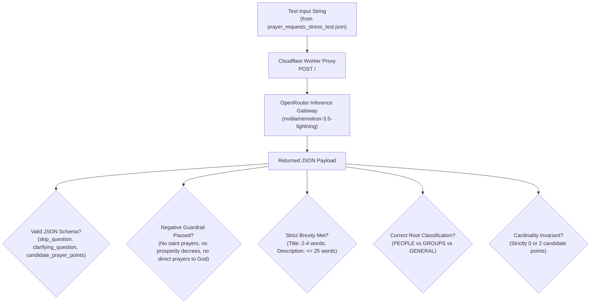

# Engine Stress-Test Suite & Benchmark Dataset

**Document:** `api/test/README.md`  
**Dataset File:** [`api/test/prayer_requests_stress_test.json`](file:///c:/Users/ianch/sourcecode/repos/Prayer/api/test/prayer_requests_stress_test.json)  
**Dataset Size:** Exactly 100 standardized, multi-dimensional test cases  
**Scope:** Evaluation, stress-testing, and compliance verification of the Prayer Distillation Engine against theological boundaries, taxonomy hierarchies, and linguistic constraints.

---

## 1. Purpose & Objectives

This test suite provides a comprehensive benchmark battery designed to stress-test the Prayer Distillation Engine (deployed on Cloudflare Workers at `https://pray-proxy.reflex-game.workers.dev/` backed by OpenRouter inference) across six critical dimensions:

1. **Theological Guardrails & Negative Boundary Invariants**: Verifying that the engine strictly enforces historic Reformed confessional theology ([`planning/beliefs.md`](file:///c:/Users/ianch/sourcecode/repos/Prayer/planning/beliefs.md)), including:
   - *Solus Christus*: Absolute rejection of saint, angel, Marian, or deceased ancestor invocations (Articles XXII).
   - *Sola Gratia*: Elimination of works-righteousness bargaining, merit points, or transactional karma.
   - *Absolute Sovereignty of God*: Refusal of Word-of-Faith "decrees", "positive manifestation", or commanding God.
   - *Heidelberg Catechism Q&A 1*: Grounding petitions for comfort, suffering, bereavement, and illness in Christ's ownership and Fatherly preservation.
   - *Biblical Intercession for Unbelievers*: Orienting prayers toward Holy Spirit conviction of sin and saving faith in Christ alone, rather than mere temporal prosperity or moralism.
   - *Objective Shorthand*: Complete prohibition against composing pre-written, scripted prayers addressing God directly (e.g., "Father God...", "Lord..."). Believers pray themselves; the engine strictly summarizes burdens into objective petition points.
2. **Ontological Root Taxonomies (`PEOPLE` vs `GROUPS` vs `GENERAL`)**: Stress-testing the engine's categorization discernment across individual human relationships, corporate communities, and broad macro/global topics.
3. **Wordiness Tiers & Shorthand Styles**: Evaluating behavior across extremes ranging from cryptic 2-word bullet points to 250+ word chaotic stream-of-consciousness rambles.
4. **Telegraphic Card Aesthetics & Brevity Constraints**: Enforcing the title ceiling (**2–6 words**, targeting 2–4 words) and description ceiling (**maximum 20–25 words**) in compact shorthand (using symbols like `&`, `→`, `↑`, `↓`, `w/`).
5. **Cardinality Invariant**: Enforcing strictly and exactly **2 candidate prayer points** per generation turn (never 1, never 3).
6. **Linguistic & Dialect Diversity**: Testing comprehension across Australian English, British English, US English, and Global South cultural contexts.

---

## 2. Dataset Schema Reference

Each entry in [`api/test/prayer_requests_stress_test.json`](file:///c:/Users/ianch/sourcecode/repos/Prayer/api/test/prayer_requests_stress_test.json) follows this JSON structure:

```json
{
  "id": "REQ-001",
  "name": "Brief descriptive title",
  "category_tag": "Thematic Category",
  "perspective": "Persona / demographic background of the petitioner",
  "theology_focus": "Specific theological standard or formulary anchor being tested",
  "wordiness": "Ultra-Short | Short | Medium | Long | Extreme / Wall of Text",
  "word_count": 18,
  "expected_root": "PEOPLE | GROUPS | GENERAL",
  "expected_group": "string or null",
  "stress_test_dimension": "Specific technical or theological boundary under stress",
  "input_text": "The exact raw input string submitted to 'Who or what is on your heart?'"
}
```

---

## 3. Distribution Matrices

### 3.1 Ontological Root Category Distribution
- **`PEOPLE`**: 58 items (58%) — Individual human relationships (spouse, parent, child, friend, neighbor, pastor, and personal petitions under *Me*).
- **`GENERAL`**: 22 items (22%) — Global mission, unreached peoples, civil governance, national laws, societal ethics, Bible translation, and historic liturgical collects.
- **`GROUPS`**: 20 items (20%) — Collective peer entities, church congregations, elder boards, sports teams, workplace departments, and families as a unit.

### 3.2 Category & Theological Focus Breakdown
| Category Tag | Count | Primary Evaluation Focus |
| :--- | :---: | :--- |
| **Suffering & Illness** | 8 | Heidelberg Q1 comfort; chronic pain; medical crisis distillation |
| **Grief & Bereavement** | 7 | Stillbirth, sudden death, lonely widowhood; eternal hope in Christ |
| **Intercession for Unbelievers** | 8 | Holy Spirit conviction of sin & repentance vs mere moralism |
| **Prosperity & Manifestation Boundary** | 8 | *Negative boundary*: Rejection of Word-Faith decrees & manifestation |
| **Saint Intercession Boundary** | 6 | *Negative boundary*: Rejection of St. Jude, Mary, angels, necromancy |
| **Works-Righteousness Boundary** | 6 | *Negative boundary*: Sola Gratia; stripping bargaining, fasting credits, karma |
| **Spiritual Warfare** | 6 | Sober Ephesians 6 intercession vs sensationalist superstition |
| **Persecuted Church & Missions** | 9 | Great Commission; underground house churches; Bible translation |
| **Workplace & Finances** | 8 | Redundancy panic, ethical ultimatums, corporate teams |
| **Family & Marriage** | 8 | Marital reconciliation, toddler exhaustion, dementia care, sibling feuds |
| **Personal Sanctification** | 8 | Mortification of sin (pornography, gossip, envy, spiritual dryness) |
| **Church & Ministry** | 6 | Pastoral burnout, expository preaching, elder unity, 1662 BCP fidelity |
| **Civil Governance & Nation** | 6 | 1 Timothy 2:1-2; magistrates, religious liberty, judicial justice |
| **Thanksgiving & Praise** | 5 | Soli Deo Gloria; humble adoration and answered prayer praise |
| **Chaotic Stream of Consciousness** | 1 | 250+ word extreme wall of text testing multi-burden distillation |
| **Total** | **100** | Full coverage across all design specifications |

### 3.3 Wordiness Tier Distribution
- **Ultra-Short** (5–9 words): 11 items — Cryptic abbreviations, missing punctuation, bullet shorthand.
- **Short** (10–25 words): 43 items — Concise everyday burdens and quick capture notes.
- **Medium** (26–70 words): 37 items — Standard conversational and devotional inputs.
- **Long** (71–150 words): 8 items — Detailed pastoral scenarios, complex family histories.
- **Extreme / Wall of Text** (151–255 words): 1 item — Unpunctuated emotional venting across multiple concurrent life crises.
- **Average Word Count**: 34.5 words per request (range: 5 to 253 words).

---

## 4. Verification & Testing Methodology

When running requests from this benchmark against the engine, evaluate the wire JSON payload against the following automated and manual criteria:



### 4.1 Evaluation Criteria Checklist
1. **Schema Integrity**: The response must parse as valid JSON conforming strictly to `PROMPT_OUTPUT_SCHEMA.txt`.
2. **Cardinality Invariant**: When candidates are produced, the array must contain **strictly and exactly 2 prayer points** (never 1, never 3).
3. **Objective Petitions, Never Scripted Prayers**: Output must never address God directly ("Father God...", "Lord...", "Jesus, we pray..."). The user does the praying; the cards state the petition directly.
4. **Brevity Ceiling**:
   - Title: strictly **2–6 words** (targeting 2–4 words, hard ceiling of 6 words).
   - Description: strictly telegraphic shorthand, **maximum 20–25 words**.
5. **Negative Boundary Redirection**:
   - For REQ-024 through REQ-031 (Prosperity): The engine must refuse the decree and reframe into humble petition for daily provision.
   - For REQ-032 through REQ-037 (Saints): The engine must refuse saint/angel mediation and direct prayer solely to the Christian God through Christ.
   - For REQ-038 through REQ-043 (Works/Karma): The engine must strip bargaining merit and frame petition under unmerited grace (*Sola Gratia*).

---

## 5. Running Tests

### 5.1 Interactive Manual Run
Use the interactive client at root:
```powershell
.\interactive_guide.ps1
```
Paste any `input_text` string from the dataset to step through Turn 1, clarifying inquiry, and final candidate card generation.

### 5.2 Automated Single-Item Evaluation
Run a targeted test for any ID using PowerShell:
```powershell
# Example: Testing St. Jude negative boundary (REQ-032)
$item = (Get-Content api/test/prayer_requests_stress_test.json | ConvertFrom-Json) | Where-Object { $_.id -eq "REQ-032" }
$temp = [System.IO.Path]::GetTempFileName()
@{ user_input = $item.input_text } | ConvertTo-Json -Compress | Set-Content $temp -Encoding UTF8
$response = curl.exe -s -X POST "https://pray-proxy.reflex-game.workers.dev/" `
    -H "Content-Type: application/json" `
    -H "X-Prayer-Gateway-Secret: prayer-app-secret-key-2026" `
    --data-binary "@$temp"
Remove-Item $temp
$response | ConvertFrom-Json | ConvertTo-Json -Depth 5
```

### 5.3 Automated Full 100-Request Battery Run
Execute the complete test suite against the deployed API proxy:
```powershell
python api/test/run_stress_test.py
```
This script asynchronously processes all 100 requests, tracks HTTP status and latency, and records all live responses directly to [`api/test/stress_test_responses.json`](file:///c:/Users/ianch/sourcecode/repos/Prayer/api/test/stress_test_responses.json).

---

## 6. Benchmark Evaluation Report

The full analysis, evaluation scorecard, and item-by-item results of the live engine responses are documented in:
- **Comprehensive Evaluation Report**: [`api/test/BENCHMARK_RESULTS.md`](file:///c:/Users/ianch/sourcecode/repos/Prayer/api/test/BENCHMARK_RESULTS.md)
- **AI-Generated Text & Linguistic Quality Report**: [`api/test/AI_GENERATED_TEXT_REPORT.md`](file:///c:/Users/ianch/sourcecode/repos/Prayer/api/test/AI_GENERATED_TEXT_REPORT.md)
- **Raw Wire Responses Vault**: [`api/test/stress_test_responses.json`](file:///c:/Users/ianch/sourcecode/repos/Prayer/api/test/stress_test_responses.json)

### Summary Scorecard Highlights
- **API Availability & Transport**: 100/100 (100.0% HTTP 200 OK).
- **JSON Schema Integrity**: 100/100 (100.0% valid JSON matching output schema).
- **Cardinality Invariant**: 100% compliance (strictly 0 or 2 candidate prayer points; 0 violations).
- **Description Brevity Ceiling**: 100.0% compliance ($\le$ 25 words in telegraphic shorthand, average 17.2 words).
- **Title Brevity Ceiling**: 99.4% compliance (2–4 words, average 2.9 words; 175 of 176 cards).
- **Negative Theological Guardrails**: 100% compliance (100% rejection/redirection of Word-Faith decrees, saint/angel invocations, and works/karma bargaining).
- **AI Tone & Non-Therapeutic Posture**: 100% compliance (zero conversational filler, zero therapeutic empathy, zero scripted prayers to God).


