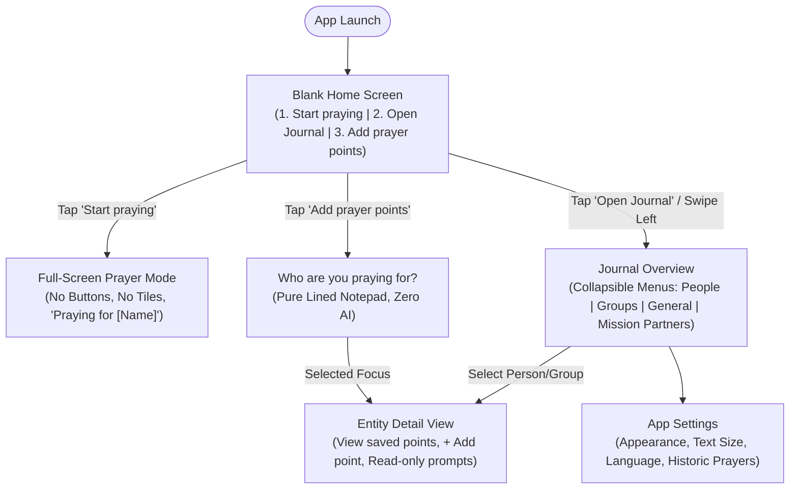
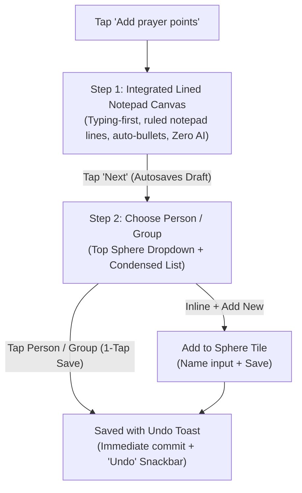

# User Experience (UX) & Product Design Specification

**Document:** `planning/UX.md`  
**Status:** Approved Design Principles & User Journey Map  
**Application Title (Unofficial):** *Pray Without Ceasing* (1 Thessalonians 5:17)  
**Last Updated:** 2026-09-10  
**Target Audience:** Product Owner, Business Stakeholders, Product Designers  
**Platform Focus:** Mobile App (Clean, solemn, distraction-free companion)  

---

## 1. Product Vision & Emotional Tone

The Prayer app is conceived as a quiet, sacred personal vault. Most consumer apps rely on vibrant colors, badges, notifications, and social feeds designed to capture and monetize user attention. In contrast, this app is designed to **give attention back to the user's interior life, personal relationships, and communion with God**.

### 1.1 Core Experience Pillars
- **Radical Simplicity & Blank Entry**: The application opens to a serene, completely uncluttered screen with strictly three options: **Start praying**, **Open Journal**, and **Add prayer points**. There are no distracting dashboards, activity feeds, or cluttered widgets on launch.
- **Strictly Passive Full-Screen Prayer Mode**: When in Prayer mode (*Start praying*), the UI transitions into an immersive, full-screen sanctuary: strictly zero buttons, zero card tiles, and zero grid lines. There are no check-off boxes, editing tools, or progress bars. The view presents the name of the entity being prayed for preceded by "Praying for" (e.g., *Praying for Sarah*), followed directly by the prayer points and a reverent, **read-only** AI prompts section reflecting on those past points (strictly unlabelled in the UI).
- **Read-Only Past Points AI Assistance (Zero Chat & Zero Adding Assistance)**: There is strictly no AI assistance when adding new prayer points. When viewing past points in Start Praying mode or in Journal mode, recorded points are sent to the API to return concise prompts displayed in **read only** format (3 to 5 lines at a time, each between 1 and 6 words long, strictly unlabelled in the UI). The AI never asks questions and never chats.
- **Zero-Gap Contiguous Geometry**: In navigation, prayer entry, and journal views, every surface, tile, card, and button is strictly adjacent to its neighbors, leaving zero visible gaps, floating margins, or padding gutters between UI elements. Tiles share 1px hairline boundary seams to form a continuous, unified architectural plane. Rounded corners, curved pill shapes, drop shadows, and bubble cards are strictly prohibited.
- **Reverent & Solemn**: The interface feels like an architectural tablet or solemn liturgical folio. Content is communicated through crisp typography, ample whitespace, and subtle hairline dividing rules.
- **Austere Simplicity (Zero Explanatory / Tutorial Text)**: As an unyielding design principle, the application shall never display explanatory, onboarding, or tutorial-like text on its UI elements. Buttons, tiles, and headers present strictly functional labels without descriptive sub-captions or instructional crutches.
- **Strict Prohibition of Ordinal / Sequential Labels ("Point 1", "Point 2")**: As an absolute design principle, the application shall never code, render, or display arbitrary sequential counters, numeric badges, or ordinal enumerations (e.g., *Point 1*, *Point 2*, *Point 1 of N*, *Item 1*) anywhere in the UI. Prayer points before Almighty God are sacred burdens of prayer, never numbered tickets or items on a bureaucratic checklist. Each prayer point is recognized and presented exclusively by its meaningful title and descriptive content.
- **Minimal Contextual Data Exposure**: Just because data is stored, calculated, or available in the backend does not mean it has value to show to the user. The interface shall strictly expose only the absolute least amount of data relevant to the immediate devotional context. Progress counters (`Topic 1 of 8`), database tallies (`7 points (5 active)`), entity taxonomy tags, and queue sequence metrics are ruthlessly suppressed from devotional and navigation views.
- **Sequestered Configuration (Zero Clutter)**: The interface is never cluttered with configuration, settings, or display options. All user preferences reside in a dedicated Settings panel navigated to only when needed from the Journal, preserving an austere, quiet devotional space.
- **Zero Emojis & Zero Gamification**: Emojis, streak counters, celebration popups, badges, and animations are strictly excluded to preserve dignity and respect.
- **Uncompromised Privacy**: Zero accounts, zero login, zero public feeds, and zero telemetry. All prayer data resides exclusively on the user's physical device.
- **Canonical Android Journal Design Principles Reference**: Authoritative design principles specific to the Android journal experience are specified in `android_journal_design_principles.md` (to be added; strictly read-only for agents).

---

## 2. Visual Identity: Warm Vintage Whites & Contiguous Tessellation

The product uses a single, unified color identity built around warm vintage whites and antique printing press charcoal ink, reflecting the solemnity of historic liturgical folios, prayer books, and authentic parchment notebooks.

### 2.1 The Single Warm Vintage Whites Palette
The application uses a single unified aesthetic that eliminates dark and light mode toggles, providing an authentic, distraction-free devotional sanctuary:
- **Base Canvas / Background (`#FAF7F2`)**: Warm vintage white / antique book parchment providing a gentle, unglared reading surface.
- **Surface / Card / Action Slabs (`#FFFDF9`)**: Lighter warm ivory surface for planar cards and action tiles.
- **Surface Elevated (`#FFFFFF`)**: Pure warm white elevation.
- **Surface Subtle (`#F0ECE1`)**: Warm soft linen container for secondary sections.
- **Primary Typography (`#1C1917`)**: Deep warm antique charcoal / carbon ink, ensuring crisp legibility with a 16.2:1 contrast ratio exceeding WCAG AAA.
- **Subtle Typography (`#6E675F`)**: Muted warm stone / sepia metadata.
- **Structural Hairlines (`#E3DDD3`, `#EDE8DF`, `#D5CCC0`)**: Delicate warm tan borders separating contiguous planar surfaces.
- **Answered Prayer Text (`#8E867C`)**: Soft warm slate.

### 2.2 Planar Geometry with Tonal Depth & Elevation Hierarchy (Zero Curved Edges)
- **Strict Orthogonality**: Every card, button, input box, dialog, sheet, and container adheres to sharp 90-degree right angles (`FlatSquareShape`, `border-radius: 0`). Curved edges, rounded corners, and pill buttons are strictly forbidden.
- **Architectural Depth without Curvature**: Visual depth and tactile hierarchy are achieved through deliberate tonal surface layering (`surface`, `surfaceSubtle`, `surfaceElevated`), hairline structural borders (`borderSubtle` 0.5dp, `borderStrong` 1dp), and disciplined elevation levels:
  - `elevationNone = 0.dp`: Base canvas and flat full-screen prayer surfaces.
  - `elevationSubtle = 1.dp`: List items, sanctuary prayer cards, and read-only prompt cards.
  - `elevationCard = 2.dp`: Action slabs on Home screen and Journal category slabs.
  - `elevationFloating = 4.dp`: Floating panels and confirmation dialogues.
  - `elevationModal = 8.dp`: Critical confirmation dialogues and menus.
  This eliminates visual flatness and adds tactile depth while strictly preserving sharp right angles and zero-radius geometry.
- **Ruled Notebook Texture & Margin Line**: The Lined Notepad features horizontal ruled lines and an authentic vertical left margin guide (36dp offset) in subdued tones, providing the grounded feel of a physical liturgical notebook.
- **Architectural & Liturgical Gravity**: The unyielding rectilinear geometry reinforces solemnity, permanence, and reverence, eschewing the casual, bubbly aesthetics of consumer social apps.

### 2.3 Styling & Typography Rules
53: - **No Decorative Icons**: Pure typographic hierarchy and delicate hairline rules.
54: - **Subdued Answered State**: In the Journal, when a prayer is answered, the text softens with a subtle strikethrough, visually signaling gratitude and completion while preserving the historical record.
55: 
56: ### 2.4 Material 3 Compliance, 8dp Spacing Rhythm & Motion Dynamics
57: - **Material 3 Alignment with 0dp Planar Contract**:
58:   - The design system leverages modern Android Material 3 foundations (`androidx.compose.material3`) while strictly preserving the solemn, non-commercial 0dp aesthetic.
59:   - All Material 3 shape tokens are overridden to `FlatSquareShape` (`RoundedCornerShape(0.dp)`), ensuring that M3 surfaces, dialogs, progress bars, text fields, and cards maintain crisp right angles.
60:   - Standard M3 component hierarchy:
61:     - Root layouts leverage M3 `Scaffold` paired with a global `SnackbarHost` for accessible, reverent feedback (e.g. confirming saved prayer points or updates).
62:     - Top headers implement M3 `TopAppBar` (`TopAppBarDefaults`) with standard `IconButton` actions and 56dp height.
63:     - Text inputs implement M3 `OutlinedTextField` with `shape = FlatSquareShape`, animated floating labels, active focus rings, and high-contrast monochrome border colors.
64:     - Card surfaces use M3 `OutlinedCard` with 0dp corners, 0.5dp hairline borders, and generous padding.
65:     - Buttons employ M3 `Button`, `OutlinedButton`, and `TextButton` with `FlatSquareShape` and bounded ripple effects.
66: - **Strict 8dp Spacing Grid & Touch Target Ergonomics (`PrayerSpacing`)**:
67:   - All layouts strictly adhere to the formal 8dp spacing grid tokens (`PrayerSpacing`):
68:     - `extraSmall = 4.dp`: inline caption gaps, subtle metadata separation.
69:     - `small = 8.dp`: sub-component spacing, chip padding, field labels.
70:     - `medium = 16.dp`: standard screen edge padding, card inner padding, list item gaps.
71:     - `large = 24.dp`: section separation, dialog padding, card margins.
72:     - `extraLarge = 32.dp`: sanctuary horizontal breathing margins, topic header clearance.
73:     - `huge = 48.dp`: accessibility touch target minimum constraint (`minTouchTarget = 48.dp`).
74:     - `primaryActionHeight = 56.dp`: primary action slabs and bottom buttons.
75:     - `sanctuaryBottom = 72.dp`: contemplative bottom clearance above navigation pills.
76:     - `cardMargin = 16.dp`: outer margin separating elevated planar cards.
77:     - `elevationNone = 0.dp`, `elevationSubtle = 1.dp`, `elevationCard = 2.dp`, `elevationFloating = 4.dp`, `elevationModal = 8.dp`: structural depth hierarchy.
78:   - Window insets are strictly managed via `Modifier.safeDrawingPadding()`, guaranteeing that content naturally avoids notches, camera cutouts, and gesture pills across all fold postures on Samsung Galaxy Flip devices.
79: - **Solemn Devotional Motion Mechanics**:
80:   - **Staggered Launch Entrance**: Home screen action slabs glide gracefully into view with staggered fade-and-settle animations (0ms, 60ms, 120ms delays with `FastOutSlowInEasing`).
81:   - **Liturgical Page-Turn Navigation**: Advancing or retreating between prayer topics in Sanctuary mode uses horizontal slide animations (`AnimatedContent`) with soft crossfades and `FastOutSlowInEasing` (350ms duration). This mimics the deliberate, sacred physical act of turning pages in an Anglican psalter or Book of Common Prayer.
82:   - **Directional Sub-Screen Transitions**: Navigating deeper into Journal hierarchies slides in from the right; returning slides out to the right (`slideInHorizontally` + `fadeIn` / `slideOutHorizontally` + `fadeOut` with `tween(320, easing = FastOutSlowInEasing)`). Entering Sanctuary prayer uses a solemn crossfade paired with subtle 24dp vertical settling.
83:   - **List Item Animations**: Dynamic additions, updates, and reordering in Journal lists use `Modifier.animateItem()` for fluid visual continuity.
84:   - **Soft Expansion**: Answered prayer sections and sub-views reveal their content smoothly via vertical expansion (`AnimatedVisibility(enter = expandVertically + fadeIn, exit = shrinkVertically + fadeOut)`).
85:   - **Interactive State Animations**: Status toggles (Active $\leftrightarrow$ Answered) and settings selections animate colors smoothly via `animateColorAsState`.
86: 
87: ### 2.5 Lexicon & Devotional Terminology Standard (Translating Functional Concepts to Sacred Language)
88: 
89: The application maintains an intentional, uncompromising distinction between **underlying functional/database concepts** (used by developers and data schemas) and **devotional app language** (experienced by the believer). Raw engineering jargon, military or marketing terms (such as *"target"*), database primitives (*"entity"*, *"record"*, *"row"*), and bureaucratic ticketing nomenclature (*"item"*, *"status"*, *"resolution"*) are strictly translated into reverent, personal, and liturgically grounded terminology:
90: 
91: | Functional / Database Concept | Meaningful App Language | Theological & Liturgical Rationale |
92: | :--- | :--- | :--- |
93: | **Target / Target Entity (`entity_id`)** | **`Praying for [Name]`** (in prayer & adding) / **`Person or group`** | Human beings, congregations, and ministries are sacred souls and fellowships held before the Throne of Grace, never clinical "targets" or abstract "entities". |
94: | **Entity Selection / Step 0 Prompt** | **`Who are you praying for?`** | Replaces clinical selection procedures with a pastoral, relational inquiry. |
| **Create Entity Action** | **`Add a person or group`** $\rightarrow$ **`Add & continue`** | Replaces database object instantiation with natural relational entry. |
| **Picker Source Section** | **`From your journal`** (never *"Or Select Existing"*) | Acknowledges the user's ongoing relational journal rather than a generic database table. |
| **Prayer Point / Record / Row / Item** | **`Prayer Point`** or **`Prayer`** (or unadorned substantive title) | Prayer points before God are solemn intercessory burdens, never items on a checklist or tickets in a queue. |
| **Ordinal Numbers (`Point 1`, `Point 2`)** | **Strictly Prohibited** (Pure title & description) | Every prayer point is a distinct, earnest plea; numbering reduces sacred intercession to administrative accounting. |
| **Capture Modes / Pathway Choice** | **`Lined Notepad`** (100% human, zero AI) | Direct writing on authentic ruled notepad with auto-bullets; zero AI assistance during entry. |
| **AI Raw Context / Ingestion** | **`Past points on target`** (in one go) | Ingests existing points and updates in a single batch when viewing past points; zero chat turns. |
| **Clarifying Inquiries & Chat** | **Strictly Prohibited** (AI does not ask questions or chat) | AI never initiates conversation or poses inquiries; operates strictly as read-only prompts. |
| **Suggested Lines / Prompts** | **`Prompts`** (Read-only, 3–5 lines, 1–6 words each, strictly unlabelled in UI) | Concise prompts based strictly on past recorded data; displayed read-only in Sanctuary and Journal without any UI label/header. |
| **Commit to Database Action** | **`Save to [Name]`** / **`Save prayer point`** (never *"Save to Entity Vault"*) | Affirms the relational destination in the user's journal rather than disk persistence. |
| **Active Prayer State** | Clean, unadorned typography | Default posture of ongoing, watchful intercession. |
| **Answered Prayer State** | **`Answered`** (with soft strikethrough in Journal) | Cultivates thanksgiving (*eucharistia*) and praise for God's faithfulness; not a "closed ticket". |
| **Answer / Resolution Note** | **`Thanksgiving note`** (or note of God's faithfulness) | Honors the theological reality that answered prayer produces gratitude to God alone. |
| **Devotional Queue / Balancing Metrics** | **`Start praying`** (queue metrics are 100% silent) | Anti-neglect balancing is a quiet pastoral servant; metrics are never exposed to the user. |
| **Journal Vault Directory** | **`Journal`** (`People`, `Groups`, `General`, `Mission Partners`) | Personal spiritual vault; avoids database administration vocabulary. |
| **Settings Panel** | **`Settings`** (`Appearance`, `Text Size`, `Language`, `Historic Prayers`) | Dignified, quiet preferences; avoids developer terminology like "Config" or "Tiers". |
110: 
111: ---

---

## 3. Screen Structure & Navigation Framework

### 3.1 The Blank Entry Screen
Upon launch, the user meets an uncluttered, contiguous canvas featuring strictly three centered flat action tiles with unadorned labels and zero explanatory sub-text:
1. **Start praying**
2. **Open Journal**
3. **Add prayer points**

The home screen features strictly zero hero headers, wordmarks, app logos, or arbitrary header titles. The three action slabs divide the screen vertically and contiguously edge-to-edge.

### 3.2 The Journal (Open Journal / Swipe Left)
Tapping **Open Journal** (or swiping left from the blank home screen) glides directly into the Journal overview presenting collapsible accordion menus for the four foundational domains:
1. **`People`**: Exclusively and strictly specific, distinct individual relationships (e.g., spouse, children, parents, a single named friend/neighbor, and personal prayer points under *Me*—including personal health, job trials, or spiritual sanctification situated within a workplace or hospital).
2. **`Groups`**: Collectives, communities, and shared peer/work environments (e.g., work colleagues, office team, church congregation, small group, committee, ministry).
3. **`General`**: Broad topics, global concerns, personal spiritual disciplines, and the preloaded collection of historic Reformed prayers.
4. **`Mission Partners`**: Supported missionary families, mission agencies, missionaries, and ministry partners (e.g., a missionary family on the field, a Bible translation agency, a church planting ministry).

Each category operates as a collapsible menu directly displaying the active people and items to pray for. Tapping an entity selects it and immediately opens their Entity Detail screen. Tapping the category header collapses or expands the group.

---

## 4. Core User Journeys

### 4.1 Journey 1: "Start Praying" (Full-Screen Prayer Mode)

1. **Immediate Immersion & Balanced Curation**: 
   - Tapping **Start praying** instantly immerses the user in full-screen prayer mode without configuration popups, filters, or setup steps.
   - **Curated Feed Balancing (Anti-Neglect)**: The local engine balances the queue using each topic's retained interaction count (`interacted_count`) and timestamp (`last_interacted_at`). Topics that have never been prayed for, or have the oldest last-interacted dates and lowest counts, are prioritized at the front of the queue so that no relationship, small group, or burden is forgotten.
2. **Full-Screen, Tileless, Gridless Typographic Presentation**:
   - The top navigation bar, bottom action dock, and on-screen buttons are completely suppressed (`display: none`).
   - The canvas contains **no boxy card tiles, no borders, and no grid lines**.
   - **Heading**: The screen begins with a clean, reverent heading stating the name of the entity preceded by "Praying for" (e.g., `Praying for Sarah`, `Praying for Parish Council`).
   - **Prayer Points**: Directly underneath, each prayer point is presented with its title and body separated by generous typographic whitespace.
   - **Design Principle: Strict Prohibition of Ordinal Labels ("Point 1", "Point 2")**: Contemplation views and prayer lists present strictly the prayer point title and description. Coding or rendering useless sequential labels or numeric badges (such as *Point 1*, *Point 2*, *Point 1 of N*, status tags, or ticket categories) is strictly prohibited.
   - **Expandable Answered Prayer Points**: Answered prayer points for that topic are rendered softly beneath active prayer points without boxy tiles or borders.
   - **Read-Only AI Prompts on Past Points (Strictly Unlabelled in UI)**: When contemplating past recorded prayer points for the active topic, an asynchronous request sends the entity's recorded points in one batch to the API proxy (`/api/v1/suggest`). The returned concise prompts (3–5 lines, 1–6 words each) are rendered as read-only bullet points (`• [prompt]`). Crucially, they are strictly unlabelled in the UI anywhere (never headed or badged as "Petitions" or "Prompts"). They are purely contemplative: zero adopt buttons, zero edit actions, zero conversational chat, and zero intrusive popups.
3. **Buttonless Gestural Navigation (Swipe-First Mobile Ergonomics)**:
   - Because on-screen buttons are completely eliminated to preserve solemn contemplation, topic progression leverages the full tactile capability of smartphones:
     - **Swipe Left (`ΔX < -40px`) / Tap right 75% / ArrowRight**: Advances to next prayer topic. Primary thumb action on mobile.
     - **Swipe Right (`ΔX > +40px`) / Tap left 25% / ArrowLeft**: Returns to previous prayer topic.
     - **Swipe Down (`ΔY > +60px`) / Tap Top Edge / Escape**: Exits prayer mode and returns immediately to the home screen.
   - Progressing past a topic automatically and silently increments the topic's `interacted_count`, updates its `last_interacted_at` timestamp, and touches `last_interacted_at` across all constituent active prayer points without demanding manual interaction.
4. **Self-Paced & Open-Ended**:
   - Each screen represents a complete topic.
   - There is no mandatory session quota or timer. The user determines the length of their devotion, advances topic by topic, and simply exits back to the home screen whenever they choose.
5. **Zero-State Fallback (Curated Reformed Prayers)**:
   - If the user has not yet recorded any personal prayer points, *Start praying* presents preloaded prayers from a curated selection of historic **Reformed, Protestant** classics:
     - The Lord's Prayer
     - Classic Anglican Book of Common Prayer (BCP) collects
     - The Apostles' Creed
   - Once the user adds personal prayers, these historic prayers permanently reside under `General → Historic Prayers`, with a user toggle to either blend them into daily prayer rotations or keep them accessible strictly on demand.

---

### 4.2 Journey 2: "Add Prayer Points" (Capture & Articulation)

Tapping **Add prayer points** from the home screen initiates a **typing-first, capture-first workflow**. Believers can immediately pour out their thoughts onto an authentic lined notepad canvas before deciding which person, group, general topic, or mission partner the points belong to:

#### Step 1: Typing-First Lined Notepad (Direct Writing, Ruled Lines & Auto-Bullets)
Opening the flow lands directly on a dedicated, contemplative lined notepad for writing prayer points immediately without preliminary categorization hurdles:
- **Authentic Physical Notepad Ruled Lines**: The entire writing surface is rendered with subtle horizontal ruled lines spaced evenly with the font line-height, providing the tactile reverence of pen and paper on a personal devotional pad.
- **Expanded Vertical Canvas**: The lined notepad occupies the entire vertical viewport (`Modifier.weight(1f)`), providing an expansive, distraction-free space for intimate spiritual writing.
- **Zero Title Field**: The user is never prompted for or shown a title field when adding new prayer points. The view presents strictly an unadorned ruled text canvas.
- **Auto Bullet-Point Writing Pad**: The writing pad automatically formats input into bullet points:
  - Focus or initial activation auto-seeds the pad with a bullet prefix (`• `).
  - Pressing line space (<kbd>Enter</kbd> / <kbd>Return</kbd>) automatically generates a new bullet on the subsequent line (`\n• `).
  - Pressing <kbd>Enter</kbd> or <kbd>Backspace</kbd> on an empty bullet removes the bullet cleanly to allow ending lists without friction.
- **Next / Save Action**:
  - When opened from Home (uncontextualized), typing text illuminates **Next** in the top header and bottom action slab. Tapping **Next** transitions seamlessly to Step 2 (Person/Group selection).
  - When opened from a specific Journal entity (*Praying for [Name]*), typing text illuminates **Save to [Name]**, committing immediately on-tap.

---

#### Step 2: Condensed Target Selection (Root Sphere Dropdown & Single-Tap Save)
After typing points and tapping **Next**:
1. **Top Root Sphere Dropdown**: A clean header dropdown displaying the active sphere (`People`, `Groups`, `General`, or `Mission Partners`), allowing instant switching between relational categories.
2. **Condensed Entity List**: Presents existing people/groups in the selected sphere in a compact, edge-to-edge list.
3. **Single-Tap Save & Immediate Detail View**: Tapping any person or group immediately saves the drafted prayer points to that entity and transitions directly into that entity's prayer point view in the Journal so the believer can immediately see the newly saved prayer point.
4. **Undo Toast Feedback**: An immediate Snackbar toast appears: *"Saved to [Name]"* with an **Undo** action. Tapping Undo removes the prayer point and restores the user's draft.
5. **Inline Add New**: An unadorned `+ Add new to [Sphere]` tile at the top of the list allows instant creation and saving on the spot.
6. **Post-Committal Branched AI Title Generation**: After local saving, an asynchronous lightweight branch of the AI engine generates a concise 2–6 word prayer point title in the background, updating the record (`UPDATE PRAYER_POINT SET title = ?`).
7. **Theological Validation Exemption**: Because this branch performs exclusively the straightforward summarization of user-committed text into a brief label, theological validation is not required.
8. **Offline Fallback**: When offline, the prayer point is stored with a truncated text preview as an interim label until background connectivity generates the permanent title.

---

#### Absolute Prohibition of AI Assistance in Add Mode
To protect the believer's intimate devotional voice:
- **Zero AI Suggestion Engine**: No suggestions, prompts, or autocomplete are generated or displayed while drafting new prayer points.
- **No Bottom Pane / No Overlay**: The notepad canvas remains pure, unencumbered by secondary toolbars, ambient panes, or dynamic text overlays.
- **Zero Chat**: The AI assistant never questions, engages in conversation, or prompts during writing.

### 4.3 Journey 3: "Open Journal" (Structural Journal & Directory)

Tapping **Open Journal** (or swiping left from the home screen) opens the complete management journal:
1. **Collapsible Category Menus**:
   - The Journal opens directly to collapsible accordion menus for **`People`**, **`Groups`**, **`General`**, and **`Mission Partners`**, directly displaying the full lists of people and burdens to pray for; tapping any person or item selects it and opens their Entity Detail screen.
2. **Entity Detail & Read-Only Prompts (Strictly Unlabelled in UI)**:
   - In the Entity Detail view, when past prayer points exist for that person or group, an asynchronous request sends the entity's recorded points in one batch to the API proxy (`/api/v1/suggest`).
   - The returned concise prompts (3–5 lines, 1–6 words each) appear as quiet, read-only bullet points (`• [prompt]`) above the points list, strictly unlabelled in the UI anywhere (never titled "Petitions" or "Prompts").
   - Believers can reflect on these pastoral prompts while browsing their journal, but cannot adopt or edit them into their personal records.
3. **Editing Saved Prayer Points (Click-Once Entry & Title Editing)**:
   - **Click Once to Start Editing**: In the Entity Detail view, clicking or tapping any saved prayer point once immediately transitions into edit mode for that prayer point.
   - **Editable Title**: The prayer point title (initially auto-generated upon creation) is fully exposed and editable. Users can freely modify, refine, or rename the title to reflect evolving pastoral circumstances.
   - **Editable Body & Auto-Bullets**: The prayer point body is fully editable, maintaining the auto bullet-point behavior (line space triggers a new bullet).
    - **Status & Thanksgiving Toggle**: Within the editor, users can mark the prayer point as `Active` or `Answered` (with an optional thanksgiving note). Answered points in the list display with subdued text and an ultra-faint strikethrough line so the text remains cleanly legible while visually resolved.
3. **Permanent Deletion (`Delete prayer point`)**:
   - Believers can permanently remove prayer points that have ended or were added in error.
   - Tapping **Delete prayer point** reveals a stark, planar confirmation prompt (*"Delete this prayer point? This cannot be undone."*).
   - Confirming permanently purges the record from local SQLite storage (`DELETE FROM PRAYER_POINT WHERE id = ?`).
   - Editor controls: **Save changes**, **Cancel**, and **Delete prayer point**.
4. **Settings Access**:
   - **Text Scaling**: Dedicated three-tier selector with pronounced, distinct jumps (**Large** *(Default)*, **Regular**, and **Compact**). The **Large** default features prominent, high-presence typography (28px home buttons, 22px card titles, 18px prayer points) for effortless, strain-free devotional contemplation. **Regular** offers balanced density (20px buttons, 16px card titles, 13px prayer points), and **Compact** provides high-density scannability (15px buttons, 12.5px card titles, 10.5px prayer points).
   - **Language / Dialect configuration**: Dedicated selector between **English (Australian / UK)** *(Default)* and **US English**. Switching immediately adjusts UI copy, prayer collects, and distillation orthography.
   - Historic Reformed prayers rotation toggle (blend into daily rotation vs. library-only).
   - Local encrypted database backup and export.

---

## 5. Smartphone Gestural System (Swipe & Touch Paradigms)

Smartphones are tactile, touch-first instruments. Devotional prayer frequently occurs during personal quiet time, walking, or moments where the phone is held in one hand. Relying strictly on small buttons or tap zones demands visual targeting, pulling the believer's focus away from prayer. 

The application elevates **Swipe Input** to a first-class interaction standard across all touch form factors:

### 5.1 Full-Screen Prayer Mode Gestures
In the buttonless, gridless prayer canvas, navigation between topics is governed primarily by horizontal thumb swipes:
- **Swipe Left (`ΔX < -40px`)**: Advances to the **Next topic** in the balanced anti-neglect queue. Matches the universal physical metaphor of turning forward to the next page of a prayer book.
- **Swipe Right (`ΔX > +40px`)**: Returns to the **Previous topic**.
- **Swipe Down (`ΔY > +60px` initiated in upper half of screen)**: Dismisses prayer mode and returns immediately to the Home screen.
- **Accessibility Fallbacks**: Tapping the right 75% of the screen, tapping the left 25%, tapping the top edge, and hardware keyboard arrows (`ArrowLeft`, `ArrowRight`, `Escape`, `Space`) remain operational as complementary fallbacks.

### 5.2 List & Card Swipe Actions (Journal & Entity Detail)
In directory and prayer point views, individual cards support native mobile list swipe gestures:
- **Swipe Card Right (`ΔX > +60px`)**: Instant status toggle between `ACTIVE` and `ANSWERED`. Provides immediate tactile satisfaction without forcing the user into edit mode just to mark answered prayer.
- **Swipe Card Left (`ΔX < -60px`)**: Reveals destructive management action (**Permanent Delete**), presenting an immediate planar confirmation dialog.
- **Tap / Single Click**: Opens the full Prayer Point Editor for title and body refinement.

### 5.3 Long-Press Responsiveness & Planar Contextual Actions
Across all touch-first views, long-pressing interactive devotional records or entities delivers an immediate, subtle tactile haptic vibration (10–15ms system `LongPress`) and surfaces stark, planar contextual action dialogs complying with the 0dp, zero-curved-edge architectural contract:
1. **People & Groups (Journal & Add-Flow Selection)**:
   - **Long Press Trigger**: Holding any person or group tile in the Journal directory or Add-flow quick picker (`LogStep.SELECT_ENTITY`) triggers haptic feedback and reveals a planar context menu:
     - **`+ Add prayer point`**: Immediately initiates adding a new prayer point anchored to this person or group.
     - **`Edit name & category`**: Opens an in-place editing dialog to rename the person/group or change their sphere (`People` $\leftrightarrow$ `Groups`). (Protected/hidden for preloaded historic collections).
     - **`Delete`**: Surfaces a planar confirmation dialog (*"Delete this person or group and all associated prayer points? This cannot be undone."*), permanently removing the entity and cascading deletion across all associated prayer points.
2. **Individual Prayer Records (Journal Entity Detail)**:
   - **Long Press Trigger**: Holding any saved prayer point tile in an entity detail list triggers haptic feedback and surfaces:
     - **`Mark as Answered` / `Mark as Active`**: Instant status toggle without requiring navigation into the full editor.
     - **`Edit prayer point`**: Navigates directly into the title, body, and thanksgiving editor.
     - **`Delete`**: Surfaces a planar confirmation dialog (*"Delete this prayer point? This cannot be undone."*) to permanently purge the record.
3. **Full-Screen Sanctuary Prayer Mode**:
   - **Long Press Trigger**: Holding any active or answered prayer point in full-screen sanctuary mode triggers haptic feedback and surfaces a quiet, solemn dialog:
     - **`Mark as Answered` / `Mark as Active`**: Allows the believer to record answered prayer in real time during devotion without leaving sanctuary mode.
     - **`Dismiss`**: Closes the dialog and immediately resumes contemplative focus.

### 5.4 Global Navigation, LIFO Back Stack & Edge-Swipe Back
- **Last-In, First-Out (LIFO) Back Stack Architecture**: All navigation follows a strict LIFO hierarchy preserving nested context across sub-screens:
  - Adding flows initiated from within an entity detail screen (`Journal` $\rightarrow$ `EntityDetail` $\rightarrow$ `LogPrayer`) pop back directly to that entity's detail view in the Journal, rather than abruptly collapsing to Home.
  - Multi-tier sub-stacks (e.g. `JournalView` in `JournalScreen` and `LogStep` in `LogPrayerScreen`) handle granular view navigation independently before delegating to top-level application navigation.
- **Swipe Right from Left Screen Edge (`Xstart ≤ 25dp, ΔX ≥ 50dp, |ΔX| ≥ 1.5|ΔY|`)**: Universal edge-swipe back navigation. Mimics the physical act of turning back a leaf in a devotional journal or prayer book. Seamlessly navigates back one hierarchical level from any sub-screen (`SanctuaryPrayerScreen` $\rightarrow$ `Home`, `EntityDetail` $\rightarrow$ `Journal` $\rightarrow$ `Home`, `LogStep.PrayerAssistant` $\rightarrow$ `LogStep.CaptureMethod` $\rightarrow$ `LogStep.TargetSelection` $\rightarrow$ `Home`).
- **Unified Platform & Gestural Back Traversal**: Edge-swipe right is fully harmonized with the Android system back handler (`BackHandler`), ensuring identical, predictable LIFO traversal regardless of whether the user taps the hardware/system back button, invokes system gesture navigation, or uses the in-app edge swipe.

### 5.5 Home Screen Gestural Pathway
- **Swipe Left on Home Canvas (`ΔX < -50px`)**: Directly slides into the Journal directory, providing immediate, fluid access to the spiritual records vault.

---

## 6. Mobile Ergonomics & Accessibility

- **Samsung Galaxy Flip & Foldable Ergonomics**:
  - **Tall Aspect Ratio (22:9 / 21.9:9)**: Optimized for tall vertical viewports (such as 360x740dp to 412x960dp on Galaxy Z Flip). Slabs stretch edge-to-edge; prayer sanctuary mode centers prayer points comfortably within the natural upper and middle reading zones.
  - **Single-Handed Thumb Zone**: Primary controls, bottom action slabs, and swipe triggers sit within the lower 60% thumb sweep radius, allowing complete operation without awkward finger gymnastics.
  - **Foldable Posture & Flex Mode**: When placed in half-folded flex posture on a flat surface or bedside table, the top screen maintains the reverent contemplation canvas while touch/swipe zones remain active on the bottom panel.
- **Thumb-Zone Navigation**: Primary actions (*Save*, *Cancel*, swipe gestures) sit comfortably within the natural thumb sweep radius on modern smartphone screens.
- **Frictionless Entry**: Zero account creation, zero login, and zero API key configuration. Users are able to pray or add prayer points within one second of opening the app.
- **Instant Local Performance**: All read and write operations interact directly with the embedded SQLite database on device, guaranteeing zero network lag or loading spinners.
- **Haptic Feedback**: Light system haptics (10–15ms) accompany successful swipe triggers (topic advance, answered toggle, delete reveal) to provide silent, non-distracting tactile reassurance.

---

## 7. Automated UI Layout & Gestural Contract Testing

To guarantee that the austere, non-commercial, liturgical visual identity is never degraded by accidental style drift, the user experience is continuously verified by automated UI layout and contract test suites across three mobile viewports (Standard 390x844, Compact 360x740, and Large 428x926):
1. **Zero-Radius Contract**: Automated DOM traversal asserting `borderRadius === '0px'` across all interactive components, buttons, inputs, tiles, and dialogue surfaces.
2. **Contiguity & Adjacency Contract**: Sub-pixel bounding rect measurement confirming that adjacent slabs (such as the three vertical home slabs and journal tiles) maintain 0px margins/padding gutters and directly abut along 1px hairline boundary seams (`Math.abs(rect[i+1].top - rect[i].bottom) <= 1.5px`).
3. **Warm Vintage White Contrast & Theme Invariants**: Programmatic verification of color tokens (`--bg: #FAF7F2`, `--text: #1C1917`), maintaining WCAG AAA contrast ratios.
4. **Three-Tier Typography Scale Verification**: Automated evaluation asserting exact font size tokens across Large (Default), Regular, and Compact scales.
5. **Full-Screen Buttonless Sanctuary Invariant**: Automated assertion verifying that in `screen-pray`, `#top-bar` and all buttons are suppressed (`display: none`), with zero card borders or gridlines.
6. **Tactile Gesture Discrimination Testing**: Synthetic touch event simulation testing horizontal topic advance ($\Delta X \le -40\text{px}$), return ($\Delta X \ge +40\text{px}$), swipe-down exit ($\Delta Y \ge +60\text{px}$ in upper screen), and diagonal rejection ($|\Delta X| < 1.5 |\Delta Y|$).
7. **Negative Lexicon & Anti-Ordinal Audit**: Programmatic scanning of rendered text across all views asserting zero forbidden clinical terms (`target`, `entity`, `ticket`, `commit`, `sqlite`) and zero ordinal labels (`Point 1`, `Item 1`, `Point 1 of N`).

In the production native Android client ([`android/app/src/test/`](file:///c:/Users/ianch/sourcecode/repos/Prayer/android/app/src/test)), these contract tests are replicated and verified natively in Kotlin (`LayoutGeometryTest.kt`, `GestureEngineTest.kt`, `LifoBackStackTest.kt`, `LexiconContractTest.kt`, `DevotionalFlowsTest.kt`, `AntiNeglectQueueTest.kt`, `TheologicalGuardrailsTest.kt`, `PrayerApiClientTest.kt`, and `DataModelsTest.kt`), totaling 64 automated tests passing with 100% compliance.
