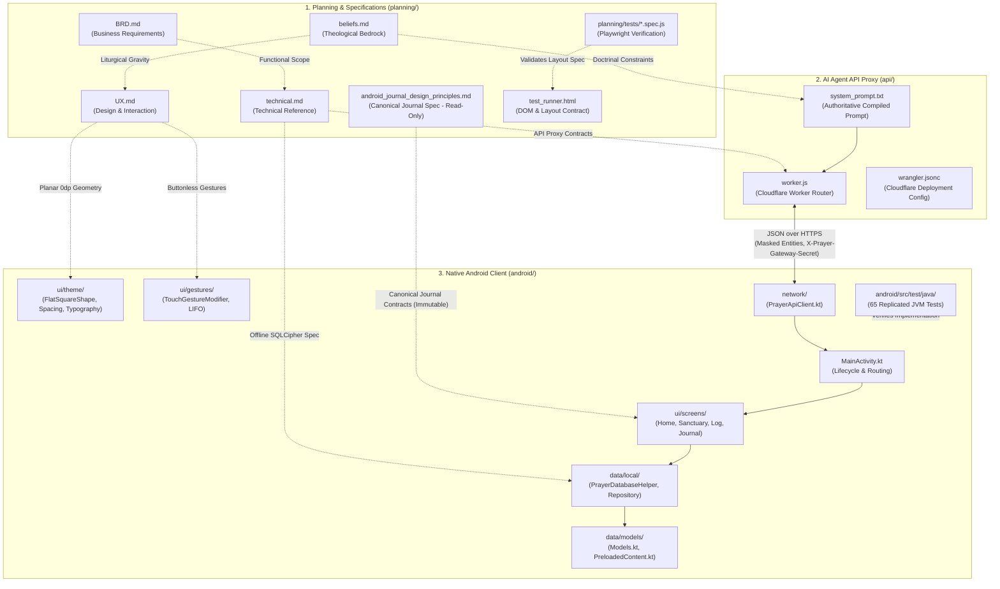
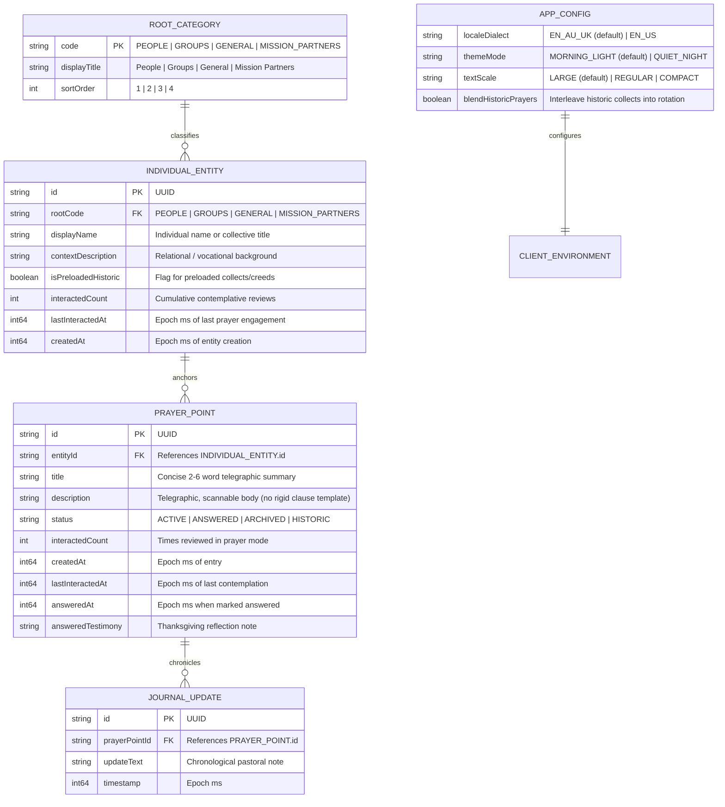
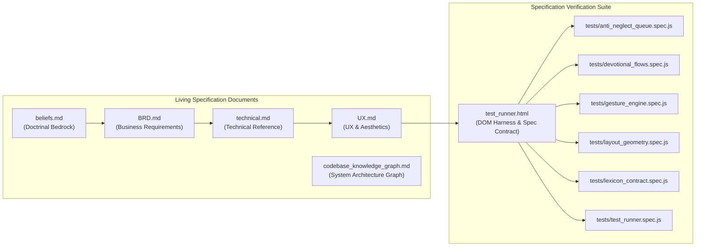
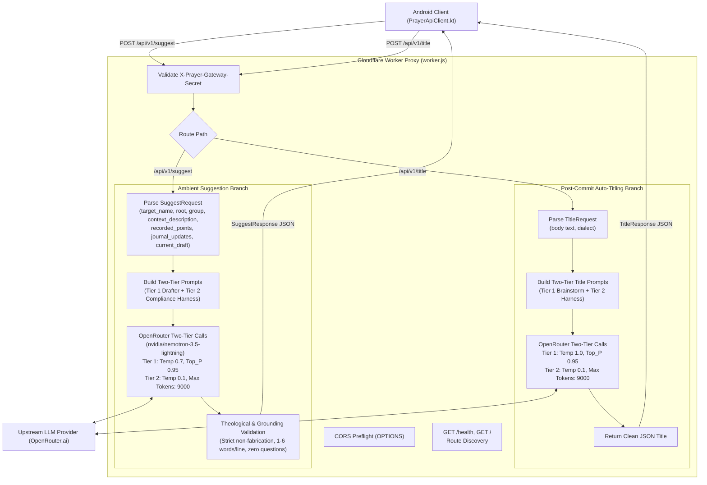
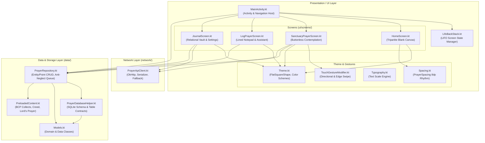
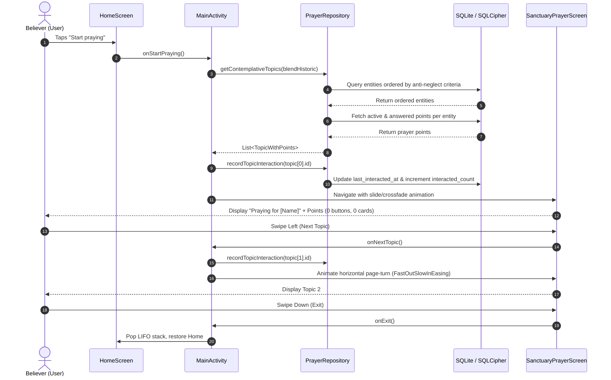
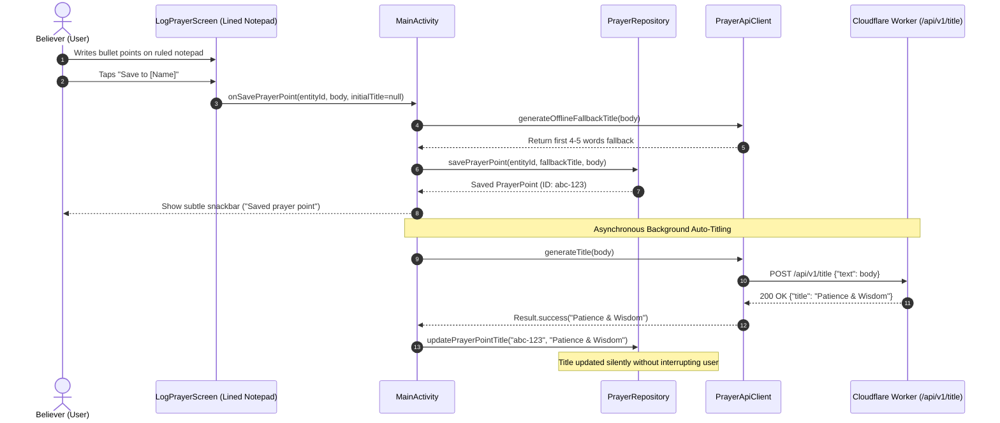
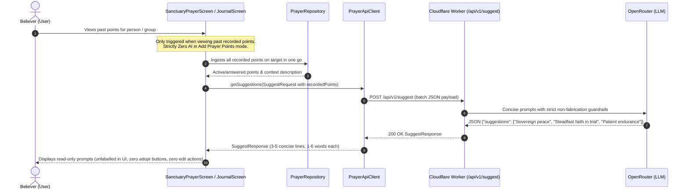

# Codebase Knowledge Graph & System Architecture Map

**Document:** [`planning/codebase_knowledge_graph.md`](file:///c:/Users/ianch/sourcecode/repos/Prayer/planning/codebase_knowledge_graph.md)  
**Status:** Living Architectural Blueprint & Dependency Graph  
**Application Title:** *Pray Without Ceasing* (1 Thessalonians 5:17)  
**Last Updated:** 2026-09-10  
**Doctrinal Bedrock:** Classical Reformed, Historic Anglican (1662 BCP), Heidelberg Catechism Q&A 1  
**Platform Scope:** Mobile Client (Android Kotlin + Jetpack Compose) & Edge API Proxy (Cloudflare Worker)  

---

## 1. Overview & Architectural Topology

The *Pray Without Ceasing* repository is organized into three primary operational domains:

1. **Planning, Conceptualization & Product Specification ([`planning/`](file:///c:/Users/ianch/sourcecode/repos/Prayer/planning))**:
   The doctrinal, functional, technical, and UX contract repository. It holds the living doctrinal specifications, canonical journal design principles (`android_journal_design_principles.md`, read-only for agents, added later), and the automated browser-based layout and gesture contract test suite.
2. **AI Agent API Production Engine ([`api/`](file:///c:/Users/ianch/sourcecode/repos/Prayer/api))**:
   A zero-cost, stateless Cloudflare Worker serverless edge proxy that interfaces anonymously with upstream LLM inference providers (OpenRouter) with strict Reformed theological guardrails, budget hard ceilings, and dual execution branches (Ambient Grounded Suggestions & Post-Commit Auto-Titling).
3. **Native Android Production Client ([`android/`](file:///c:/Users/ianch/sourcecode/repos/Prayer/android))**:
   An offline-first, encrypted (Room / SQLCipher) mobile client implemented in Kotlin and Jetpack Compose adhering to an austere Material 3 0dp planar geometry, buttonless swipe gesture mechanics, and an anti-neglect intercession queue.



---

## 2. Ontological & Doctrinal Knowledge Graph

The application architecture enforces strict theological, ontological, and lexical invariants across all tiers.



### 2.1 Confessional Guardrails & Doctrinal Invariants

All AI prompts, client UI strings, and database models are bound by the following confessional rules:

| Doctrinal Invariant | Architectural Enforcement Point | System Guarantee |
| :--- | :--- | :--- |
| **Exclusivity of Christ (*Solus Christus*)** | [`api/prompts/PROMPT_THEOLOGY.txt`](file:///c:/Users/ianch/sourcecode/repos/Prayer/api/prompts/PROMPT_THEOLOGY.txt), [`TheologicalGuardrailsTest.kt`](file:///c:/Users/ianch/sourcecode/repos/Prayer/android/app/src/test/java/au/prayer/app/TheologicalGuardrailsTest.kt) | Prayers directed exclusively to God in the name of Jesus Christ; zero saint, relic, Mary, or angelic intercession. |
| **Sovereignty of God (*Soli Deo Gloria*)** | [`api/prompts/PROMPT_THEOLOGY.txt`](file:///c:/Users/ianch/sourcecode/repos/Prayer/api/prompts/PROMPT_THEOLOGY.txt), [`api/worker.js`](file:///c:/Users/ianch/sourcecode/repos/Prayer/api/worker.js) | Complete rejection of prosperity dogmas, word-faith decrees, positive manifestation, and bargaining. |
| **Heidelberg Catechism Q&A 1 Comfort** | [`api/prompts/PROMPT_THEOLOGY.txt`](file:///c:/Users/ianch/sourcecode/repos/Prayer/api/prompts/PROMPT_THEOLOGY.txt) | Suffering and anxiety framed in Christ's ownership, Father's sovereign preservation, and Holy Spirit assurance. |
| **Believer's Agency (Ambient Assistant)** | [`api/prompts/PROMPT_PERSONA.txt`](file:///c:/Users/ianch/sourcecode/repos/Prayer/api/prompts/PROMPT_PERSONA.txt), [`PROMPT_SUGGESTION_FLOW.txt`](file:///c:/Users/ianch/sourcecode/repos/Prayer/api/prompts/PROMPT_SUGGESTION_FLOW.txt) | AI operates silently in the background; zero questions and zero chat; provides telegraphic suggested prayer points; never writes actual prayers addressing God ("Dear Lord..."). |
| **Strict Non-Fabrication (Prohibition of Presumed Burdens)** | [`api/prompts/PROMPT_SUGGESTION_FLOW.txt`](file:///c:/Users/ianch/sourcecode/repos/Prayer/api/prompts/PROMPT_SUGGESTION_FLOW.txt), [`api/worker.js`](file:///c:/Users/ianch/sourcecode/repos/Prayer/api/worker.js) | AI shall never make up content or invent unstated trials, surgeries, or crises if existing data is limited; strictly grounded in recorded target context. |
| **Batch Target Context Ingestion** | [`api/worker.js`](file:///c:/Users/ianch/sourcecode/repos/Prayer/api/worker.js), [`PrayerApiClient.kt`](file:///c:/Users/ianch/sourcecode/repos/Prayer/android/app/src/main/java/au/prayer/app/network/PrayerApiClient.kt) | All recorded user data on the target is passed to the AI in one go (not line by line) via `POST /api/v1/suggest`. |
| **Prohibition of Ordinal / Sequential Badges** | [`planning/UX.md`](file:///c:/Users/ianch/sourcecode/repos/Prayer/planning/UX.md), [`LexiconContractTest.kt`](file:///c:/Users/ianch/sourcecode/repos/Prayer/android/app/src/test/java/au/prayer/app/LexiconContractTest.kt) | Never code or display generic ordinal labels (*Point 1*, *Point 2*, *Item 1 of N*); prayer points are sacred burdens. |
| **Minimal Contextual Data Exposure** | [`planning/BRD.md`](file:///c:/Users/ianch/sourcecode/repos/Prayer/planning/BRD.md), [`SanctuaryPrayerScreen.kt`](file:///c:/Users/ianch/sourcecode/repos/Prayer/android/app/src/main/java/au/prayer/app/ui/screens/SanctuaryPrayerScreen.kt) | Internal progression counters, queue tallies, and root tags are suppressed from devotional presentation. |
| **Personal Privacy & Confidentiality** | [`api/prompts/PROMPT_TAXONOMY_PRIVACY.txt`](file:///c:/Users/ianch/sourcecode/repos/Prayer/api/prompts/PROMPT_TAXONOMY_PRIVACY.txt), [`PrayerApiClient.kt`](file:///c:/Users/ianch/sourcecode/repos/Prayer/android/app/src/main/java/au/prayer/app/network/PrayerApiClient.kt) | Entity names are masked locally before transmission; entity resolution remains 100% on-device. |

---

## 3. Subsystem Deep Dive: Planning & Contracts (`planning/`)

The [`planning/`](file:///c:/Users/ianch/sourcecode/repos/Prayer/planning) folder houses the specifications and layout verification suites.



### 3.1 Document Matrix
- **[`beliefs.md`](file:///c:/Users/ianch/sourcecode/repos/Prayer/planning/beliefs.md)**: Establishes confessional commitments, 1662 BCP liturgical roots, the Heidelberg Q1 comfort model, and explicit prohibitions against prosperity gospel, saintly intercession, and AI prayer generation.
- **[`BRD.md`](file:///c:/Users/ianch/sourcecode/repos/Prayer/planning/BRD.md)**: Product scope, target audience (<100 users, personal distribution), 3-choice home canvas, passive prayer mode, lined notepad entry with pushed-down assistant, and $5/month operational budget ceiling.
- **[`technical.md`](file:///c:/Users/ianch/sourcecode/repos/Prayer/planning/technical.md)**: SQLCipher database schema, zero-leakage API key security, Cloudflare Worker proxy specs, OkHttp client configurations, and anti-neglect queue balancing logic.
- **[`UX.md`](file:///c:/Users/ianch/sourcecode/repos/Prayer/planning/UX.md)**: Material 3 0dp planar geometry, 8dp spacing tokens (`PrayerSpacing`), buttonless smartphone swipe navigation, LIFO back stack transitions, Morning Light vs Quiet Night visual modes, and sacred terminology lexicon.

### 3.2 Automated Specification Verification (`planning/tests/`)
Driven by Playwright, validating the specification contracts directly against [`test_runner.html`](file:///c:/Users/ianch/sourcecode/repos/Prayer/planning/test_runner.html):
- **`layout_geometry.spec.js`**: Enforces `border-radius: 0px`, 0px gutters/margins between adjacent tiles, 1px hairline seams, and full-screen buttonless sanctuary layout.
- **`gesture_engine.spec.js`**: Validates horizontal swipes (advance/previous topic), vertical swipe down (exit sanctuary), and left edge-swipe right LIFO back stack navigation.
- **`anti_neglect_queue.spec.js`**: Proves FIFO topic rotation sorted by least recently prayed and lowest interaction counts.
- **`lexicon_contract.spec.js`**: Validates zero occurrences of forbidden engineering jargon (*target*, *entity*, *commit*, *ticket*, *Point 1*, *Point 2*).
- **`devotional_flows.spec.js`**: Exercises end-to-end user journeys from blank launch to prayer, notepad writing, and journal management.

---

## 4. Subsystem Deep Dive: AI Agent API (`api/`)

The [`api/`](file:///c:/Users/ianch/sourcecode/repos/Prayer/api) directory contains the production serverless proxy deployed on Cloudflare Workers.



### 4.1 Modular Prompts & System Assembly
The system prompt is organized under [`api/prompts/`](file:///c:/Users/ianch/sourcecode/repos/Prayer/api/prompts) and compiled into [`api/system_prompt.txt`](file:///c:/Users/ianch/sourcecode/repos/Prayer/api/system_prompt.txt):
- **[`PROMPT_PERSONA.txt`](file:///c:/Users/ianch/sourcecode/repos/Prayer/api/prompts/PROMPT_PERSONA.txt)**: Concise distillation engine; zero therapeutic filler, zero artificial empathy.
- **[`PROMPT_SUGGESTION_FLOW.txt`](file:///c:/Users/ianch/sourcecode/repos/Prayer/api/prompts/PROMPT_SUGGESTION_FLOW.txt)**: Ambient suggestion rules; strictly no questions; no conversational chat; batch target context ingestion; 1–6 words per line; strictly grounded in recorded target data; strict non-fabrication when data is limited.
- **[`PROMPT_THEOLOGY.txt`](file:///c:/Users/ianch/sourcecode/repos/Prayer/api/prompts/PROMPT_THEOLOGY.txt)**: Reformed confessional guardrails; Solus Christus; Heidelberg Q1 comfort; prayer for unbelievers focused on repentance/faith; strict prohibition against composing actual prayers.
- **[`PROMPT_TAXONOMY_PRIVACY.txt`](file:///c:/Users/ianch/sourcecode/repos/Prayer/api/prompts/PROMPT_TAXONOMY_PRIVACY.txt)**: Four root mapping rules (`PEOPLE`, `GROUPS`, `GENERAL`, `MISSION_PARTNERS`); personal prayer points under `PEOPLE` (*Me*); single-root invariant; on-device entity privacy masking.
- **[`PROMPT_CARD_STYLE.txt`](file:///c:/Users/ianch/sourcecode/repos/Prayer/api/prompts/PROMPT_CARD_STYLE.txt)**: Suggested prayer point line structure: strictly 1 to 6 words per line; telegraphic scannable fragments; no preamble; zero ordinal tags.
- **[`PROMPT_OUTPUT_SCHEMA.txt`](file:///c:/Users/ianch/sourcecode/repos/Prayer/api/prompts/PROMPT_OUTPUT_SCHEMA.txt)**: Strict JSON output schema matching wire format `{"suggestions": ["line 1", "line 2", ...]}`.

### 4.2 AI API Testing Policy: Strict Prohibition & Offline Validation
- **No Live API Tests**: All automated test scripts, 100-request benchmark suites, and interactive CLI test clients against the AI API/OpenRouter proxy have been completely removed from the repository.
- **Mandatory Prohibition**: Agents and developers must never execute automated test requests against the production Cloudflare Worker or OpenRouter upstream to prevent token consumption and unwanted cost.
- **Offline Doctrinal & Schema Verification**: Guardrail enforcement and schema verification are handled statically via `system_prompt.txt` architecture and offline Android JVM unit tests (`TheologicalGuardrailsTest.kt`, `PrayerApiClientTest.kt`).

---

## 5. Subsystem Deep Dive: Native Android Client (`android/`)

The native mobile app is structured using standard clean architecture principles for modern Android with Kotlin and Jetpack Compose.



### 5.1 Component Inventory & Class Responsibilities

#### Presentation Layer (`au.prayer.app.ui`)
- **[`MainActivity.kt`](file:///c:/Users/ianch/sourcecode/repos/Prayer/android/app/src/main/java/au/prayer/app/MainActivity.kt)**: Root activity. Initializes `PrayerDatabaseHelper`, `PrayerRepository`, and `PrayerApiClient`. Hosts the `LifoBackStack` and renders directional slide/fade transitions via `AnimatedContent`. Launches asynchronous background auto-titling after prayer point committal.
- **[`components/LinedNotepad.kt`](file:///c:/Users/ianch/sourcecode/repos/Prayer/android/app/src/main/java/au/prayer/app/ui/components/LinedNotepad.kt)**: Authentic ruled paper notepad component featuring horizontal ruled lines and a subtle vertical margin line (36dp offset), auto-bulleting (`• `), and integration with standard Compose `TextFieldValue`.
- **[`screens/HomeScreen.kt`](file:///c:/Users/ianch/sourcecode/repos/Prayer/android/app/src/main/java/au/prayer/app/ui/screens/HomeScreen.kt)**: Renders the tripartite launch screen: **Start praying**, **Open Journal**, and **Add prayer points**. Uses elevated planar cards (`elevationCard = 2.dp`) with subtle borders and 0dp right angles.
- **[`screens/SanctuaryPrayerScreen.kt`](file:///c:/Users/ianch/sourcecode/repos/Prayer/android/app/src/main/java/au/prayer/app/ui/screens/SanctuaryPrayerScreen.kt)**: Full-screen buttonless prayer mode. Displays solely `Praying for [Name]`, followed by unadorned prayer points wrapped in subtle planar cards (`elevationSubtle = 1.dp`), expandable answered prayers, and an asynchronous read-only AI prompts card when past points exist (strictly unlabelled in the UI). Employs `TouchGestureModifier` for swipe navigation and responsive touch zones.
- **[`screens/LogPrayerScreen.kt`](file:///c:/Users/ianch/sourcecode/repos/Prayer/android/app/src/main/java/au/prayer/app/ui/screens/LogPrayerScreen.kt)**: Handles typing-first prayer point addition with **strictly zero AI assistance**. Users draft unencumbered on an authentic lined ruled notepad with auto-bulleting (`• `) and select/create a target entity. Pushes direct single-tap saving with Undo toast.
- **[`screens/JournalScreen.kt`](file:///c:/Users/ianch/sourcecode/repos/Prayer/android/app/src/main/java/au/prayer/app/ui/screens/JournalScreen.kt)**: Directory view of all people, groups, general topics, and mission partners. Opens directly to collapsible accordion menus for `People`, `Groups`, `General`, and `Mission Partners` directly surfacing active lists for immediate selection; selecting an entity opens their Entity Detail screen with prayer points, one-click editing, and asynchronous read-only AI prompts (strictly unlabelled in the UI). Also hosts sequestered application settings.
- **[`gestures/TouchGestureModifier.kt`](file:///c:/Users/ianch/sourcecode/repos/Prayer/android/app/src/main/java/au/prayer/app/ui/gestures/TouchGestureModifier.kt)**: High-precision pointer gesture detector. Distinguishes horizontal swipes ($\Delta X \ge 50\text{dp}$), vertical dismiss swipes ($\Delta Y \ge 50\text{dp}$), and left edge-swipe right navigation ($X_{start} \le 25\text{dp}$).
- **[`navigation/LifoBackStack.kt`](file:///c:/Users/ianch/sourcecode/repos/Prayer/android/app/src/main/java/au/prayer/app/ui/navigation/LifoBackStack.kt)**: LIFO navigation stack ensuring predictable, sequential back navigation across screen states.
- **[`theme/Theme.kt`](file:///c:/Users/ianch/sourcecode/repos/Prayer/android/app/src/main/java/au/prayer/app/ui/theme/Theme.kt)**: Material 3 theme configuration enforcing `FlatSquareShape` (`RoundedCornerShape(0.dp)`) across all M3 components. Defines high-contrast monochrome palettes with tonal container levels (`surface`, `surfaceSubtle`, `surfaceElevated`, `borderSubtle`, `borderStrong`).
- **[`theme/Spacing.kt`](file:///c:/Users/ianch/sourcecode/repos/Prayer/android/app/src/main/java/au/prayer/app/ui/theme/Spacing.kt)**: Design tokens adhering to an 8dp spacing rhythm (`PrayerSpacing`), including elevation hierarchy (`elevationNone`, `elevationSubtle`, `elevationCard`, `elevationFloating`, `elevationModal`) and `cardMargin`.
- **[`theme/Typography.kt`](file:///c:/Users/ianch/sourcecode/repos/Prayer/android/app/src/main/java/au/prayer/app/ui/theme/Typography.kt)**: Dynamic typography scaling supporting `LARGE`, `REGULAR`, and `COMPACT` modes with high-legibility sans-serif styles.

#### Data & Local Persistence Layer (`au.prayer.app.data`)
- **[`local/PrayerDatabaseHelper.kt`](file:///c:/Users/ianch/sourcecode/repos/Prayer/android/app/src/main/java/au/prayer/app/data/local/PrayerDatabaseHelper.kt)**: SQLite helper configuring tables (`entities`, `points`, `app_config`), column schemas, foreign key indices, and initial preloaded seed injection.
- **[`local/PrayerRepository.kt`](file:///c:/Users/ianch/sourcecode/repos/Prayer/android/app/src/main/java/au/prayer/app/data/local/PrayerRepository.kt)**: Encapsulates database transactions. Implements the **Anti-Neglect Devotional Queue Algorithm**:
  ```sql
  SELECT e.* FROM entities e
  WHERE e.is_historic = 0
  AND EXISTS (
      SELECT 1 FROM points p 
      WHERE p.entity_id = e.id 
      AND p.status IN ('ACTIVE', 'HISTORIC')
  )
  ORDER BY 
      e.last_interacted_at IS NOT NULL ASC,
      e.last_interacted_at ASC,
      e.interacted_count ASC,
      RANDOM()
  ```
- **[`models/Models.kt`](file:///c:/Users/ianch/sourcecode/repos/Prayer/android/app/src/main/java/au/prayer/app/data/models/Models.kt)**: Domain entities (`RootCode`, `PrayerStatus`, `LocaleDialect`, `ThemeMode`, `TextScale`, `IndividualEntity`, `PrayerPoint`, `TopicWithPoints`, `AppConfig`).
- **[`models/PreloadedContent.kt`](file:///c:/Users/ianch/sourcecode/repos/Prayer/android/app/src/main/java/au/prayer/app/data/models/PreloadedContent.kt)**: Seed content comprising The Lord's Prayer, classic 1662 BCP collects, and the Apostles' Creed.

#### Network Layer (`au.prayer.app.network`)
- **[`network/PrayerApiClient.kt`](file:///c:/Users/ianch/sourcecode/repos/Prayer/android/app/src/main/java/au/prayer/app/network/PrayerApiClient.kt)**: OkHttp client connecting to the Cloudflare Worker proxy (`POST /api/v1/suggest`, `POST /api/v1/title`). Handles batch target context serialization, security header injection, and offline fallback title generation.

---

## 6. System Data & Control Flows

### 6.1 Contemplative Sanctuary Prayer Flow



### 6.2 Lined Notepad Entry & Asynchronous Auto-Titling



### 6.3 Read-Only AI Prompts Flow for Past Points



---

## 7. Quality & Verification Contract Mapping

The repository maintains two independent test suites guaranteeing identical behavior across specifications and native production code:


### 7.1 Cross-Cutting Verification Suite Matrix

| Contract / Feature | Planning Specification Test (`planning/tests/`) | Native Android Unit Test (`android/app/src/test/`) | Contract Guarantee |
| :--- | :--- | :--- | :--- |
| **0dp Planar Geometry** | `layout_geometry.spec.js` | [`LayoutGeometryTest.kt`](file:///c:/Users/ianch/sourcecode/repos/Prayer/android/app/src/test/java/au/prayer/app/LayoutGeometryTest.kt) | Every tile has `border-radius: 0dp`, 0px gutters, directly abutting 1px seams. |
| **Buttonless Sanctuary** | `layout_geometry.spec.js` | [`LayoutGeometryTest.kt`](file:///c:/Users/ianch/sourcecode/repos/Prayer/android/app/src/test/java/au/prayer/app/LayoutGeometryTest.kt) | Zero buttons, zero cards, zero borders in Sanctuary prayer mode. |
| **Swipe Gestures** | `gesture_engine.spec.js` | [`GestureEngineTest.kt`](file:///c:/Users/ianch/sourcecode/repos/Prayer/android/app/src/test/java/au/prayer/app/GestureEngineTest.kt) | Horizontal swipe advances/returns; vertical swipe exits; left edge-swipe right pops back stack. |
| **Anti-Neglect Queue** | `anti_neglect_queue.spec.js` | [`AntiNeglectQueueTest.kt`](file:///c:/Users/ianch/sourcecode/repos/Prayer/android/app/src/test/java/au/prayer/app/AntiNeglectQueueTest.kt) | Topics ordered by oldest `last_interacted_at` and lowest `interacted_count`. |
| **Lexicon Compliance** | `lexicon_contract.spec.js` | [`LexiconContractTest.kt`](file:///c:/Users/ianch/sourcecode/repos/Prayer/android/app/src/test/java/au/prayer/app/LexiconContractTest.kt) | Zero occurrences of *target*, *entity*, *commit*, *ticket*, *Point 1*, *Point 2*. |
| **Devotional Flows** | `devotional_flows.spec.js` | [`DevotionalFlowsTest.kt`](file:///c:/Users/ianch/sourcecode/repos/Prayer/android/app/src/test/java/au/prayer/app/DevotionalFlowsTest.kt) | End-to-end coverage: blank start, note capture, journal management, topic progression. |
| **LIFO Back Stack** | N/A (State Machine) | [`LifoBackStackTest.kt`](file:///c:/Users/ianch/sourcecode/repos/Prayer/android/app/src/test/java/au/prayer/app/LifoBackStackTest.kt) | LIFO push/pop mechanics, root preservation, empty-stack safety. |
| **Data Serialization** | N/A | [`DataModelsTest.kt`](file:///c:/Users/ianch/sourcecode/repos/Prayer/android/app/src/test/java/au/prayer/app/DataModelsTest.kt) | Wire JSON serialization/deserialization for entities, points, configs, and payloads. |
| **API Client & Networking** | N/A | [`PrayerApiClientTest.kt`](file:///c:/Users/ianch/sourcecode/repos/Prayer/android/app/src/test/java/au/prayer/app/PrayerApiClientTest.kt) | OkHttp serialization, timeout enforcement, fallback title generation. |
| **Theological Guardrails** | N/A (Tested in `api/test/`) | [`TheologicalGuardrailsTest.kt`](file:///c:/Users/ianch/sourcecode/repos/Prayer/android/app/src/test/java/au/prayer/app/TheologicalGuardrailsTest.kt) | Verifies Solus Christus, rejection of prosperity/saints, and absence of direct AI prayer text. |

---

## 8. Complete File & Dependency Mapping Matrix

| Relative Path | Architectural Layer | Primary Responsibility | Direct Upstream Dependencies | Primary Downstream Consumers |
| :--- | :--- | :--- | :--- | :--- |
| **[`AGENTS.md`](file:///c:/Users/ianch/sourcecode/repos/Prayer/AGENTS.md)** | Root Governance | Workspace protocol, reading prerequisites, synchronization rules | Universal | All Agents & Developers |
| **[`planning/beliefs.md`](file:///c:/Users/ianch/sourcecode/repos/Prayer/planning/beliefs.md)** | Specification / Theology | Doctrinal foundation, confessional standards, prayer theology | Historic Formularies | `BRD.md`, `technical.md`, `UX.md`, `system_prompt.txt` |
| **[`planning/BRD.md`](file:///c:/Users/ianch/sourcecode/repos/Prayer/planning/BRD.md)** | Specification / Product | Business requirements, MVP scope, core features | `beliefs.md` | `technical.md`, `UX.md`, Android App |
| **[`planning/technical.md`](file:///c:/Users/ianch/sourcecode/repos/Prayer/planning/technical.md)** | Specification / Tech | System architecture, SQLCipher schema, proxy specs | `beliefs.md`, `BRD.md` | `worker.js`, `PrayerRepository.kt`, `PrayerApiClient.kt` |
| **[`planning/UX.md`](file:///c:/Users/ianch/sourcecode/repos/Prayer/planning/UX.md)** | Specification / Design | Planar 0dp aesthetics, gestures, lexicon, motion tokens | `beliefs.md`, `BRD.md` | `Theme.kt`, `Spacing.kt`, `TouchGestureModifier.kt` |
| **`android_journal_design_principles.md`** | Canonical Spec / Design | Immutable design principles for Android journal (Strictly read-only; added later) | User-authored | All Agents, `JournalScreen.kt` |
| **[`api/worker.js`](file:///c:/Users/ianch/sourcecode/repos/Prayer/api/worker.js)** | AI API / Edge Proxy | Multi-route Cloudflare Worker router & inference proxy | `system_prompt.txt`, OpenRouter API | `PrayerApiClient.kt` |
| **[`api/wrangler.jsonc`](file:///c:/Users/ianch/sourcecode/repos/Prayer/api/wrangler.jsonc)** | AI API / Deployment | Cloudflare Workers deployment configuration | Cloudflare CLI | Cloudflare Edge Runtime |
| **[`api/system_prompt.txt`](file:///c:/Users/ianch/sourcecode/repos/Prayer/api/system_prompt.txt)** | AI API / Prompt | Authoritative compiled system prompt | `beliefs.md`, `BRD.md` | `worker.js` |
| **[`android/app/src/main/java/au/prayer/app/MainActivity.kt`](file:///c:/Users/ianch/sourcecode/repos/Prayer/android/app/src/main/java/au/prayer/app/MainActivity.kt)** | Android / Activity | Root activity, lifecycle, LIFO navigation, auto-titling | `PrayerRepository`, `LifoBackStack`, `Theme` | Android OS |
| **[`android/app/src/main/java/au/prayer/app/ui/screens/HomeScreen.kt`](file:///c:/Users/ianch/sourcecode/repos/Prayer/android/app/src/main/java/au/prayer/app/ui/screens/HomeScreen.kt)** | Android / Screen | Tripartite home launch screen | `Theme.kt`, `Spacing.kt` | `MainActivity.kt` |
| **[`android/app/src/main/java/au/prayer/app/ui/screens/SanctuaryPrayerScreen.kt`](file:///c:/Users/ianch/sourcecode/repos/Prayer/android/app/src/main/java/au/prayer/app/ui/screens/SanctuaryPrayerScreen.kt)** | Android / Screen | Buttonless full-screen prayer mode with read-only AI prompts (unlabelled in UI) | `TouchGestureModifier.kt`, `Theme.kt`, `PrayerApiClient.kt` | `MainActivity.kt` |
| **[`android/app/src/main/java/au/prayer/app/ui/screens/LogPrayerScreen.kt`](file:///c:/Users/ianch/sourcecode/repos/Prayer/android/app/src/main/java/au/prayer/app/ui/screens/LogPrayerScreen.kt)** | Android / Screen | Ruled lined notepad, zero AI assistance, single-tap save | `Theme.kt`, `Spacing.kt` | `MainActivity.kt` |
| **[`android/app/src/main/java/au/prayer/app/ui/screens/JournalScreen.kt`](file:///c:/Users/ianch/sourcecode/repos/Prayer/android/app/src/main/java/au/prayer/app/ui/screens/JournalScreen.kt)** | Android / Screen | Journal directory, prayer point editing, read-only AI prompts (unlabelled in UI) | `Theme.kt`, `Models.kt`, `PrayerApiClient.kt` | `MainActivity.kt` |
| **[`android/app/src/main/java/au/prayer/app/ui/gestures/TouchGestureModifier.kt`](file:///c:/Users/ianch/sourcecode/repos/Prayer/android/app/src/main/java/au/prayer/app/ui/gestures/TouchGestureModifier.kt)** | Android / Gestures | High-precision swipe and edge-swipe detection | Android Compose Pointer API | `SanctuaryPrayerScreen.kt`, `JournalScreen.kt` |
| **[`android/app/src/main/java/au/prayer/app/ui/navigation/LifoBackStack.kt`](file:///c:/Users/ianch/sourcecode/repos/Prayer/android/app/src/main/java/au/prayer/app/ui/navigation/LifoBackStack.kt)** | Android / Navigation | LIFO screen state manager | Kotlin Collections | `MainActivity.kt` |
| **[`android/app/src/main/java/au/prayer/app/ui/theme/Theme.kt`](file:///c:/Users/ianch/sourcecode/repos/Prayer/android/app/src/main/java/au/prayer/app/ui/theme/Theme.kt)** | Android / Theming | `FlatSquareShape` (0dp), monochrome color schemes | Material 3 Compose | All Screens |
| **[`android/app/src/main/java/au/prayer/app/ui/theme/Spacing.kt`](file:///c:/Users/ianch/sourcecode/repos/Prayer/android/app/src/main/java/au/prayer/app/ui/theme/Spacing.kt)** | Android / Theming | `PrayerSpacing` 8dp grid spacing tokens | Compose Dp | All Screens |
| **[`android/app/src/main/java/au/prayer/app/ui/theme/Typography.kt`](file:///c:/Users/ianch/sourcecode/repos/Prayer/android/app/src/main/java/au/prayer/app/ui/theme/Typography.kt)** | Android / Theming | Multi-scale typographic hierarchies | Compose Typography | All Screens |
| **[`android/app/src/main/java/au/prayer/app/data/local/PrayerDatabaseHelper.kt`](file:///c:/Users/ianch/sourcecode/repos/Prayer/android/app/src/main/java/au/prayer/app/data/local/PrayerDatabaseHelper.kt)** | Android / Database | SQLite schema definition and table creation | Android SQLite | `PrayerRepository.kt` |
| **[`android/app/src/main/java/au/prayer/app/data/local/PrayerRepository.kt`](file:///c:/Users/ianch/sourcecode/repos/Prayer/android/app/src/main/java/au/prayer/app/data/local/PrayerRepository.kt)** | Android / Repository | CRUD operations, Anti-Neglect queue query | `PrayerDatabaseHelper.kt`, `Models.kt` | `MainActivity.kt` |
| **[`android/app/src/main/java/au/prayer/app/data/models/Models.kt`](file:///c:/Users/ianch/sourcecode/repos/Prayer/android/app/src/main/java/au/prayer/app/data/models/Models.kt)** | Android / Domain Models | Enums and data classes | Kotlinx Serialization | Repository, API Client, UI |
| **[`android/app/src/main/java/au/prayer/app/data/models/PreloadedContent.kt`](file:///c:/Users/ianch/sourcecode/repos/Prayer/android/app/src/main/java/au/prayer/app/data/models/PreloadedContent.kt)** | Android / Seed Data | Historic Reformed collects, creeds, Lord's prayer | `Models.kt` | `PrayerDatabaseHelper.kt`, `PrayerRepository.kt` |
| **[`android/app/src/main/java/au/prayer/app/network/PrayerApiClient.kt`](file:///c:/Users/ianch/sourcecode/repos/Prayer/android/app/src/main/java/au/prayer/app/network/PrayerApiClient.kt)** | Android / Network | OkHttp client, wire payloads (`suggest`, `title`), fallback | OkHttp, Kotlinx Serialization | `MainActivity.kt`, `SanctuaryPrayerScreen.kt`, `JournalScreen.kt` |
