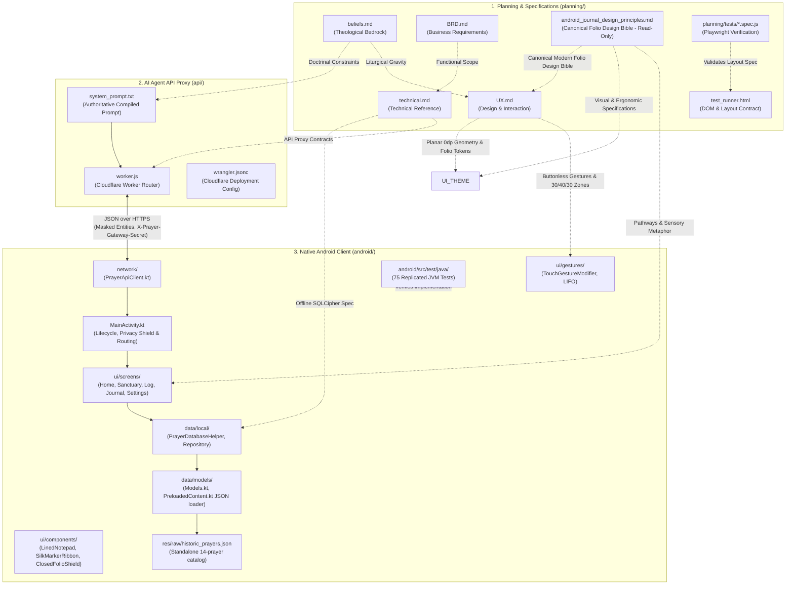
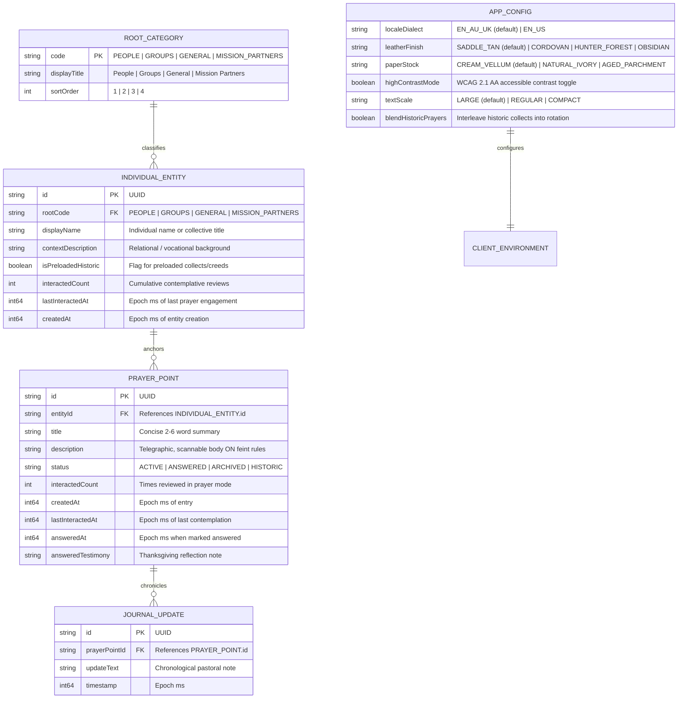
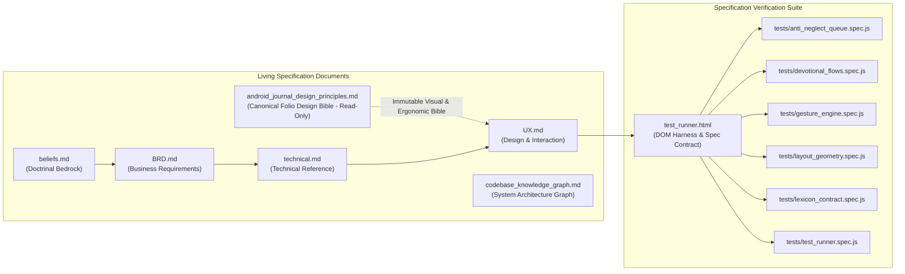
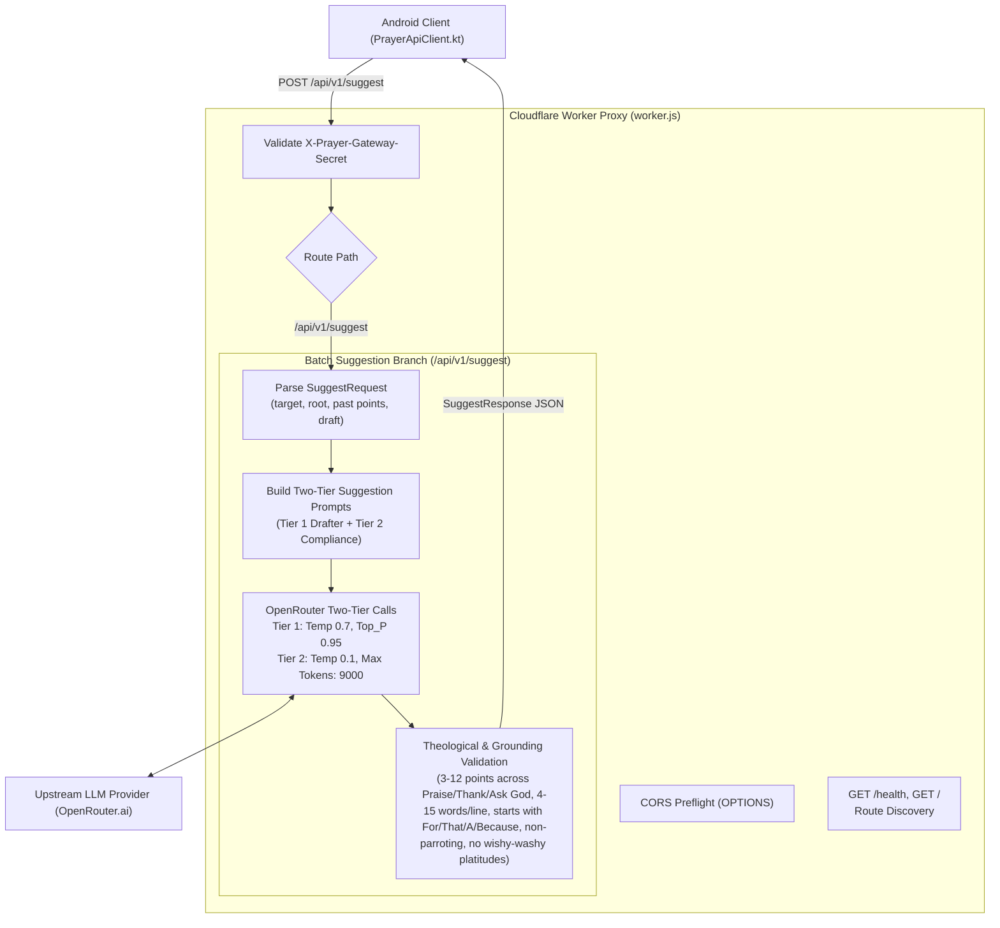
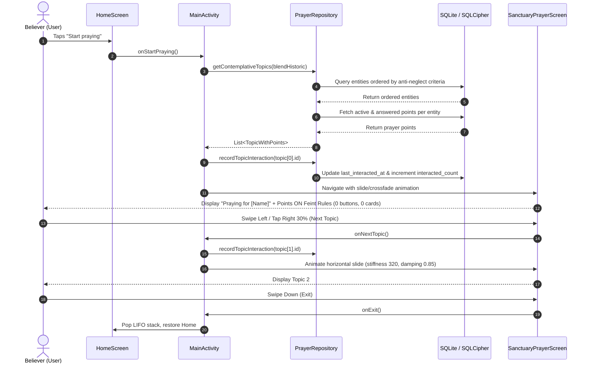
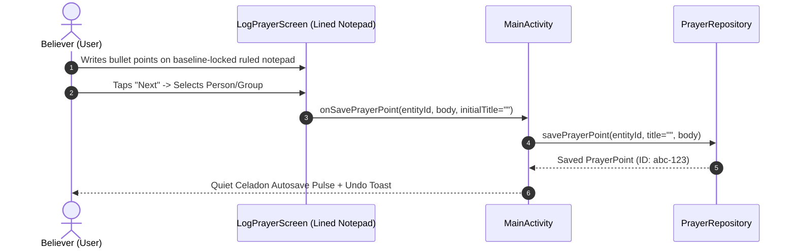
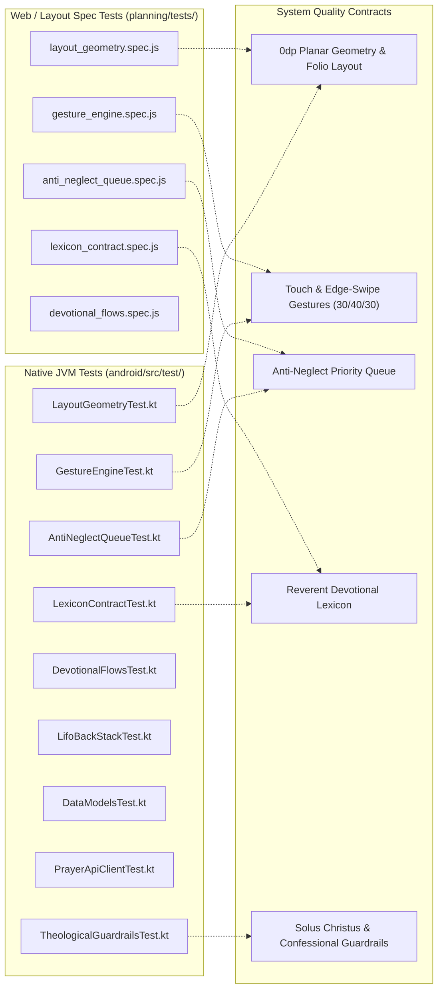

# Codebase Knowledge Graph & System Architecture Map

**Document:** [`planning/codebase_knowledge_graph.md`](file:///c:/Users/ianch/sourcecode/repos/Prayer/planning/codebase_knowledge_graph.md)  
**Status:** Living Architectural Blueprint & Dependency Graph  
**Application Title:** *Pray Without Ceasing* (1 Thessalonians 5:17)  
**Last Updated:** 2026-09-11  
**Doctrinal Bedrock:** Classical Reformed, Historic Anglican (1662 BCP), Heidelberg Catechism Q&A 1  
**Design Bedrock:** Modern Leatherbound Craft (The Modern Folio) defined in [`planning/android_journal_design_principles.md`](file:///c:/Users/ianch/sourcecode/repos/Prayer/planning/android_journal_design_principles.md) (Strictly read-only)  
**Platform Scope:** Mobile Client (Android Kotlin + Jetpack Compose) & Edge API Proxy (Cloudflare Worker)  

---

## 1. Overview & Architectural Topology

The *Pray Without Ceasing* repository is organized into three primary operational domains:

1. **Planning, Conceptualization & Product Specification ([`planning/`](file:///c:/Users/ianch/sourcecode/repos/Prayer/planning))**:
   The doctrinal, functional, technical, and UX contract repository. It holds living doctrinal specifications (`beliefs.md`), business requirements (`BRD.md`), technical reference (`technical.md`), UX specifications (`UX.md`), the immutable visual design bible ([`android_journal_design_principles.md`](file:///c:/Users/ianch/sourcecode/repos/Prayer/planning/android_journal_design_principles.md)), and the automated browser-based layout and gesture contract test suite.
2. **AI Agent API Production Engine ([`api/`](file:///c:/Users/ianch/sourcecode/repos/Prayer/api))**:
   A zero-cost, stateless Cloudflare Worker serverless edge proxy that interfaces anonymously with upstream LLM inference providers (OpenRouter) with strict Reformed theological guardrails, budget hard ceilings ($5.00/mo), and dual execution branches (Ambient Grounded Suggestions & Post-Commit Auto-Titling).
3. **Native Android Production Client ([`android/`](file:///c:/Users/ianch/sourcecode/repos/Prayer/android))**:
   An offline-first, encrypted (Room with SQLCipher) mobile client implemented in Kotlin and Jetpack Compose adhering to the Modern Leatherbound Folio aesthetic, 0dp planar geometry, 8dp spacing rhythm, dual-engine typography, baseline-synchronized feint rules, buttonless swipe gesture mechanics, and an anti-neglect intercession queue.

---

## 2. Ontological & Doctrinal Knowledge Graph

The application architecture enforces strict theological, ontological, and lexical invariants across all tiers.

### 2.1 Confessional Guardrails & Doctrinal Invariants

| Doctrinal Invariant | Architectural Enforcement Point | System Guarantee |
| :--- | :--- | :--- |
| **Exclusivity of Christ (*Solus Christus*)** | [`api/prompts/PROMPT_THEOLOGY.txt`](file:///c:/Users/ianch/sourcecode/repos/Prayer/api/prompts/PROMPT_THEOLOGY.txt), [`TheologicalGuardrailsTest.kt`](file:///c:/Users/ianch/sourcecode/repos/Prayer/android/app/src/test/java/au/prayer/app/TheologicalGuardrailsTest.kt) | Prayers directed exclusively to God in the name of Jesus Christ; zero saint, relic, Mary, or angelic intercession. |
| **Sovereignty of God (*Soli Deo Gloria*)** | [`api/prompts/PROMPT_THEOLOGY.txt`](file:///c:/Users/ianch/sourcecode/repos/Prayer/api/prompts/PROMPT_THEOLOGY.txt), [`api/worker.js`](file:///c:/Users/ianch/sourcecode/repos/Prayer/api/worker.js) | Complete rejection of prosperity dogmas, word-faith decrees, positive manifestation, and bargaining. |
| **Heidelberg Catechism Q&A 1 Comfort** | [`api/prompts/PROMPT_THEOLOGY.txt`](file:///c:/Users/ianch/sourcecode/repos/Prayer/api/prompts/PROMPT_THEOLOGY.txt) | Suffering and anxiety framed in Christ's ownership, Father's sovereign preservation, and Holy Spirit assurance. |
| **Believer's Agency (Ambient Assistant)** | [`api/prompts/PROMPT_PERSONA.txt`](file:///c:/Users/ianch/sourcecode/repos/Prayer/api/prompts/PROMPT_PERSONA.txt), [`PROMPT_SUGGESTION_FLOW.txt`](file:///c:/Users/ianch/sourcecode/repos/Prayer/api/prompts/PROMPT_SUGGESTION_FLOW.txt) | AI operates silently in the background; zero questions and zero chat; provides telegraphic suggested prayer points; never writes actual prayers addressing God ("Dear Lord..."). |
| **Strict Non-Fabrication & Anti-Overfitting** | [`api/worker.js`](file:///c:/Users/ianch/sourcecode/repos/Prayer/api/worker.js), [`api/system_prompt.txt`](file:///c:/Users/ianch/sourcecode/repos/Prayer/api/system_prompt.txt) | AI shall never invent unstated trials, cancer, surgeries, or tragedies; strictly grounded in recorded target context and forbidden from copying or overfitting to few-shot prompt examples. |
| **Complete Grammatical Sentences (Never Cut Off)** | [`api/worker.js`](file:///c:/Users/ianch/sourcecode/repos/Prayer/api/worker.js) | Every suggested prompt must be a 100% complete, fully finished grammatical thought. Serverless proxy defensively strips dangling prepositions/conjunctions and condenses gracefully without blind truncation. |
| **Batch Target Context Ingestion** | [`api/worker.js`](file:///c:/Users/ianch/sourcecode/repos/Prayer/api/worker.js), [`PrayerApiClient.kt`](file:///c:/Users/ianch/sourcecode/repos/Prayer/android/app/src/main/java/au/prayer/app/network/PrayerApiClient.kt) | All recorded user data on the target is passed to the AI in one go (not line by line) via `POST /api/v1/suggest`. |
| **Modern Leatherbound Folio Metaphor** | [`android_journal_design_principles.md`](file:///c:/Users/ianch/sourcecode/repos/Prayer/planning/android_journal_design_principles.md), [`UX.md`](file:///c:/Users/ianch/sourcecode/repos/Prayer/planning/UX.md) | Structural metaphor of leatherbound notebook with fine ruled paper, warm vector casing, fine vellum canvas, archival inks, and silk marker ribbon. |
| **The Singular Folio Law** | [`android_journal_design_principles.md`](file:///c:/Users/ianch/sourcecode/repos/Prayer/planning/android_journal_design_principles.md), [`UX.md`](file:///c:/Users/ianch/sourcecode/repos/Prayer/planning/UX.md) | Single glare-free tactile theme (cream vellum + iron-gall ink) comfortable in daylight and bedside lamplight, eliminating day/night color inversion. |
| **The Baseline Synchronization Law** | [`android_journal_design_principles.md`](file:///c:/Users/ianch/sourcecode/repos/Prayer/planning/android_journal_design_principles.md), [`LinedNotepad.kt`](file:///c:/Users/ianch/sourcecode/repos/Prayer/android/app/src/main/java/au/prayer/app/ui/components/LinedNotepad.kt) | Ruled lines dynamically anchored to active typographic baselines (`28sp`); never static repeating background stripes. |
| **The 56dp Left Margin Track** | [`android_journal_design_principles.md`](file:///c:/Users/ianch/sourcecode/repos/Prayer/planning/android_journal_design_principles.md), [`UX.md`](file:///c:/Users/ianch/sourcecode/repos/Prayer/planning/UX.md) | Disciplined two-track layout: 56dp vertical margin rule for status notation pills and timestamps; 64dp narrative text inset. |
| **Universal 48dp Touch Target** | [`android_journal_design_principles.md`](file:///c:/Users/ianch/sourcecode/repos/Prayer/planning/android_journal_design_principles.md), [`UX.md`](file:///c:/Users/ianch/sourcecode/repos/Prayer/planning/UX.md) | Minimum `48 × 48dp` touch bounding box on all interactive elements (silk ribbon expanded to `48 × 56dp`). |
| **Devotional Prayer Touch Zoning** | [`android_journal_design_principles.md`](file:///c:/Users/ianch/sourcecode/repos/Prayer/planning/android_journal_design_principles.md), [`SanctuaryPrayerScreen.kt`](file:///c:/Users/ianch/sourcecode/repos/Prayer/android/app/src/main/java/au/prayer/app/ui/screens/SanctuaryPrayerScreen.kt) | Left 30% (previous), Right 30% (next), Center 40% (reading & in-place status resolution). |
| **Prohibition of Ordinal / Sequential Badges** | [`planning/UX.md`](file:///c:/Users/ianch/sourcecode/repos/Prayer/planning/UX.md), [`LexiconContractTest.kt`](file:///c:/Users/ianch/sourcecode/repos/Prayer/android/app/src/test/java/au/prayer/app/LexiconContractTest.kt) | Never code or display generic ordinal labels (*Point 1*, *Point 2*, *Item 1 of N*); prayer points are sacred burdens. |
| **Minimal Contextual Data Exposure** | [`planning/BRD.md`](file:///c:/Users/ianch/sourcecode/repos/Prayer/planning/BRD.md), [`SanctuaryPrayerScreen.kt`](file:///c:/Users/ianch/sourcecode/repos/Prayer/android/app/src/main/java/au/prayer/app/ui/screens/SanctuaryPrayerScreen.kt) | Internal progression counters, queue tallies, and root tags are suppressed from devotional presentation. |
| **Collapsed-by-Default Prayer Prompts** | [`beliefs.md`](file:///c:/Users/ianch/sourcecode/repos/Prayer/planning/beliefs.md), [`SanctuaryPrayerScreen.kt`](file:///c:/Users/ianch/sourcecode/repos/Prayer/android/app/src/main/java/au/prayer/app/ui/screens/SanctuaryPrayerScreen.kt), [`JournalScreen.kt`](file:///c:/Users/ianch/sourcecode/repos/Prayer/android/app/src/main/java/au/prayer/app/ui/screens/JournalScreen.kt) | AI prayer prompts are hidden and collapsed by default across sanctuary prayer and journal detail views, expanding only upon explicit user request. |
| **Closed Folio Privacy Shield** | [`android_journal_design_principles.md`](file:///c:/Users/ianch/sourcecode/repos/Prayer/planning/android_journal_design_principles.md), [`MainActivity.kt`](file:///c:/Users/ianch/sourcecode/repos/Prayer/android/app/src/main/java/au/prayer/app/MainActivity.kt) | Recent Apps task switcher view is shielded by a flat vector leather cover with embossed monogram seal. |
| **Historic Prayer AI Suppression** | [`SanctuaryPrayerScreen.kt`](file:///c:/Users/ianch/sourcecode/repos/Prayer/android/app/src/main/java/au/prayer/app/ui/screens/SanctuaryPrayerScreen.kt), [`JournalScreen.kt`](file:///c:/Users/ianch/sourcecode/repos/Prayer/android/app/src/main/java/au/prayer/app/ui/screens/JournalScreen.kt), [`PreloadedContent.kt`](file:///c:/Users/ianch/sourcecode/repos/Prayer/android/app/src/main/java/au/prayer/app/data/models/PreloadedContent.kt) | Entities with `isPreloadedHistoric = true` receive no AI prompt generation; these carry the prayers of the saints and need no AI augmentation. Subject header rendered as direct title (not "Praying for") in Sanctuary mode. |

---

## 3. Subsystem Deep Dive: Planning & Contracts (`planning/`)

### 3.1 Document Matrix
- **[`beliefs.md`](file:///c:/Users/ianch/sourcecode/repos/Prayer/planning/beliefs.md)**: Confessional commitments, 1662 BCP liturgical roots, Heidelberg Q1 comfort model, Modern Leatherbound Folio reverence, and prohibitions against prosperity gospel, saintly intercession, and AI prayer generation.
- **[`BRD.md`](file:///c:/Users/ianch/sourcecode/repos/Prayer/planning/BRD.md)**: Product scope, target audience (<100 users, personal distribution), 3-choice frontispiece, passive prayer mode, direct lined notepad entry, Modern Folio design system, and $5/month operational budget ceiling.
- **[`technical.md`](file:///c:/Users/ianch/sourcecode/repos/Prayer/planning/technical.md)**: SQLCipher database schema, zero-leakage API key security, Cloudflare Worker proxy specs, baseline-synchronized feint rules, 56dp margin track, universal 48dp touch targets, closed folio privacy shield, and anti-neglect queue balancing logic.
- **[`UX.md`](file:///c:/Users/ianch/sourcecode/repos/Prayer/planning/UX.md)**: Modern Leatherbound Folio aesthetic, The Singular Folio Law, Four Chromatic Tiers, dual-engine typography, baseline synchronization, 56dp margin track, silk marker ribbon tab, 30/40/30 devotional touch zones, LIFO back stack transitions, and sacred terminology lexicon.
- **[`android_journal_design_principles.md`](file:///c:/Users/ianch/sourcecode/repos/Prayer/planning/android_journal_design_principles.md)**: Authoritative visual design bible for the analog-inspired leather and paper Android journal (**Strictly Read-Only for agents**).

---

## 4. Subsystem Deep Dive: AI Agent API (`api/`)

---

## 5. Subsystem Deep Dive: Native Android Client (`android/`)

```mermaid
graph TD
    subgraph UI_Layer ["Presentation / UI Layer"]
        MAIN["MainActivity.kt<br/>(Activity & Navigation Host)"]
        LIFO["LifoBackStack.kt<br/>(LIFO Screen State Manager)"]
        
        subgraph Screens ["Screens (ui/screens/)"]
            HOME["HomeScreen.kt<br/>(Frontispiece Canvas)"]
            SANCTUARY["SanctuaryPrayerScreen.kt<br/>(Buttonless Contemplation, 30/40/30 Zones & Collapsed Prompts)"]
            LOG["LogPrayerScreen.kt<br/>(Lined Notepad Canvas & Assistant)"]
            JOURNAL["JournalScreen.kt<br/>(Relational Vault, Ribbon & Collapsed Prompts)"]
            SETTINGS["SettingsScreen.kt<br/>(Folio Preferences & Binding)"]
        end

        subgraph Components_Theme ["Components, Theme & Gestures"]
            THEME["Theme.kt<br/>(4 Chromatic Tiers, 4 Leather Finishes, High-Contrast AA)"]
            SPACING["Spacing.kt<br/>(56dp Margin, 64dp Inset, 8dp Grid)"]
            TYPO["Typography.kt<br/>(Dual-Engine Serif + Sans Scaling)"]
            GESTURES["TouchGestureModifier.kt<br/>(Directional & Edge Swipe)"]
            NOTEPAD["components/LinedNotepad.kt<br/>(Baseline-Locked Ruled Canvas)"]
            RIBBON["components/SilkMarkerRibbon.kt<br/>(Swallow-Tail Bookmark Tab)"]
            SHIELD["components/ClosedFolioShield.kt<br/>(Privacy Concealment Cover)"]
        end
    end

    subgraph Network_Layer ["Network Layer (network/)"]
        API_CLIENT["PrayerApiClient.kt<br/>(OkHttp, Serializer, Fallback)"]
    end

    subgraph Data_Layer ["Data & Storage Layer (data/)"]
        REPO["PrayerRepository.kt<br/>(Entity/Point CRUD, Anti-Neglect Queue, getHistoricEntities)"]
        DB_HELPER["PrayerDatabaseHelper.kt<br/>(SQLite Schema, DB v3 Migration, Multi-Entity Historic Seeding)"]
        MODELS["Models.kt<br/>(Domain & Data Classes)"]
        PRELOADED["PreloadedContent.kt<br/>(JSON catalog loader: parses res/raw/historic_prayers.json<br/>into 14 PreloadedHistoricTopic pairs:<br/>6 BCP/Creed + 8 Spurgeon pulpit prayers)"]
        RAW_HISTORIC["res/raw/historic_prayers.json<br/>(Standalone structured historic prayer catalog)"]
    end

    MAIN --> LIFO
    MAIN --> HOME
    MAIN --> SANCTUARY
    MAIN --> LOG
    MAIN --> JOURNAL
    MAIN --> SHIELD
    
    HOME --> THEME
    HOME --> SPACING
    SANCTUARY --> GESTURES
    SANCTUARY --> THEME
    SANCTUARY --> API_CLIENT
    LOG --> NOTEPAD
    LOG --> THEME
    JOURNAL --> THEME
    JOURNAL --> RIBBON
    JOURNAL --> API_CLIENT
    JOURNAL --> SETTINGS
    SETTINGS --> THEME

    MAIN --> REPO
    LOG --> REPO
    JOURNAL --> REPO
    SANCTUARY --> REPO

    REPO --> DB_HELPER
    REPO --> MODELS
    REPO --> PRELOADED
    DB_HELPER --> MODELS
    PRELOADED --> RAW_HISTORIC
```

---

## 6. System Data & Control Flows

### 6.1 Contemplative Sanctuary Prayer Flow

### 6.2 Lined Notepad Entry & Asynchronous Auto-Titling

---

## 7. Quality & Verification Contract Mapping

### 7.1 Cross-Cutting Verification Suite Matrix

| Contract / Feature | Planning Specification Test (`planning/tests/`) | Native Android Unit Test (`android/app/src/test/`) | Contract Guarantee |
| :--- | :--- | :--- | :--- |
| **0dp Planar Geometry & Folio Layout** | `layout_geometry.spec.js` | [`LayoutGeometryTest.kt`](file:///c:/Users/ianch/sourcecode/repos/Prayer/android/app/src/test/java/au/prayer/app/LayoutGeometryTest.kt) | Every tile has `border-radius: 0dp`, 0px gutters, directly abutting hairline seams, baseline-locked rules, and WCAG AA High-Contrast tokens. |
| **Buttonless Sanctuary** | `layout_geometry.spec.js` | [`LayoutGeometryTest.kt`](file:///c:/Users/ianch/sourcecode/repos/Prayer/android/app/src/test/java/au/prayer/app/LayoutGeometryTest.kt) | Zero buttons, zero cards, zero borders in Sanctuary prayer mode. |
| **Swipe Gestures & Touch Zoning** | `gesture_engine.spec.js` | [`GestureEngineTest.kt`](file:///c:/Users/ianch/sourcecode/repos/Prayer/android/app/src/test/java/au/prayer/app/GestureEngineTest.kt) | Horizontal swipe advances/returns; vertical swipe exits; left edge-swipe right pops back stack; 30/40/30 zones verified. |
| **Anti-Neglect Queue** | `anti_neglect_queue.spec.js` | [`AntiNeglectQueueTest.kt`](file:///c:/Users/ianch/sourcecode/repos/Prayer/android/app/src/test/java/au/prayer/app/AntiNeglectQueueTest.kt) | Topics ordered by oldest `last_interacted_at` and lowest `interacted_count`. |
| **Lexicon Compliance** | `lexicon_contract.spec.js` | [`LexiconContractTest.kt`](file:///c:/Users/ianch/sourcecode/repos/Prayer/android/app/src/test/java/au/prayer/app/LexiconContractTest.kt) | Zero occurrences of *target*, *entity*, *commit*, *ticket*, *Point 1*, *Point 2*. |
| **Devotional Flows** | `devotional_flows.spec.js` | [`DevotionalFlowsTest.kt`](file:///c:/Users/ianch/sourcecode/repos/Prayer/android/app/src/test/java/au/prayer/app/DevotionalFlowsTest.kt) | End-to-end coverage: blank start, note capture, journal management, topic progression. |
| **LIFO Back Stack** | N/A (State Machine) | [`LifoBackStackTest.kt`](file:///c:/Users/ianch/sourcecode/repos/Prayer/android/app/src/test/java/au/prayer/app/LifoBackStackTest.kt) | LIFO push/pop mechanics, root preservation, empty-stack safety. |
| **Data Serialization** | N/A | [`DataModelsTest.kt`](file:///c:/Users/ianch/sourcecode/repos/Prayer/android/app/src/test/java/au/prayer/app/DataModelsTest.kt) | Wire JSON serialization/deserialization for entities, points, configs, and payloads. |
| **API Client & Networking** | N/A | [`PrayerApiClientTest.kt`](file:///c:/Users/ianch/sourcecode/repos/Prayer/android/app/src/test/java/au/prayer/app/PrayerApiClientTest.kt) | OkHttp serialization, timeout enforcement, ambient suggestions. |
| **Theological Guardrails** | N/A (Tested in `api/test/`) | [`TheologicalGuardrailsTest.kt`](file:///c:/Users/ianch/sourcecode/repos/Prayer/android/app/src/test/java/au/prayer/app/TheologicalGuardrailsTest.kt) | Verifies Solus Christus, rejection of prosperity/saints, and absence of direct AI prayer text. |

---

## 8. Complete File & Dependency Mapping Matrix

| Relative Path | Architectural Layer | Primary Responsibility | Direct Upstream Dependencies | Primary Downstream Consumers |
| :--- | :--- | :--- | :--- | :--- |
| **[`AGENTS.md`](file:///c:/Users/ianch/sourcecode/repos/Prayer/AGENTS.md)** | Root Governance | Workspace protocol, reading prerequisites, synchronization rules | Universal | All Agents & Developers |
| **[`planning/beliefs.md`](file:///c:/Users/ianch/sourcecode/repos/Prayer/planning/beliefs.md)** | Specification / Theology | Doctrinal foundation, confessional standards, prayer theology | Historic Formularies | `BRD.md`, `technical.md`, `UX.md`, `system_prompt.txt` |
| **[`planning/BRD.md`](file:///c:/Users/ianch/sourcecode/repos/Prayer/planning/BRD.md)** | Specification / Product | Business requirements, MVP scope, core features, folio design | `beliefs.md`, `android_journal_design_principles.md` | `technical.md`, `UX.md`, Android App |
| **[`planning/technical.md`](file:///c:/Users/ianch/sourcecode/repos/Prayer/planning/technical.md)** | Specification / Tech | System architecture, SQLCipher schema, proxy specs, folio geometry | `beliefs.md`, `BRD.md`, `android_journal_design_principles.md` | `worker.js`, `PrayerRepository.kt`, `PrayerApiClient.kt` |
| **[`planning/UX.md`](file:///c:/Users/ianch/sourcecode/repos/Prayer/planning/UX.md)** | Specification / Design | Modern Folio aesthetics, baseline sync, gestures, 48dp targets, privacy shield | `beliefs.md`, `BRD.md`, `android_journal_design_principles.md` | `Theme.kt`, `Spacing.kt`, `TouchGestureModifier.kt` |
| **[`android_journal_design_principles.md`](file:///c:/Users/ianch/sourcecode/repos/Prayer/planning/android_journal_design_principles.md)** | Canonical Spec / Design | Authoritative visual design bible for the modern folio (Strictly read-only) | User-authored | All Agents, `UX.md`, `technical.md`, Android App |
| **[`api/worker.js`](file:///c:/Users/ianch/sourcecode/repos/Prayer/api/worker.js)** | AI API / Edge Proxy | Multi-route Cloudflare Worker router & inference proxy (mandates deployment via Wrangler script `npm run deploy` / `npx wrangler deploy` on change or edge sync) | `system_prompt.txt`, OpenRouter API | `PrayerApiClient.kt` |
| **[`api/wrangler.jsonc`](file:///c:/Users/ianch/sourcecode/repos/Prayer/api/wrangler.jsonc)** | AI API / Deployment | Cloudflare Workers deployment configuration (`wrangler deploy`) | Cloudflare CLI | Cloudflare Edge Runtime |
| **[`api/system_prompt.txt`](file:///c:/Users/ianch/sourcecode/repos/Prayer/api/system_prompt.txt)** | AI API / Prompt | Authoritative compiled system prompt | `beliefs.md`, `BRD.md` | `worker.js` |
| **[`android/app/src/main/java/au/prayer/app/MainActivity.kt`](file:///c:/Users/ianch/sourcecode/repos/Prayer/android/app/src/main/java/au/prayer/app/MainActivity.kt)** | Android / Activity | Root activity, lifecycle, LIFO navigation, privacy mask, launch state | `PrayerRepository`, `LifoBackStack`, `Theme` | Android OS |
| **[`android/app/src/main/java/au/prayer/app/ui/screens/HomeScreen.kt`](file:///c:/Users/ianch/sourcecode/repos/Prayer/android/app/src/main/java/au/prayer/app/ui/screens/HomeScreen.kt)** | Android / Screen | Modern Folio frontispiece, bookplate actions, cold-boot opening revelation | `Theme.kt`, `Spacing.kt`, `SilkMarkerRibbon.kt` | `MainActivity.kt` |
| **[`android/app/src/main/java/au/prayer/app/ui/screens/SanctuaryPrayerScreen.kt`](file:///c:/Users/ianch/sourcecode/repos/Prayer/android/app/src/main/java/au/prayer/app/ui/screens/SanctuaryPrayerScreen.kt)** | Android / Screen | Buttonless full-screen prayer mode with read-only AI prompts & 30/40/30 zones | `TouchGestureModifier.kt`, `Theme.kt`, `PrayerApiClient.kt` | `MainActivity.kt` |
| **[`android/app/src/main/java/au/prayer/app/ui/screens/LogPrayerScreen.kt`](file:///c:/Users/ianch/sourcecode/repos/Prayer/android/app/src/main/java/au/prayer/app/ui/screens/LogPrayerScreen.kt)** | Android / Screen | Ruled lined notepad canvas, zero AI assistance, single-tap save | `Theme.kt`, `Spacing.kt`, `LinedNotepad.kt` | `MainActivity.kt` |
| **[`android/app/src/main/java/au/prayer/app/ui/screens/JournalScreen.kt`](file:///c:/Users/ianch/sourcecode/repos/Prayer/android/app/src/main/java/au/prayer/app/ui/screens/JournalScreen.kt)** | Android / Screen | Journal directory, date-separated entry listings, in-place subject creation per sphere, prayer point editing, silk ribbon, read-only AI prompts | `Theme.kt`, `Models.kt`, `PrayerApiClient.kt` | `MainActivity.kt` |
| **[`android/app/src/main/java/au/prayer/app/ui/screens/SettingsScreen.kt`](file:///c:/Users/ianch/sourcecode/repos/Prayer/android/app/src/main/java/au/prayer/app/ui/screens/SettingsScreen.kt)** | Android / Screen | Modern Folio settings, leather dye swatches, live text scale previews, dialect selector, historic prayer & contrast toggles | `Theme.kt`, `Spacing.kt`, `Typography.kt`, `Models.kt` | `JournalScreen.kt` |
| **[`android/app/src/main/java/au/prayer/app/ui/components/LinedNotepad.kt`](file:///c:/Users/ianch/sourcecode/repos/Prayer/android/app/src/main/java/au/prayer/app/ui/components/LinedNotepad.kt)** | Android / Component | Baseline-synchronized ruled notepad canvas with auto-bulleting | Compose Foundation | `LogPrayerScreen.kt` |
| **[`android/app/src/main/java/au/prayer/app/ui/gestures/TouchGestureModifier.kt`](file:///c:/Users/ianch/sourcecode/repos/Prayer/android/app/src/main/java/au/prayer/app/ui/gestures/TouchGestureModifier.kt)** | Android / Gestures | High-precision swipe, 30/40/30 zoning, and edge-swipe detection | Android Compose Pointer API | `SanctuaryPrayerScreen.kt`, `JournalScreen.kt` |
| **[`android/app/src/main/java/au/prayer/app/ui/navigation/LifoBackStack.kt`](file:///c:/Users/ianch/sourcecode/repos/Prayer/android/app/src/main/java/au/prayer/app/ui/navigation/LifoBackStack.kt)** | Android / Navigation | LIFO screen state manager | Kotlin Collections | `MainActivity.kt` |
| **[`android/app/src/main/java/au/prayer/app/ui/theme/Theme.kt`](file:///c:/Users/ianch/sourcecode/repos/Prayer/android/app/src/main/java/au/prayer/app/ui/theme/Theme.kt)** | Android / Theming | Folio leather and vellum schemes | Material 3 Compose | All Screens |
| **[`android/app/src/main/java/au/prayer/app/ui/theme/Spacing.kt`](file:///c:/Users/ianch/sourcecode/repos/Prayer/android/app/src/main/java/au/prayer/app/ui/theme/Spacing.kt)** | Android / Theming | `PrayerSpacing` 8dp grid spacing tokens & 48dp minimum targets | Compose Dp | All Screens |
| **[`android/app/src/main/java/au/prayer/app/ui/theme/Typography.kt`](file:///c:/Users/ianch/sourcecode/repos/Prayer/android/app/src/main/java/au/prayer/app/ui/theme/Typography.kt)** | Android / Theming | Dual-engine typographic scaling (Literary Serif + Ledger Sans) | Compose Typography | All Screens |
| **[`android/app/src/main/res/values/themes.xml`](file:///c:/Users/ianch/sourcecode/repos/Prayer/android/app/src/main/res/values/themes.xml)** | Android / Resources | Zero-flash Theme.Prayer with warm vellum windowBackground | Android OS Theme | Android Manifest |
| **[`android/app/src/main/res/values-v31/themes.xml`](file:///c:/Users/ianch/sourcecode/repos/Prayer/android/app/src/main/res/values-v31/themes.xml)** | Android / Resources | Android 12+ SplashScreen theme with debossed monogram icon | Android 12+ OS | Android Manifest |
| **[`android/app/src/main/res/drawable/ic_splash_monogram.xml`](file:///c:/Users/ianch/sourcecode/repos/Prayer/android/app/src/main/res/drawable/ic_splash_monogram.xml)** | Android / Resources | Debossed Latin cross monogram vector icon | Android Vector | themes.xml (v31) |
| **[`android/app/src/main/java/au/prayer/app/data/local/PrayerDatabaseHelper.kt`](file:///c:/Users/ianch/sourcecode/repos/Prayer/android/app/src/main/java/au/prayer/app/data/local/PrayerDatabaseHelper.kt)** | Android / Database | SQLite schema definition and table creation | Android SQLite | `PrayerRepository.kt` |
| **[`android/app/src/main/java/au/prayer/app/data/local/PrayerRepository.kt`](file:///c:/Users/ianch/sourcecode/repos/Prayer/android/app/src/main/java/au/prayer/app/data/local/PrayerRepository.kt)** | Android / Repository | CRUD operations, Anti-Neglect queue query | `PrayerDatabaseHelper.kt`, `Models.kt` | `MainActivity.kt` |
| **[`android/app/src/main/java/au/prayer/app/data/models/Models.kt`](file:///c:/Users/ianch/sourcecode/repos/Prayer/android/app/src/main/java/au/prayer/app/data/models/Models.kt)** | Android / Domain Models | Enums and data classes | Kotlinx Serialization | Repository, API Client, UI |
| **[`android/app/src/main/java/au/prayer/app/data/models/PreloadedContent.kt`](file:///c:/Users/ianch/sourcecode/repos/Prayer/android/app/src/main/java/au/prayer/app/data/models/PreloadedContent.kt)** | Android / Seed Data | Parses `res/raw/historic_prayers.json` into 14 `PreloadedHistoricTopic` pairs (entities + HISTORIC points); lazy singleton cache | `Models.kt`, Kotlinx Serialization, `res/raw/historic_prayers.json` | `PrayerDatabaseHelper.kt`, `PrayerRepository.kt` |
| **[`android/app/src/main/res/raw/historic_prayers.json`](file:///c:/Users/ianch/sourcecode/repos/Prayer/android/app/src/main/res/raw/historic_prayers.json)** | Android / Seed Data | Standalone structured catalog of the 14 public-domain historic prayers (Lord's Prayer, 1662 BCP collects, Apostles' Creed, Spurgeon pulpit prayers); single source of truth for historic content | User-authored (public domain texts) | `PreloadedContent.kt`, JVM test classpath (`AntiNeglectQueueTest.kt`) |
| **[`android/app/src/main/java/au/prayer/app/network/PrayerApiClient.kt`](file:///c:/Users/ianch/sourcecode/repos/Prayer/android/app/src/main/java/au/prayer/app/network/PrayerApiClient.kt)** | Android / Network | OkHttp client, wire payloads (`suggest`), grouped ambient prompts (Praise God, Thank God, Ask God) | OkHttp, Kotlinx Serialization | `MainActivity.kt`, `SanctuaryPrayerScreen.kt`, `JournalScreen.kt` |
