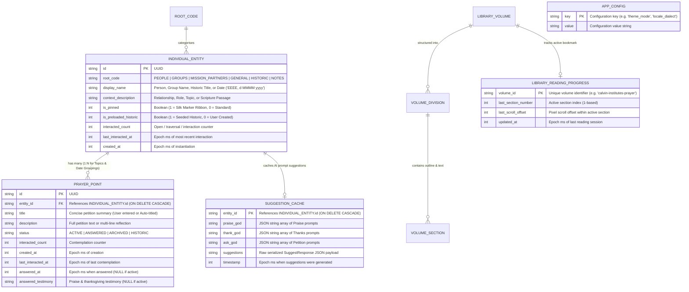
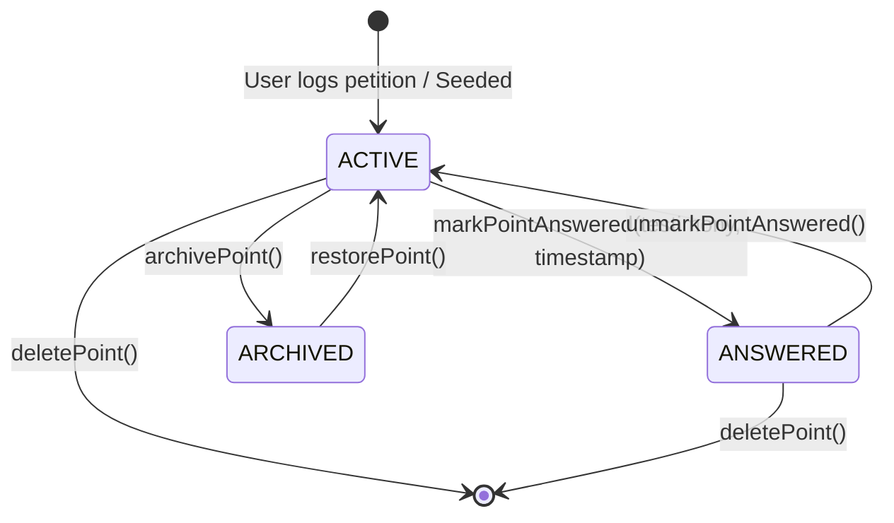
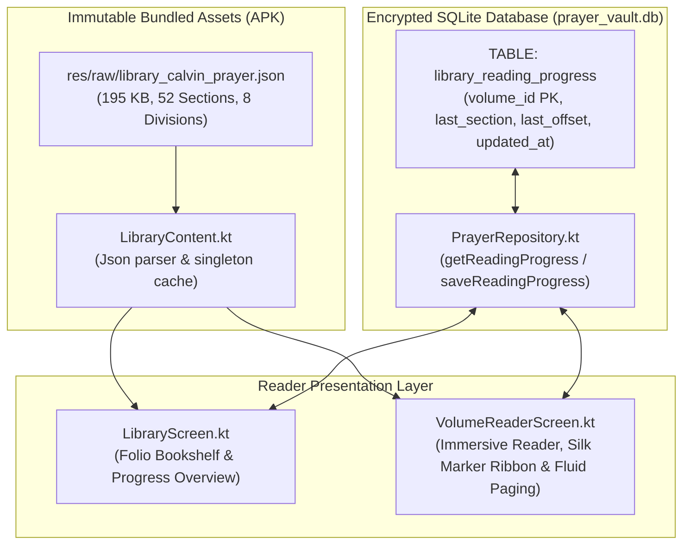
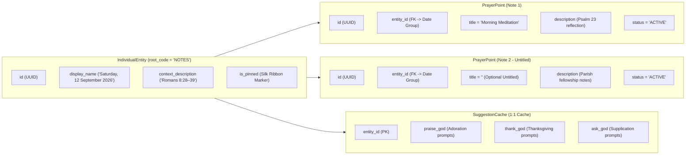

# Unified Data Architecture & Entity Specification: Prayer Points, Theological Books, and Daily Notes

## 1. Architectural Overview & The Tripartite Content Model

The *Pray Without Ceasing* application organizes all spiritual content, liturgical devotion, and personal study into three foundational content pillars:

1. **Intercessory Prayer Points & Topics (`PrayerPoint` & `IndividualEntity`)**:
   - The devotional core of personal and corporate intercession.
   - Organised into a 1-to-many relationship where an `IndividualEntity` represents a spiritual burden or topic (categorised under *People*, *Groups*, *Mission Partners*, *General*, or *Historic*), and multiple `PrayerPoint` records capture discrete, ongoing, answered, or archived petitions.
   - Surfaced dynamically during contemplative prayer via an anti-neglect priority queue.

2. **Theological Library Books & Treatises (`LibraryVolume`, `VolumeDivision`, `VolumeSection`)**:
   - The patristic and Reformed theological vault enriching intercession with classic spiritual literature.
   - Architected as a **hybrid storage model**: rich, immutable, public-domain theological treatises are stored as structured JSON raw assets (e.g., John Calvin's *Of Prayer: A Perpetual Exercise of Faith*, *Institutes* Book III, Chapter XX), while mutable user reading progress, section bookmarks, and scroll offsets are persisted in SQLite (`TABLE_LIBRARY_PROGRESS`).

3. **Daily Study Notes & Scripture Reflections (`RootCode.NOTES` Projection)**:
   - A quiet, reverent daily reflection, Scripture meditation, and study canvas.
   - **The Date as Grouping Invariant**: The calendar date is not a note; the date is an organizing grouping container (`IndividualEntity` with `rootCode = RootCode.NOTES`), under which the believer can file **any number of notes** (`PrayerPoint` records) with individual, optional titles.
   - Rather than introducing a disparate or disjointed table structure, daily notes project naturally onto the unified **Entity-Point relational architecture**:
     - Date grouping container, calendar date, study topic, and silk ribbon pin state are held in `IndividualEntity` with `rootCode = RootCode.NOTES`.
     - Individual notes are persisted in associated `PrayerPoint` records referencing the date entity (`1:N`), each with an optional `title` (empty string `""` if untitled) and multi-line `description` body.
     - Ambient AI prompt suggestions are cached in `suggestion_cache`.
   - Strictly isolated from the contemplative prayer queue via the **Sanctuary Isolation Invariant**.

This tripartite architecture enforces database normalization, zero-migration schema consistency, SQLCipher cryptographic protection at rest, and full export/restore compatibility via encrypted vault archives.

---

## 2. Entity-Relationship Data Model & Unified System Diagram



---

## 3. Domain 1: Prayer Points & Intercessory Entities

### 3.1 `IndividualEntity` Specification ([`TABLE_ENTITIES`](file:///c:/Users/ianch/sourcecode/repos/Prayer/android/app/src/main/java/au/prayer/app/data/local/PrayerDatabaseHelper.kt#L27-L37))

The `IndividualEntity` represents an intercessory subject or container. In the UI, entities are grouped under five user-facing taxonomies and one isolated note taxonomy.

| Field Name | Kotlin Type | SQLite Column | SQLite Type | Constraints | Description & Domain Rules |
| :--- | :--- | :--- | :--- | :--- | :--- |
| **`id`** | `String` | `id` | `TEXT` | `PRIMARY KEY` | RFC 4122 UUID uniquely identifying the entity record. |
| **`rootCode`** | `RootCode` | `root_code` | `TEXT` | `NOT NULL` | Taxonomy partition: `PEOPLE`, `GROUPS`, `MISSION_PARTNERS`, `GENERAL`, `HISTORIC`, or `NOTES`. |
| **`displayName`** | `String` | `display_name` | `TEXT` | `NOT NULL` | Primary human-readable title (e.g. `"Rev. Thomas Cranmer"`, `"St. Jude's Youth"`, or `"Saturday, 12 September 2026"`). |
| **`contextDescription`** | `String` | `context_description` | `TEXT` | `NULL` | Secondary descriptor (e.g. `"Rector • Parish Leadership"`, `"Mission in East Africa"`, or `"Study • Romans 8:28–39"`). Default: `""`. |
| **`isPinned`** | `Boolean` | `is_pinned` | `INTEGER` | `NOT NULL DEFAULT 0` | When `1`, renders the Garnet Silk Marker Ribbon (`❧`) tab and forces top sorting priority in queue and journal lists. |
| **`isPreloadedHistoric`** | `Boolean` | `is_preloaded_historic` | `INTEGER` | `NOT NULL DEFAULT 0` | `1` if seeded from `res/raw/historic_prayers.json`; `0` for user-authored records. |
| **`interactedCount`** | `Int` | `interacted_count` | `INTEGER` | `NOT NULL DEFAULT 0` | Cumulative times this entity has been brought into the Sanctuary or viewed. Used by anti-neglect queue. |
| **`lastInteractedAt`** | `Long?` | `last_interacted_at` | `INTEGER` | `NULL` | Timestamp (epoch ms) of the most recent prayer contemplation or edit. |
| **`createdAt`** | `Long` | `created_at` | `INTEGER` | `NOT NULL` | Timestamp (epoch ms) when the entity was created. |

#### Taxonomy Root Codes (`RootCode` Enum)
```kotlin
enum class RootCode(val displayTitle: String, val sortOrder: Int) {
    PEOPLE("People", 1),
    GROUPS("Groups", 2),
    MISSION_PARTNERS("Mission Partners", 3),
    GENERAL("General", 4),
    HISTORIC("Historic", 5),
    NOTES("Notes", 6)
}
```

---

### 3.2 `PrayerPoint` Specification ([`TABLE_POINTS`](file:///c:/Users/ianch/sourcecode/repos/Prayer/android/app/src/main/java/au/prayer/app/data/local/PrayerDatabaseHelper.kt#L38-L56))

The `PrayerPoint` captures a discrete prayer petition, supplication, praise item, or reflection body belonging to an `IndividualEntity`.

| Field Name | Kotlin Type | SQLite Column | SQLite Type | Constraints | Description & Domain Rules |
| :--- | :--- | :--- | :--- | :--- | :--- |
| **`id`** | `String` | `id` | `TEXT` | `PRIMARY KEY` | RFC 4122 UUID uniquely identifying the prayer point. |
| **`entityId`** | `String` | `entity_id` | `TEXT` | `NOT NULL, FK` | Foreign key referencing `individual_entities(id)` with `ON DELETE CASCADE`. |
| **`title`** | `String` | `title` | `TEXT` | `NOT NULL` | Concise title (up to 40 characters) or auto-generated title. Empty `""` for notes. |
| **`description`** | `String` | `description` | `TEXT` | `NOT NULL` | The full intercessory petition text, prayer body, or multi-line reflection. |
| **`status`** | `PrayerStatus` | `status` | `TEXT` | `NOT NULL DEFAULT 'ACTIVE'` | Status enum: `ACTIVE`, `ANSWERED`, `ARCHIVED`, or `HISTORIC`. |
| **`interactedCount`** | `Int` | `interacted_count` | `INTEGER` | `NOT NULL DEFAULT 0` | Number of times this point has been surfaced during prayer sessions. |
| **`createdAt`** | `Long` | `created_at` | `INTEGER` | `NOT NULL` | Epoch millisecond timestamp of point creation. |
| **`lastInteractedAt`** | `Long?` | `last_interacted_at` | `INTEGER` | `NULL` | Epoch millisecond timestamp when last contemplated. |
| **`answeredAt`** | `Long?` | `answered_at` | `INTEGER` | `NULL` | Timestamp (epoch ms) when marked as answered. Null if active. |
| **`answeredTestimony`** | `String?` | `answered_testimony` | `TEXT` | `NULL` | User testimony of God's sovereign answer, recorded for thanksgiving. Null if active. |

#### Prayer Status Lifecycle Transitions


- **`ACTIVE`**: The petition is in active circulation. Displayed in Sanctuary prayer cards and journal active lists.
- **`ANSWERED`**: God has graciously answered the petition. The point is archived from active intercession into the Thanksgiving / Answered drawer. Preserves `answeredAt` and `answeredTestimony`.
- **`ARCHIVED`**: Retired from active prayer without a specific answered testimony.
- **`HISTORIC`**: Immutable, public-domain liturgical prayers seeded from the classic Reformed and Anglican tradition.

---

### 3.3 Relational Aggregations: `TopicWithPoints`

In the application's domain layer, entities and their associated prayer points are loaded as cohesive devotional units via [`TopicWithPoints`](file:///c:/Users/ianch/sourcecode/repos/Prayer/android/app/src/main/java/au/prayer/app/data/models/Models.kt#L69-L73):

```kotlin
@Serializable
data class TopicWithPoints(
    val entity: IndividualEntity,
    val activePoints: List<PrayerPoint>,
    val answeredPoints: List<PrayerPoint>
)
```

During prayer sessions, the UI renders the entity identity along with all of its `activePoints` contiguously, allowing holistic contemplation of the person or burden before God rather than disjointed fragments.

---

### 3.4 Preloaded Historic Prayers

14 public-domain historic prayers (including John Calvin, Thomas Cranmer, Augustine of Hippo, and Martin Luther) are packaged as a single source of truth in [`res/raw/historic_prayers.json`](file:///c:/Users/ianch/sourcecode/repos/Prayer/android/app/src/main/res/raw/historic_prayers.json) and parsed via [`PreloadedContent.kt`](file:///c:/Users/ianch/sourcecode/repos/Prayer/android/app/src/main/java/au/prayer/app/data/models/PreloadedContent.kt).

- **Seeding Invariant**: On first boot or database upgrade, `PrayerDatabaseHelper.syncHistoricContent(db)` inserts or updates the 14 prayers into `TABLE_ENTITIES` and `TABLE_POINTS` with:
  - `root_code = 'HISTORIC'`
  - `is_preloaded_historic = 1`
  - `status = 'ACTIVE'` (or `'HISTORIC'`)
- **Blending Toggle**: Users can toggle `blendHistoricPrayers` in Settings. When enabled, historic prayers are interleaved into the user's daily contemplative intercessory rotation.

---

### 3.5 Anti-Neglect Contemplative Queue Scoring

To ensure that no brother, sister, mission partner, or burden is forgotten, the Sanctuary prayer rotation (`PrayerRepository.getContemplativeTopics`) calculates an anti-neglect priority order:

1. **Pinned Priority**: Topics with `is_pinned = 1` always surface first.
2. **Interaction Frequency**: Topics with lower `interacted_count` are prioritized over frequently visited ones.
3. **Recency of Contemplation**: Topics with older `last_interacted_at` (or `NULL` indicating never visited) take precedence over recently contemplated topics.
4. **Creation Age**: Older unresolved topics (`created_at ASC`) break ties.

```sql
SELECT e.* FROM individual_entities e
WHERE e.is_preloaded_historic = 0
  AND e.root_code != 'NOTES'
ORDER BY 
    e.is_pinned DESC,
    e.interacted_count ASC,
    e.last_interacted_at ASC NULLS FIRST,
    e.created_at ASC
```

---

### 3.6 Post-Commit Asynchronous Auto-Titling Contract

When a believer writes a freeform prayer petition on the notepad, the app immediately writes the point to SQLite with `status = 'ACTIVE'` and a fallback title. In the background, it fires an asynchronous request to the Cloudflare Worker API proxy (`/api/auto-title`):
- **Input**: The raw petition `description` and parent entity context.
- **Output**: A reverent, biblically grounded summary title ($\le 40$ characters, title-cased, zero emojis).
- **Post-Commit Persistence**: The database is asynchronously updated via `PrayerRepository.updatePointTitle(pointId, reverentTitle)`. The UI dynamically updates without interrupting the user's prayer rhythm.

---

## 4. Domain 2: Theological Books & Library Treatises

### 4.1 Hybrid Storage Architecture: Bundled JSON Assets vs. Mutable SQLite State

The Theological Library is designed to house classical Christian treatises on prayer and faith. Because these works are substantial, multi-chapter, public-domain texts that are strictly immutable, storing them inside a SQLite database would inflate database size and complicate migration schemas.

Therefore, the application employs a **hybrid storage pattern**:
1. **Treatise Content (Read-Only Asset)**: Stored as structured, versioned JSON files in `res/raw/` (e.g. `res/raw/library_calvin_prayer.json`). Loaded, parsed into memory, and cached by [`LibraryContent.kt`](file:///c:/Users/ianch/sourcecode/repos/Prayer/android/app/src/main/java/au/prayer/app/data/models/LibraryContent.kt).
2. **Reading Progress & Bookmark State (Mutable SQLite)**: Persisted in SQLite table [`library_reading_progress`](file:///c:/Users/ianch/sourcecode/repos/Prayer/android/app/src/main/java/au/prayer/app/data/local/PrayerDatabaseHelper.kt#L21-L26), tracking the reader's active section and scroll offset.



---

### 4.2 Data Models: `LibraryVolume`, `VolumeDivision`, `VolumeSection` ([`LibraryModels.kt`](file:///c:/Users/ianch/sourcecode/repos/Prayer/android/app/src/main/java/au/prayer/app/data/models/LibraryModels.kt))

```kotlin
@Serializable
data class LibraryVolume(
    val schemaVersion: Int = 1,
    val volumeId: String,
    val title: String,
    val subtitle: String = "",
    val author: String,
    val work: String = "",
    val translator: String = "",
    val language: String = "en",
    val publicDomain: Boolean = true,
    val sourceUrl: String = "",
    val divisions: List<VolumeDivision> = emptyList(),
    val sections: List<VolumeSection> = emptyList()
)

@Serializable
data class VolumeDivision(
    val division: String,          // e.g. "I", "II", "III", ...
    val description: String,       // Analytical summary of the division's theological subject
    val startSection: Int,         // Starting section number (inclusive)
    val endSection: Int            // Ending section number (inclusive)
)

@Serializable
data class VolumeSection(
    val sectionNumber: Int,        // 1-indexed section number matching the historical treatise
    val outlineSummary: String = "", // Detailed outline of the section's argument
    val paragraphs: List<String> = emptyList() // Flowing paragraph text blocks
)
```

---

### 4.3 SQLite Progress Schema: `TABLE_LIBRARY_PROGRESS`

| Field Name | Kotlin Type | SQLite Column | SQLite Type | Constraints | Description & Domain Rules |
| :--- | :--- | :--- | :--- | :--- | :--- |
| **`volumeId`** | `String` | `volume_id` | `TEXT` | `PRIMARY KEY` | Unique treatise volume key (e.g. `"calvin-institutes-prayer"`). |
| **`lastSectionNumber`** | `Int` | `last_section_number` | `INTEGER` | `NOT NULL DEFAULT 1` | The section number (1-based) where the reader placed their bookmark ribbon. |
| **`lastScrollOffset`** | `Int` | `last_scroll_offset` | `INTEGER` | `NOT NULL DEFAULT 0` | Pixel scroll offset within the active section's lazy column. |
| **`updatedAt`** | `Long` | `updated_at` | `INTEGER` | `NOT NULL` | Epoch millisecond timestamp of the last reading session. |

---

### 4.4 Silk Marker Ribbon Bookmark & Scroll State Restoration

- In [`VolumeReaderScreen.kt`](file:///c:/Users/ianch/sourcecode/repos/Prayer/android/app/src/main/java/au/prayer/app/ui/screens/VolumeReaderScreen.kt), when the reader turns to a new section or leaves the screen, `PrayerRepository.saveReadingProgress(...)` records the active section and scroll state.
- Upon reopening the treatise from the Bookshelf, the app reads `TABLE_LIBRARY_PROGRESS` and:
  1. Instantly mounts the exact section the believer was meditating upon.
  2. Restores the exact vertical scroll position via `lazyListState.scrollToItem(0, lastScrollOffset)`.
  3. Renders the Garnet Silk Marker Ribbon at the top of the folio page to indicate an active bookmark.

---

### 4.5 Inaugural Volume 1: John Calvin's *Of Prayer*

- **Author**: John Calvin (1509–1564).
- **Work**: *Institutes of the Christian Religion*, Book III, Chapter XX.
- **Title**: *Of Prayer: A Perpetual Exercise of Faith. The Daily Benefits Derived from It*.
- **Translation**: Henry Beveridge (1845, Public Domain).
- **Structure**: 52 distinct sections organized into 8 overarching theological divisions:
  - **Division I (Sec 1–2)**: Nature and necessity of prayer as the chief exercise of faith.
  - **Division II (Sec 3)**: To whom prayer must be addressed (refutation of objections).
  - **Division III (Sec 4–16)**: The four cardinal rules of prayer (reverence, sense of need, repentance, confident hope).
  - **Division IV (Sec 17–19)**: In whose Name prayer must be offered (Christ the sole Mediator).
  - **Division V (Sec 20–27)**: Refutation of saintly intercession and human merits.
  - **Division VI (Sec 28–33)**: Vocal and secret prayer, ceremonies, and inward sincerity.
  - **Division VII (Sec 34–50)**: Exposition of the Lord's Prayer (Six Petitions).
  - **Division VIII (Sec 51–52)**: Perseverance, times of prayer, and the assurance of faith.

---

## 5. Domain 3: Daily Reflection & Study Notes

### 5.1 The Entity-Point Projection Architecture (Date as Grouping Container)

Daily study notes and reflections project onto the unified Entity-Point relational schema:
- **Date Grouping Container**: Represented as an [`IndividualEntity`](file:///c:/Users/ianch/sourcecode/repos/Prayer/android/app/src/main/java/au/prayer/app/data/models/Models.kt#L42-L52) where:
  - `rootCode = RootCode.NOTES` (`"NOTES"`)
  - `displayName = formattedDate` (e.g. `"Saturday, 12 September 2026"`, RFC/ISO compliant daily deduplication key)
  - `contextDescription = studyTopic` (Optional Scripture passage or study theme, e.g. `"Study • Romans 8:28–39"`)
  - `isPinned = isPinned` (Pins the date grouping to the top of the archive)
- **Individual Filed Notes (1:N Children)**: Stored as multiple associated [`PrayerPoint`](file:///c:/Users/ianch/sourcecode/repos/Prayer/android/app/src/main/java/au/prayer/app/data/models/Models.kt#L55-L66) records where:
  - `entityId = entity.id` (Foreign key referencing the parent date grouping)
  - `title = noteTitle` (Individual title; empty string `""` if untitled, as titling is optional)
  - `description = fullMultiLineText` (The complete reflection or study note body)
  - `status = PrayerStatus.ACTIVE`
  - `createdAt = timestamp` (Timestamp of note instantiation)
- **AI Reflection Prompts**: Caches generated prompts in `TABLE_SUGGESTION_CACHE` keyed by `entity_id`.



---

### 5.2 Feint Ruled Line Canvas & Typography Synchronization

The visual presentation of notes uses [`LinedNotepad.kt`](file:///c:/Users/ianch/sourcecode/repos/Prayer/android/app/src/main/java/au/prayer/app/ui/components/LinedNotepad.kt), enforcing the **Baseline Synchronization Law**:
- Ruled feint lines are dynamically anchored to the active typographic baseline ($28\text{sp}$ standard body cadence) of the text layout engine.
- Every rule sits precisely beneath the rendered glyphs.
- In blank space beneath the written meditation, ruled lines continue downwards to maintain physical notebook continuity.
- Dynamic pinch-to-zoom scaling ($0.75\times$ to $2.5\times$) recalculates the line pitch $H_{px}$ so feint rules and text never drift out of sync.

---

### 5.3 Sanctuary Isolation Invariant

- **Absolute Rule**: Daily study notes and Scripture reflections **MUST NEVER** appear in the contemplative prayer queue rotation.
- **Enforcement**: In [`PrayerRepository.getContemplativeTopics(...)`](file:///c:/Users/ianch/sourcecode/repos/Prayer/android/app/src/main/java/au/prayer/app/data/local/PrayerRepository.kt#L373-L382), the query explicitly excludes notes:
  ```sql
  SELECT e.* FROM individual_entities e
  WHERE e.is_preloaded_historic = 0
    AND e.root_code != 'NOTES'
  ...
  ```
  `RootCode.NOTES` remains sequestered strictly within the Notes directory and study canvas.

---

### 5.4 Three-Tier Folio Navigation Architecture (`LifoBackStack`)

[`NotesScreen.kt`](file:///c:/Users/ianch/sourcecode/repos/Prayer/android/app/src/main/java/au/prayer/app/ui/screens/NotesScreen.kt) organizes notes into a three-tier LIFO navigational hierarchy:

1. **`NotesView.OVERVIEW` (Date Groupings Directory)**:
   - Lists date groupings in reverse chronological order (`is_pinned DESC, created_at DESC`).
   - Prominent **Today's Date Grouping Card** displays the formatted date string, current note count, and a direct `+ Note` quick creation action.
   - Past Date Groupings display note counts (e.g. `"3 notes"`), study topic pill, and note previews.
   - Tapping a date grouping opens `DATE_DETAIL`.

2. **`NotesView.DATE_DETAIL` (Filed Notes for Date)**:
   - Folio header displays the full date in `typography.subjectHeader`, Silk Marker Ribbon pin toggle, and inline editable study topic/passage pill.
   - Prominent `+ Add Note` button to file a new note under this date.
   - LazyColumn of filed notes displaying individual titles (or italic `(Untitled Note)` when blank), timestamp (`10:45 AM`), 2-line snippet preview, and deletion actions.
   - Tapping any note opens `NOTE_EDITOR`.

3. **`NotesView.NOTE_EDITOR` (The Ruled Notepad Canvas)**:
   - TopAppBar: Permanently fixed to `"Notes"`, with zoom reset indicator and quiet autosave status (`Save` / `Saved`).
   - Canvas Header: Breadcrumb date indicator and individual **Title (Optional)** `BasicTextField` in Literary Serif (`20sp`, semi-bold).
   - Lined notepad canvas (`LinedNotepad`) with dynamic pinch-to-zoom (`0.75f` to `2.5f`) and baseline synchronization.
   - Collapsed-by-default `❧ Prompts for Prayer ❧` card generating contemplative prompts grounded in the active note.
   - Strict LIFO back navigation autosaves text changes quietly on return.

---

## 6. Cross-Cutting Infrastructure & Persistence

### 6.1 Unified SQLite DDL Specification

```sql
-- 1. Entities: Topics, Subjects & Note Containers
CREATE TABLE IF NOT EXISTS individual_entities (
    id TEXT PRIMARY KEY,
    root_code TEXT NOT NULL,
    display_name TEXT NOT NULL,
    context_description TEXT,
    is_preloaded_historic INTEGER NOT NULL DEFAULT 0,
    interacted_count INTEGER NOT NULL DEFAULT 0,
    last_interacted_at INTEGER,
    created_at INTEGER NOT NULL,
    is_pinned INTEGER NOT NULL DEFAULT 0
);

-- 2. Prayer Points: Petitions, Intercessions & Note Bodies
CREATE TABLE IF NOT EXISTS prayer_points (
    id TEXT PRIMARY KEY,
    entity_id TEXT NOT NULL,
    title TEXT NOT NULL,
    description TEXT NOT NULL,
    status TEXT NOT NULL DEFAULT 'ACTIVE',
    interacted_count INTEGER NOT NULL DEFAULT 0,
    created_at INTEGER NOT NULL,
    last_interacted_at INTEGER,
    answered_at INTEGER,
    answered_testimony TEXT,
    FOREIGN KEY (entity_id) REFERENCES individual_entities (id) ON DELETE CASCADE
);

-- 3. Library Reading Progress: Volume Bookmarks & Scroll Offsets
CREATE TABLE IF NOT EXISTS library_reading_progress (
    volume_id TEXT PRIMARY KEY,
    last_section_number INTEGER NOT NULL DEFAULT 1,
    last_scroll_offset INTEGER NOT NULL DEFAULT 0,
    updated_at INTEGER NOT NULL
);

-- 4. AI Suggestion Cache: Grounded Prayer Prompts
CREATE TABLE IF NOT EXISTS suggestion_cache (
    entity_id TEXT PRIMARY KEY,
    praise_god TEXT NOT NULL,
    thank_god TEXT NOT NULL,
    ask_god TEXT NOT NULL,
    suggestions TEXT NOT NULL,
    timestamp INTEGER NOT NULL,
    FOREIGN KEY (entity_id) REFERENCES individual_entities (id) ON DELETE CASCADE
);

-- 5. Application Configuration: Locale, Theme & Settings
CREATE TABLE IF NOT EXISTS app_config (
    key TEXT PRIMARY KEY,
    value TEXT NOT NULL
);
```

---

### 6.2 Encrypted Vault Backup & Restore (`VaultBackupPayload`)

To preserve personal prayer archives without relying on unencrypted cloud sync, the app provides full vault backup and restore protected by 256-bit AES-GCM and PBKDF2 key derivation ([`VaultBackupCrypto.kt`](file:///c:/Users/ianch/sourcecode/repos/Prayer/android/app/src/main/java/au/prayer/app/data/security/VaultBackupCrypto.kt)).

The backup payload packages all three content domains into a unified portable schema ([`VaultBackupPayload.kt`](file:///c:/Users/ianch/sourcecode/repos/Prayer/android/app/src/main/java/au/prayer/app/data/models/VaultBackupPayload.kt)):

```kotlin
@Serializable
data class VaultBackupPayload(
    val version: Int = 1,
    val createdAt: Long = System.currentTimeMillis(),
    val appVersion: String = "1.0.0",
    val config: AppConfig = AppConfig(),
    val entities: List<IndividualEntity> = emptyList(),
    val prayerPoints: List<PrayerPoint> = emptyList(),
    val libraryProgress: List<ReadingProgress> = emptyList()
)
```

- **Excluded from Backup**: Preloaded historic content (`is_preloaded_historic = 1`) and static bundled books are excluded from backup payloads since they are automatically reseeded from application binaries upon startup.
- **Conflict Resolution**: During restore, users can choose **Append (Non-destructive)** or **Replace Entire Vault**.

---

## 7. Concrete Mock Ingestion Examples

### 7.1 Kotlin In-Memory Object Instances

```kotlin
// ============================================================================
// 1. PRAYER POINTS & TOPIC ENTITY (Domain 1)
// ============================================================================
val mockMissionEntity = IndividualEntity(
    id = "11111111-2222-3333-4444-555555555555",
    rootCode = RootCode.MISSION_PARTNERS,
    displayName = "David & Ruth Livingstone",
    contextDescription = "Kigali Parish • Theological Training & Church Planting",
    isPinned = true,
    isPreloadedHistoric = false,
    interactedCount = 12,
    lastInteractedAt = 1789300000000L,
    createdAt = 1785000000000L
)

val mockActivePoint = PrayerPoint(
    id = "aaaaaaaa-bbbb-cccc-dddd-eeeeeeeeeeee",
    entityId = "11111111-2222-3333-4444-555555555555",
    title = "Syllabus Approval for Seminary",
    description = "Pray that the provincial council approves the new Reformed liturgy and doctrine syllabus without impediment.",
    status = PrayerStatus.ACTIVE,
    interactedCount = 5,
    createdAt = 1785100000000L,
    lastInteractedAt = 1789300000000L,
    answeredAt = null,
    answeredTestimony = null
)

val mockAnsweredPoint = PrayerPoint(
    id = "ffffffff-gggg-hhhh-iiii-jjjjjjjjjjjj",
    entityId = "11111111-2222-3333-4444-555555555555",
    title = "Visa Extension Granted",
    description = "Request urgent approval for 3-year residency and work permits for the family.",
    status = PrayerStatus.ANSWERED,
    interactedCount = 7,
    createdAt = 1785000000000L,
    lastInteractedAt = 1787000000000L,
    answeredAt = 1787100000000L,
    answeredTestimony = "Praise God! The immigration office approved the 3-year multi-entry visas in full."
)

// ============================================================================
// 2. THEOLOGICAL BOOK & READING PROGRESS (Domain 2)
// ============================================================================
val mockReadingProgress = ReadingProgress(
    volumeId = "calvin-institutes-prayer",
    lastSectionNumber = 4,
    lastScrollOffset = 340,
    updatedAt = 1789305000000L
)

// ============================================================================
// 3. DAILY STUDY NOTE (Domain 3)
// ============================================================================
val mockNoteEntity = IndividualEntity(
    id = "f47ac10b-58cc-4372-a567-0e02b2c3d479",
    rootCode = RootCode.NOTES,
    displayName = "Saturday, 12 September 2026",
    contextDescription = "Study • Romans 8:28–39 (The Golden Chain)",
    isPinned = true,
    isPreloadedHistoric = false,
    interactedCount = 4,
    lastInteractedAt = 1789301400000L,
    createdAt = 1789288800000L
)

val mockNoteBodyPoint = PrayerPoint(
    id = "3c9b7412-82ab-4ef1-90a6-16f982d63cb8",
    entityId = "f47ac10b-58cc-4372-a567-0e02b2c3d479",
    title = "",
    description = """
        Meditating on verse 28: 'And we know that all things work together for good to them that love God...'

        Even through seasons of grief, confusion, and distress, God's sovereign providence holds every detail.

        Key Takeaways:
        1. Suffering is never meaningless in Christ.
        2. Conformed to the image of His Son is the ultimate aim.
        3. Pray for endurance for our parish family this week.
    """.trimIndent(),
    status = PrayerStatus.ACTIVE,
    interactedCount = 4,
    createdAt = 1789288800000L,
    lastInteractedAt = 1789301400000L,
    answeredAt = null,
    answeredTestimony = null
)
```

---

### 7.2 Executable SQLite DML Inserts

```sql
-- 1. Insert Mission Partner Topic & Associated Points
INSERT INTO individual_entities (
    id, root_code, display_name, context_description,
    is_pinned, is_preloaded_historic, interacted_count,
    last_interacted_at, created_at
) VALUES (
    '11111111-2222-3333-4444-555555555555',
    'MISSION_PARTNERS',
    'David & Ruth Livingstone',
    'Kigali Parish • Theological Training & Church Planting',
    1, 0, 12, 1789300000000, 1785000000000
);

INSERT INTO prayer_points (
    id, entity_id, title, description, status,
    interacted_count, created_at, last_interacted_at,
    answered_at, answered_testimony
) VALUES (
    'aaaaaaaa-bbbb-cccc-dddd-eeeeeeeeeeee',
    '11111111-2222-3333-4444-555555555555',
    'Syllabus Approval for Seminary',
    'Pray that the provincial council approves the new Reformed liturgy and doctrine syllabus without impediment.',
    'ACTIVE', 5, 1785100000000, 1789300000000, NULL, NULL
);

INSERT INTO prayer_points (
    id, entity_id, title, description, status,
    interacted_count, created_at, last_interacted_at,
    answered_at, answered_testimony
) VALUES (
    'ffffffff-gggg-hhhh-iiii-jjjjjjjjjjjj',
    '11111111-2222-3333-4444-555555555555',
    'Visa Extension Granted',
    'Request urgent approval for 3-year residency and work permits for the family.',
    'ANSWERED', 7, 1785000000000, 1787000000000, 1787100000000,
    'Praise God! The immigration office approved the 3-year multi-entry visas in full.'
);

-- 2. Insert Book Reading Progress (Calvin's Of Prayer)
INSERT OR REPLACE INTO library_reading_progress (
    volume_id, last_section_number, last_scroll_offset, updated_at
) VALUES (
    'calvin-institutes-prayer', 4, 340, 1789305000000
);

-- 3. Insert Daily Note & Associated Feint Notepad Point
INSERT INTO individual_entities (
    id, root_code, display_name, context_description,
    is_pinned, is_preloaded_historic, interacted_count,
    last_interacted_at, created_at
) VALUES (
    'f47ac10b-58cc-4372-a567-0e02b2c3d479',
    'NOTES',
    'Saturday, 12 September 2026',
    'Study • Romans 8:28–39 (The Golden Chain)',
    1, 0, 4, 1789301400000, 1789288800000
);

INSERT INTO prayer_points (
    id, entity_id, title, description, status,
    interacted_count, created_at, last_interacted_at,
    answered_at, answered_testimony
) VALUES (
    '3c9b7412-82ab-4ef1-90a6-16f982d63cb8',
    'f47ac10b-58cc-4372-a567-0e02b2c3d479',
    '',
    'Meditating on verse 28: ''And we know that all things work together for good to them that love God...''

Even through seasons of grief, confusion, and distress, God''s sovereign providence holds every detail.

Key Takeaways:
1. Suffering is never meaningless in Christ.
2. Conformed to the image of His Son is the ultimate aim.
3. Pray for endurance for our parish family this week.',
    'ACTIVE', 4, 1789288800000, 1789301400000, NULL, NULL
);
```

---

## 8. Repository Contracts & CRUD Lifecycle Reference ([`PrayerRepository.kt`](file:///c:/Users/ianch/sourcecode/repos/Prayer/android/app/src/main/java/au/prayer/app/data/local/PrayerRepository.kt))

| Domain Area | Repository Method | Implementation Contract |
| :--- | :--- | :--- |
| **Entities** | `getEntitiesByRoot(root: RootCode)` | Retrieves all entities matching taxonomy root, ordered by `is_pinned DESC, display_name ASC`. |
| **Entities** | `insertEntity(entity: IndividualEntity)` | Inserts a new subject or note container into `TABLE_ENTITIES`. |
| **Entities** | `updateEntity(id, displayName, rootCode, context)` | Updates name, taxonomy classification, and context descriptor. |
| **Entities** | `toggleEntityPinned(id, isPinned)` | Updates `is_pinned` (0/1), controlling bookmark ribbon display and queue boost. |
| **Entities** | `deleteEntity(id)` | Deletes the entity record; automatically cascades to all associated points and prompt cache. |
| **Prayer Points** | `getPointsForEntity(entityId)` | Retrieves all active points belonging to the entity, sorted by `created_at ASC`. |
| **Prayer Points** | `getAnsweredPointsForEntity(entityId)` | Retrieves all answered points belonging to the entity, sorted by `answered_at DESC`. |
| **Prayer Points** | `addPointToEntity(entityId, description, title)` | Inserts a new prayer point. If `title` is blank, assigns initial truncated title for background auto-titler. |
| **Prayer Points** | `markPointAnswered(pointId, testimony)` | Transitions status to `ANSWERED`, sets `answered_at` to current epoch ms, and persists testimony. |
| **Prayer Points** | `unmarkPointAnswered(pointId)` | Reverts status to `ACTIVE` and clears `answered_at` and `answered_testimony`. |
| **Prayer Points** | `updatePointTitle(pointId, newTitle)` | Asynchronously updates petition title upon completion of AI auto-titling. |
| **Contemplative Queue** | `getContemplativeTopics(limit)` | Selects entities for Sanctuary intercession using anti-neglect scoring (excludes `NOTES`). |
| **Contemplative Queue** | `recordContemplationInteraction(entityId, pointIds)` | Increments `interacted_count` and updates `last_interacted_at` for visited entity and points. |
| **Library Books** | `getReadingProgress(volumeId)` | Queries `TABLE_LIBRARY_PROGRESS` to retrieve last saved section and scroll position. |
| **Library Books** | `saveReadingProgress(progress)` | Uses `INSERT OR REPLACE` to persist bookmark section number, pixel scroll offset, and timestamp. |
| **Daily Notes** | `getNotesEntities()` | Queries `TABLE_ENTITIES` where `root_code = 'NOTES'`, sorted by `is_pinned DESC, created_at DESC`. |
| **Daily Notes** | `getOrCreateTodayNoteEntity(dateStr)` | Gets or creates the grouping entity for the current calendar day (`display_name = dateStr`). |
| **Daily Notes** | `getNotesForDateEntity(entityId)` | Retrieves all individual notes (`PrayerPoint`s) filed under the date grouping, sorted chronologically (`created_at ASC`). |
| **Daily Notes** | `getNote(noteId)` | Retrieves a specific note by ID. |
| **Daily Notes** | `createNote(entityId, title, description)` | Inserts a new note under the date grouping with optional title. |
| **Daily Notes** | `updateNote(noteId, title, description)` | Updates title and body of an existing note. |
| **Daily Notes** | `deleteNote(noteId)` | Deletes a specific note without affecting sibling notes or the date grouping. |
| **Daily Notes** | `getNoteCountForEntity(entityId)` | Counts total notes filed under a date grouping. |
| **Daily Notes** | `getNoteText(entityId)` | Joins all point descriptions for the note entity with newlines (legacy). |
| **Daily Notes** | `saveNoteText(entityId, text)` | Non-destructively updates the first note or inserts a new one. |
| **Suggestion Cache** | `getCachedSuggestions(entityId)` | Retrieves cached praise, thanksgiving, and ask prompts if generated within freshness window. |
| **Suggestion Cache** | `saveCachedSuggestions(entityId, resp)` | Serializes and persists OpenRouter AI suggestions to `TABLE_SUGGESTION_CACHE`. |
| **Vault Backup** | `createBackupPayload()` | Gathers all user entities, points, library progress, and config into a `VaultBackupPayload`. |
| **Vault Backup** | `restoreVault(payload, overwrite)` | Decrypts and restores entities, points, and reading progress with append or replace semantics. |

---

## 9. Architectural Invariants & Data Integrity Rules

1. **The Sanctuary Isolation Invariant**: `RootCode.NOTES` records are strictly barred from the contemplative prayer queue (`SanctuaryPrayerScreen`). Contemplation belongs to intercessory burdens, praise, and historic prayers, not daily notebook reflections.
2. **Cascade Deletion Integrity**: Every child record (`prayer_points`, `suggestion_cache`) maintains a strict foreign key reference to `individual_entities(id)` with `ON DELETE CASCADE`. Removing an entity leaves zero orphaned points or cached prompts in the database.
3. **Immutable Treatises & Static Integrity**: Library treatises are bundled in APK read-only assets (`R.raw.library_calvin_prayer`). The database never alters theological text, preserving historical fidelity. Only user bookmarks (`library_reading_progress`) are stored in mutable tables.
4. **Feint Rule Baseline Alignment**: Every text point rendered on a lined notepad must compute its horizontal feint rule positions strictly from the active typographic line height and baseline offset of the font, preserving notebook visual realism across all pinch-to-zoom scales.
5. **Zero-Audit Active State**: The data model maintains current state directly. Sequential point counters (*Point 1*, *Point 2*) and internal metrics are never displayed to the believer in the UI, adhering to the principle of **Minimal Contextual Data Exposure**.
