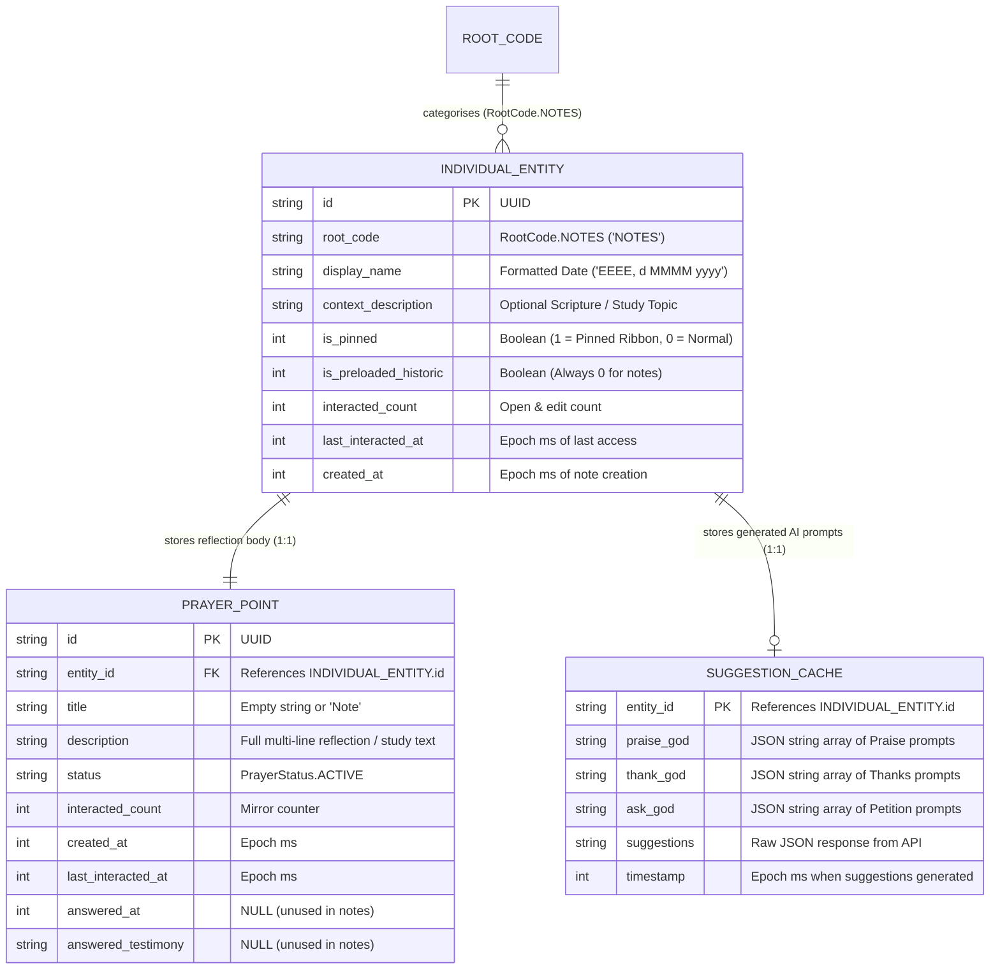

# Notes Data Architecture & Entity Specification

## 1. Architectural Overview & Design Pattern

The Notes section within the application provides a quiet, reverent daily reflection, Scripture meditation, and study canvas. Rather than creating a segregated table hierarchy or disparate data format, daily notes intentionally reuse the application's unified **Entity-Point relational architecture**:
* **Identity & Metadata**: Encapsulated as an [`IndividualEntity`](file:///c:/Users/ianch/sourcecode/repos/Prayer/android/app/src/main/java/au/prayer/app/data/models/Models.kt#L42-L52) with `rootCode = RootCode.NOTES`.
* **Body Text**: Stored as an associated 1:1 [`PrayerPoint`](file:///c:/Users/ianch/sourcecode/repos/Prayer/android/app/src/main/java/au/prayer/app/data/models/Models.kt#L55-L66) whose `description` contains the full multi-line reflection text.
* **AI Assist Prompts**: Cached in [`suggestion_cache`](file:///c:/Users/ianch/sourcecode/repos/Prayer/android/app/src/main/java/au/prayer/app/data/local/PrayerDatabaseHelper.kt#L39-L45) keyed by the note's entity UUID.

This architecture preserves database normalization, zero-migration schema consistency, and leverages existing SQLCipher encryption and backup/restore mechanisms.

---

## 2. Entity-Relationship Data Model



---

## 3. Detailed Field Dictionary

### 3.1 Parent Container: `IndividualEntity` ([`TABLE_ENTITIES`](file:///c:/Users/ianch/sourcecode/repos/Prayer/android/app/src/main/java/au/prayer/app/data/local/PrayerDatabaseHelper.kt#L27-L37))

| Field Name | Kotlin Type | SQLite Column | SQLite Type | Constraints | Description & Domain Rules |
| :--- | :--- | :--- | :--- | :--- | :--- |
| **`id`** | `String` | `id` | `TEXT` | `PRIMARY KEY` | RFC 4122 UUID uniquely identifying the daily note entity. |
| **`rootCode`** | `RootCode` | `root_code` | `TEXT` | `NOT NULL` | Fixed to `RootCode.NOTES` (`"NOTES"`, sort order 6). Isolates notes from devotional intercession. |
| **`displayName`** | `String` | `display_name` | `TEXT` | `NOT NULL` | Note title formatted strictly as `"EEEE, d MMMM yyyy"` (e.g. `"Saturday, 12 September 2026"`). Used for daily deduplication. |
| **`contextDescription`** | `String` | `context_description` | `TEXT` | `NULL` | Optional Scripture reading, passage reference, or study topic (e.g. `"Study • Romans 8:28–39"`). Default: `""`. |
| **`isPinned`** | `Boolean` | `is_pinned` | `INTEGER` | `NOT NULL DEFAULT 0` | When `true` (`1`), displays the red Silk Marker Ribbon (`❧`) and pins the note to the top of Past Reflections. |
| **`isPreloadedHistoric`** | `Boolean` | `is_preloaded_historic` | `INTEGER` | `NOT NULL DEFAULT 0` | Always `false` (`0`) for user notes. |
| **`interactedCount`** | `Int` | `interacted_count` | `INTEGER` | `NOT NULL DEFAULT 0` | Total number of times this daily note has been opened in detail view. |
| **`lastInteractedAt`** | `Long?` | `last_interacted_at` | `INTEGER` | `NULL` | Epoch millisecond timestamp recording the most recent open/edit interaction. |
| **`createdAt`** | `Long` | `created_at` | `INTEGER` | `NOT NULL` | Epoch millisecond timestamp when the note was first instantiated. |

### 3.2 Child Text Content: `PrayerPoint` ([`TABLE_POINTS`](file:///c:/Users/ianch/sourcecode/repos/Prayer/android/app/src/main/java/au/prayer/app/data/local/PrayerDatabaseHelper.kt#L38-L56))

| Field Name | Kotlin Type | SQLite Column | SQLite Type | Constraints | Description & Domain Rules |
| :--- | :--- | :--- | :--- | :--- | :--- |
| **`id`** | `String` | `id` | `TEXT` | `PRIMARY KEY` | RFC 4122 UUID uniquely identifying the text body point. |
| **`entityId`** | `String` | `entity_id` | `TEXT` | `NOT NULL, FK` | Foreign key referencing `TABLE_ENTITIES(id)` with `ON DELETE CASCADE`. |
| **`title`** | `String` | `title` | `TEXT` | `NOT NULL` | Unused for notes; stored as empty string `""` or `"Note"`. |
| **`description`** | `String` | `description` | `TEXT` | `NOT NULL` | The full multi-line reflection and study text entered on the ruled notepad canvas. |
| **`status`** | `PrayerStatus` | `status` | `TEXT` | `NOT NULL DEFAULT 'ACTIVE'` | Always `PrayerStatus.ACTIVE` (`"ACTIVE"`). Status transitions (`ANSWERED`/`ARCHIVED`) are excluded for notes. |
| **`interactedCount`** | `Int` | `interacted_count` | `INTEGER` | `NOT NULL DEFAULT 0` | Interaction counter aligned with parent note opens. |
| **`createdAt`** | `Long` | `created_at` | `INTEGER` | `NOT NULL` | Epoch millisecond timestamp when the body point was created. |
| **`lastInteractedAt`** | `Long?` | `last_interacted_at` | `INTEGER` | `NULL` | Epoch millisecond timestamp when the text body was last modified. |
| **`answeredAt`** | `Long?` | `answered_at` | `INTEGER` | `NULL` | Always `null` for notes. |
| **`answeredTestimony`** | `String?` | `answered_testimony` | `TEXT` | `NULL` | Always `null` for notes. |

### 3.3 Prompt Cache: `SuggestionCache` ([`TABLE_SUGGESTION_CACHE`](file:///c:/Users/ianch/sourcecode/repos/Prayer/android/app/src/main/java/au/prayer/app/data/local/PrayerDatabaseHelper.kt#L39-L45))

| Field Name | Kotlin Type | SQLite Column | SQLite Type | Constraints | Description & Domain Rules |
| :--- | :--- | :--- | :--- | :--- | :--- |
| **`entityId`** | `String` | `entity_id` | `TEXT` | `PRIMARY KEY` | References `individual_entities(id)` for which AI prompts were generated. |
| **`praiseGod`** | `List<String>` | `praise_god` | `TEXT` | `NULL` | JSON array string containing adoration and praise suggestions derived from reflection text. |
| **`thankGod`** | `List<String>` | `thank_god` | `TEXT` | `NULL` | JSON array string containing thanksgiving suggestions. |
| **`askGod`** | `List<String>` | `ask_god` | `TEXT` | `NULL` | JSON array string containing supplication and intercession prompts. |
| **`suggestions`** | `String` | `suggestions` | `TEXT` | `NULL` | Full serialized JSON payload of the `SuggestResponse`. |
| **`timestamp`** | `Long` | `timestamp` | `INTEGER` | `NOT NULL` | Epoch millisecond timestamp when the cache was populated. |

---

## 4. Concrete Mock Ingestion Examples

### 4.1 Kotlin In-Memory Object Instances

```kotlin
// 1. Parent Note Entity
val mockNoteEntity = IndividualEntity(
    id = "f47ac10b-58cc-4372-a567-0e02b2c3d479",
    rootCode = RootCode.NOTES,
    displayName = "Saturday, 12 September 2026",
    contextDescription = "Study • Romans 8:28–39 (The Golden Chain)",
    isPinned = true,
    isPreloadedHistoric = false,
    interactedCount = 4,
    lastInteractedAt = 1789301400000L,
    createdAt = 1789288800000L
)

// 2. Child Note Text Record
val mockNoteBodyPoint = PrayerPoint(
    id = "3c9b7412-82ab-4ef1-90a6-16f982d63cb8",
    entityId = "f47ac10b-58cc-4372-a567-0e02b2c3d479",
    title = "",
    description = """
        Meditating on verse 28: 'And we know that all things work together for good to them that love God...'

        Even through seasons of grief, confusion, and distress, God's sovereign providence holds every detail.

        Key Takeaways:
        1. Suffering is never meaningless in Christ.
        2. Conformed to the image of His Son is the ultimate aim.
        3. Pray for endurance for our parish family this week.
    """.trimIndent(),
    status = PrayerStatus.ACTIVE,
    interactedCount = 4,
    createdAt = 1789288800000L,
    lastInteractedAt = 1789301400000L,
    answeredAt = null,
    answeredTestimony = null
)
```

### 4.2 SQLite DDL & Executable DML Inserts

```sql
-- Schema DDL
CREATE TABLE IF NOT EXISTS individual_entities (
    id TEXT PRIMARY KEY,
    root_code TEXT NOT NULL,
    display_name TEXT NOT NULL,
    context_description TEXT,
    is_preloaded_historic INTEGER NOT NULL DEFAULT 0,
    interacted_count INTEGER NOT NULL DEFAULT 0,
    last_interacted_at INTEGER,
    created_at INTEGER NOT NULL,
    is_pinned INTEGER NOT NULL DEFAULT 0
);

CREATE TABLE IF NOT EXISTS prayer_points (
    id TEXT PRIMARY KEY,
    entity_id TEXT NOT NULL,
    title TEXT NOT NULL,
    description TEXT NOT NULL,
    status TEXT NOT NULL DEFAULT 'ACTIVE',
    interacted_count INTEGER NOT NULL DEFAULT 0,
    created_at INTEGER NOT NULL,
    last_interacted_at INTEGER,
    answered_at INTEGER,
    answered_testimony TEXT,
    FOREIGN KEY (entity_id) REFERENCES individual_entities (id) ON DELETE CASCADE
);

CREATE TABLE IF NOT EXISTS suggestion_cache (
    entity_id TEXT PRIMARY KEY,
    praise_god TEXT,
    thank_god TEXT,
    ask_god TEXT,
    suggestions TEXT,
    timestamp INTEGER NOT NULL
);

-- Executable Sample Inserts
INSERT INTO individual_entities (
    id, root_code, display_name, context_description,
    is_pinned, is_preloaded_historic, interacted_count,
    last_interacted_at, created_at
) VALUES (
    'f47ac10b-58cc-4372-a567-0e02b2c3d479',
    'NOTES',
    'Saturday, 12 September 2026',
    'Study • Romans 8:28–39 (The Golden Chain)',
    1,
    0,
    4,
    1789301400000,
    1789288800000
);

INSERT INTO prayer_points (
    id, entity_id, title, description, status,
    interacted_count, created_at, last_interacted_at,
    answered_at, answered_testimony
) VALUES (
    '3c9b7412-82ab-4ef1-90a6-16f982d63cb8',
    'f47ac10b-58cc-4372-a567-0e02b2c3d479',
    '',
    'Meditating on verse 28: ''And we know that all things work together for good to them that love God...''

Even through seasons of grief, confusion, and distress, God''s sovereign providence holds every detail.

Key Takeaways:
1. Suffering is never meaningless in Christ.
2. Conformed to the image of His Son is the ultimate aim.
3. Pray for endurance for our parish family this week.',
    'ACTIVE',
    4,
    1789288800000,
    1789301400000,
    NULL,
    NULL
);

INSERT INTO suggestion_cache (
    entity_id, praise_god, thank_god, ask_god, suggestions, timestamp
) VALUES (
    'f47ac10b-58cc-4372-a567-0e02b2c3d479',
    '["Praise God for His eternal purpose and sovereignty over all trials.", "Exalt Christ as the firstborn among many brethren."]',
    '["Thank God that nothing can separate us from His love in Christ.", "Thank Him for the Holy Spirit who groans and intercedes."]',
    '["Ask for patient endurance when facing grief or distress.", "Pray for parish members undergoing severe trial."]',
    '{"promptGroups":[{"category":"Praise God","prompts":["Praise God..."]},{"category":"Thank God","prompts":["Thank God..."]},{"category":"Ask God","prompts":["Ask God..."]}]}',
    1789301450000
);
```

---

## 5. Repository Contracts & CRUD Lifecycle ([`PrayerRepository.kt`](file:///c:/Users/ianch/sourcecode/repos/Prayer/android/app/src/main/java/au/prayer/app/data/local/PrayerRepository.kt))

| Operation | Repository Method | Implementation Contract |
| :--- | :--- | :--- |
| **Fetch All Notes** | `getNotesEntities(): List<IndividualEntity>` | Queries `TABLE_ENTITIES` where `root_code = 'NOTES'`, sorted by `is_pinned DESC, created_at DESC`. |
| **Get or Create Today** | `getOrCreateTodayNoteEntity(formattedDate: String): IndividualEntity` | Checks if note entity with `display_name = formattedDate` and `root_code = 'NOTES'` exists; if absent, creates it with empty `contextDescription`. |
| **Fetch Note Text** | `getNoteText(entityId: String): String` | Queries `TABLE_POINTS` where `entity_id = ?` and joins all point `description` lines with newlines (`\n`). |
| **Save Note Text** | `saveNoteText(entityId: String, text: String): PrayerPoint` | Updates the first existing `PrayerPoint.description` and removes any extraneous duplicate points; if no point exists, inserts a new point with `title = ""` and `status = ACTIVE`. |
| **Update Study Topic** | `updateEntity(id, displayName, rootCode, contextDescription)` | Persists modifications to the Scripture reference / study topic string in `context_description`. |
| **Toggle Pin Ribbon** | `toggleEntityPinned(id: String, isPinned: Boolean)` | Updates `is_pinned` (0 or 1), driving the interactive silk ribbon marker state. |
| **Delete Note** | `deleteEntity(id: String)` | Deletes the parent entity; cascades delete automatically to child points via SQLite `ON DELETE CASCADE`. |

---

## 6. Architectural Invariants & Boundary Rules

### 6.1 Sanctuary Isolation Invariant
* **Strict Rule**: Daily reflection and study notes **MUST NEVER** appear in the contemplative prayer rotation.
* **Enforcement**: In [`PrayerRepository.getContemplativeTopics(...)`](file:///c:/Users/ianch/sourcecode/repos/Prayer/android/app/src/main/java/au/prayer/app/data/local/PrayerRepository.kt#L373-L382):
  ```kotlin
  val userEntityQuery = """
      SELECT e.* FROM ${PrayerDatabaseHelper.TABLE_ENTITIES} e
      WHERE e.${PrayerDatabaseHelper.COL_ENTITY_HISTORIC} = 0
      AND e.${PrayerDatabaseHelper.COL_ENTITY_ROOT} != 'NOTES'
      ...
  """
  ```
  `RootCode.NOTES` is permanently excluded from prayer queue traversal.

### 6.2 AI Prompt Suggestions Integration
* Notes trigger async suggest requests to [`PrayerApiClient.getSuggestions(...)`](file:///c:/Users/ianch/sourcecode/repos/Prayer/android/app/src/main/java/au/prayer/app/network/PrayerApiClient.kt) with `root = "NOTES"`.
* Each non-blank line of the note is mapped to a `RecordedPoint(title = line.take(40), body = line, status = "active")`.
* Prompts are rendered inside a collapsed-by-default drawer (`❧ Prompts for Prayer`) at the bottom of the notepad so as not to distract from silent contemplation.

### 6.3 Mathematical Feint Ruled Line Alignment
* The note editing canvas uses [`LinedNotepad.kt`](file:///c:/Users/ianch/sourcecode/repos/Prayer/android/app/src/main/java/au/prayer/app/ui/components/LinedNotepad.kt).
* The line pitch $H_{px}$ dynamically synchronizes to the text measurer's line height of the active font, accounting for multi-touch pinch-to-zoom scaling ($0.75\times$ to $2.5\times$).
