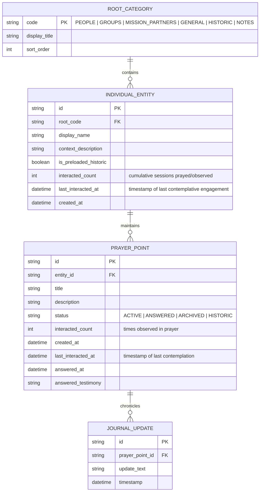

# Technical Decisions & Architecture Reference

**Document:** `planning/technical.md`  
**Status:** Approved Decisions & Living Architectural Reference  
**Application Title (Unofficial):** *Pray Without Ceasing* (1 Thessalonians 5:17)  
**Last Updated:** 2026-09-11  
**Platform Scope:** Mobile Only (Android initial; engineered for iOS portability)  
**Security Posture:** 100% Offline-First Local Persistence; Hardware-Secured Encrypted Vault (Room with SQLCipher)  
**Cloud Infrastructure:** Zero-Cost Cloudflare Worker Serverless Proxy (Zero User Login / Zero API Key Required)  
**Canonical Design Bible:** [`planning/android_journal_design_principles.md`](file:///c:/Users/ianch/sourcecode/repos/Prayer/planning/android_journal_design_principles.md) (Strictly read-only)  

---

## 1. Approved Technical Decisions

The following architectural decisions have been explicitly agreed upon and form the foundational technical boundaries for the system.

### 1.1 Data Hierarchy & Ontological Model
- **Ontological Model**: Four foundational roots:
  - **`People` (Root 1)**: Exclusively and strictly specific, distinct individual human relationships (e.g., spouse, parent, child, a single named friend/neighbor, and personal prayer points under *Me*—including personal trials, health, or sanctification occurring within a workplace or hospital).
  - **`Groups` (Root 2)**: Collectives, communities, and shared peer/work environments (e.g., work colleagues, office team, church congregation, small group, committee, ministry).
  - **`General` (Root 3)**: Broad topics, global prayer points, societal needs, and preloaded historic Reformed prayers. **Each preloaded historic prayer occupies its own distinct `IndividualEntity` (topic)** — never grouped under a single aggregate entity.
  - **`Mission Partners` (Root 4)**: Supported missionary families, mission agencies, missionaries, and ministry partners (e.g., a missionary family on the field, a Bible translation agency, a church planting ministry).
- **Entity Model**:


- **Preloaded Historic Content (DB Version 9)**:
  - **Architecture**: Each historic prayer is its own distinct `IndividualEntity` (`is_preloaded_historic = true`, `rootCode = HISTORIC`), paired 1:1 with a `PrayerPoint` (`status = HISTORIC`).
  - **Standalone Content Document**: The full catalog of 30 prayers (entities + full prayer text) is maintained as a standalone structured JSON document at [`android/app/src/main/res/raw/historic_prayers.json`](file:///c:/Users/ianch/sourcecode/repos/Prayer/android/app/src/main/res/raw/historic_prayers.json). It is the single source of truth for historic content: `PreloadedContent` parses it (via `kotlinx.serialization`) into `PreloadedHistoricTopic(entity, prayerPoint)` pairs at runtime and seeds the encrypted database on first launch. The same document is wired onto the JVM test classpath (`build.gradle.kts` test sourceSet) so unit tests parse the identical file.
  - **Data Class**: `PreloadedHistoricTopic(entity: IndividualEntity, prayerPoint: PrayerPoint)` — the fundamental pairing unit.
  - **DB Version**: `DATABASE_VERSION = 10`. Migration v2→v3 deletes legacy single-aggregate row; v4→v5 reseeds 30-prayer catalog; v6→v7 updates historic root code and title-first display names; v7→v8 updates all preloaded historic prayer points to latest wording and line breaks (`syncHistoricContent`); v8→v9 explicitly purges any orphaned/renamed historic entries (`historic-spurgeon-thanks-be-unto-god`) and any Spurgeon entities erroneously created under `GENERAL`, ensuring all Spurgeon entries reside exclusively under `HISTORIC`; v9→v10 creates `TABLE_SUGGESTION_CACHE` (`suggestion_cache`) to persist the last returned API prayer prompts per entity for instant display and seamless background refreshes. In addition, `onOpen(db)` automatically executes `syncHistoricContent` so bundled text enhancements are synchronized and orphans purged on every app launch without requiring a wipe or manual migration.
  - **30 distinct topics** seeded under `Historic` (ordered after `General`, which follows `Mission Partners`), displaying Title first, then author/source:
    1. The Lord's Prayer (Matthew 6:9–13)
    2. Collect for Peace (1662 BCP, Morning Prayer)
    3. Collect for Grace (1662 BCP, Morning Prayer)
    4. Collect for Purity (1662 BCP, Holy Communion)
    5. A General Thanksgiving (1662 BCP, Bishop Edward Reynolds)
    6. The Apostles' Creed (ecumenical; Thirty-Nine Articles Art. VIII)
    7. Help from on High (C.H. Spurgeon) (Passmore & Alabaster 1905, Prayer I)
    8. A Prayer for Holiness (C.H. Spurgeon) (Prayer VIII)
    9. Thanks Be To God (C.H. Spurgeon) (Prayer II)
    10. Love Without Measure (C.H. Spurgeon) (Prayer III)
    11. The All-Prevailing Plea (C.H. Spurgeon) (Prayer IV)
    12. Under the Blood (C.H. Spurgeon) (Prayer XI)
    13. The Peace of God (C.H. Spurgeon) (Prayer XV)
    14. The Great Sacrifice (C.H. Spurgeon) (Prayer XX)
    15. A Morning Prayer (Syrian Clementine Liturgy, 1st c.)
    16. For Rulers (Clement of Rome, 1st c.)
    17. A Pure Heart (Clementine Liturgy, 1st c.)
    18. Intercession (Polycarp, 2nd c.)
    19. A Dying Prayer (Polycarp, 2nd c.)
    20. For a Pure Heart (Liturgy of St James, 2nd c.)
    21. For Right Blessings (Basil the Great, 4th c.)
    22. For Two or Three (John Chrysostom, 4th c.)
    23. For Pardon (Ambrose of Milan, 4th c.)
    24. For Protection (Nerses of Clajes, 4th c.)
    25. For Steadfastness (Augustine of Hippo, 4th–5th c.)
    26. Evening Prayer (Augustine of Hippo, 4th–5th c.)
    27. Praise (Augustine of Hippo, 4th–5th c.)
    28. For Right Living (Leonine Sacramentary, 5th c.)
    29. For Love of God (Gelasian Sacramentary, 5th c.)
    30. To Serve You (Gelasian Sacramentary, 5th c.)
  - **Public Domain Status**: Spurgeon died 1892; original 1905 Passmore & Alabaster edition digitized on Internet Archive. 1662 BCP is public domain. Early church texts from Potts, *Prayers of the Early Church* (1953, public domain in the U.S.; CCEL transcription). Only original texts used; early church and Spurgeon entries lightly modernised (replacement of archaic vocabulary, pronouns, and verb forms; structured with tasteful devotional line breaks for meditative reading cadence).
  - **Zero-State Queue**: When no user topics exist, `getContemplativeTopics()` returns all 30 historic entities. When user topics exist, `blend_historic_prayers` boolean governs interleaving.
  - **AI & Answered Status Suppression**: `isPreloadedHistoric = true` and `PrayerStatus.HISTORIC` suppress AI prompt generation, `JournalScreen` context AI actions, and all active/answered toggle buttons/actions across Sanctuary and Journal screens. The 37.52dp left track (reduced by 33% from 56dp) remains structurally rendered as an unadorned spacer to preserve the red margin guide line and 45.52dp text inset alignment.

- **Theological Library Architecture & Standalone Document Assets**:
  - **Inaugural Asset**: `android/app/src/main/res/raw/library_calvin_prayer.json` (190 KB).
  - **Content**: John Calvin, *Institutes of the Christian Religion*, Book III, Chapter XX (*Of Prayer: A Perpetual Exercise of Faith*; trans. Henry Beveridge, 1845; Public Domain).
  - **Structure**: 8 Principal Divisions, 52 analytical outline summaries, and 52 structured sections reflowed into 99 flowing paragraphs.
  - **Data Models**: `@Serializable` Kotlin models (`LibraryVolume`, `VolumeDivision`, `VolumeSection`, `ReadingProgress`) in `au.prayer.app.data.models.LibraryModels.kt`.
  - **Loader & Memory Cache**: `au.prayer.app.data.models.LibraryContent.kt` lazy singleton. Deserialized volume occupies ~400 KB heap memory, safely uncollected during reading.
  - **Reading Persistence**: `ReadingProgress` tracks `lastSectionNumber`, `lastScrollOffset`, and `updatedAt` for seamless restoration across app lifecycles.

- **Daily Reflections & Study Notes Architecture (`NotesScreen`, `RootCode.NOTES`)**:
  - **Date as Grouping Container**: The calendar date is not a note; it is an organizing grouping container stored in `TABLE_ENTITIES` with `rootCode = RootCode.NOTES` (sort order 6) and display names formatted as `"[Day of week], [d] [MMMM] [yyyy]"` (e.g. `"Saturday, 12 September 2026"`).
  - **Multi-Note Child Persistence (1:N)**: Multiple notes are filed under each date grouping in `TABLE_POINTS` (`entity_id = dateEntity.id`). Each note carries an optional `title` (`""` if untitled) and full note text in `description` (`status = PrayerStatus.ACTIVE`).
  - **Repository Methods**:
    - `getNotesEntities()`: Retrieves all date grouping entities under `RootCode.NOTES`, ordered by pinned state descending and created timestamp descending.
    - `getOrCreateTodayNoteEntity(dateStr)`: Retrieves or instantiates the grouping container for today's calendar date.
    - `getNotesForDateEntity(entityId)`: Retrieves all notes filed under the date grouping, sorted chronologically (`created_at ASC`).
    - `getNote(noteId)`: Retrieves an individual note by UUID.
    - `createNote(entityId, title, description)`: Inserts a new note under the date grouping with optional title.
    - `updateNote(noteId, title, description)`: Updates title and body of an existing note.
    - `deleteNote(noteId)`: Deletes an individual note without affecting sibling notes or the parent date container.
    - `getNoteCountForEntity(entityId)`: Counts notes filed under a date grouping.
  - **Three-Tier Navigation (`LifoBackStack`)**:
    - `NotesView.OVERVIEW`: Date Groupings Directory (Today's note count and quick `+ Note` action, plus Past Dates).
    - `NotesView.DATE_DETAIL`: List of filed notes for the selected date grouping, with inline study topic editor, Silk Ribbon toggle, and `+ Add Note`.
    - `NotesView.NOTE_EDITOR`: Ruled notepad canvas (`LinedNotepad`) with individual **Title (Optional)** field, dynamic zoom, quiet autosave, and grounded AI prompts.
  - **Sanctuary Isolation Invariant**: `PrayerRepository.getContemplativeTopics()` explicitly filters out `RootCode.NOTES` (`userEntityQuery = "... WHERE root_code != 'NOTES' AND is_preloaded_historic = 0 ..."`), ensuring daily notes and study reflections never enter the devotional intercession queue.
  - **AI Prompt Integration & Persistent Cache**: Note content triggers asynchronous suggest requests via `PrayerApiClient.getSuggestions(...)` with `root = "NOTES"` and target name reflecting date and note title. Prompts are grouped into *Praise God*, *Thank God*, and *Ask God*, cached in `TABLE_SUGGESTION_CACHE` (`suggestion_cache`), and collapsed by default under the `❧ Prompts for Prayer ❧` divider.

- **Client Configuration & Preferences Schema (`APP_CONFIG`)**:
  - Encrypted key-value or single-row table in SQLite storing local preferences:
    - `locale_dialect`: `"EN_AU_UK"` (Default) | `"EN_US"`. Governs application copy, liturgical texts, date nuances, and prompt dialect instructions.
    - `leather_finish`: `"SADDLE_TAN"` (Default `#8C532B`) | `"CORDOVAN"` (`#5E2A2B`) | `"HUNTER_FOREST"` (`#2D483A`) | `"OBSIDIAN"` (`#35322F`).
    - `paper_stock`: `"CREAM_VELLUM"` (Default `#FAF7F0`) | `"NATURAL_IVORY"` (`#F5EFEB`) | `"AGED_PARCHMENT"` (`#EFE8DA`).
    - `high_contrast_mode`: Boolean (Default `false`). When active, meets WCAG 2.1 AA non-text contrast guidelines (`#9C9488` rules on `#FFFFFF`, `#0F0E0D` ink).
    - `text_scale`: `"LARGE"` (Default) | `"REGULAR"` | `"COMPACT"` (Retained in data model for backwards compatibility; removed from Settings menu UI).
    - `text_zoom_scale`: Float clamped between `0.75f` and `2.5f` (Default `1.0f`). Persisted in SQLite `TABLE_CONFIG` under `"text_zoom_scale"` for cross-session continuity.
    - `blend_historic_prayers`: Boolean (Default: `false`).
- **Dual-Engine Typographic Configuration & Pinch-to-Zoom Scaling**:
  - **Narrative Typographic Engine**: High-grade literary serif (*Literata*, *Newsreader*, *EB Garamond*, or *Lora*) applied to narrative petitions, prayer point descriptions, answered thanksgiving notes, and frontispiece quotes.
  - **Ledger Typographic Engine**: Understated neo-grotesque or humanist sans-serif (*Plus Jakarta Sans*, *Inter*, or *Roboto Flex*) applied to category headers, timestamps, entity tags, margin status asides, and settings chrome.
  - **Pinch-to-Zoom Dynamic Rescaling**: Multi-touch 2-finger pinch (`pinchToZoom` with `PointerEventPass.Initial`) scales all typographic tokens via `PrayerTypography.withZoom(scale)` proportionally across font size and line height between 75% and 250%, accompanied by an understated floating zoom indicator pill (`${percent}% • Reset`) and top bar reset action (`${percent}% ↺`). Active across `SanctuaryPrayerScreen`, `VolumeReaderScreen`, `JournalScreen` (Overview, Entity Detail, and `JournalView.EDIT_PRAYER_POINT`), and `LogPrayerScreen` (`LogStep.DRAFT_PRAYER_POINTS`).
  - **Mathematical Baseline Synchronization Law (`SanctuaryPrayerScreen`, `VolumeReaderScreen`, `LinedNotepad`)**:
    - Feint horizontal rules strictly match active text line height: $H_{px} = \text{lineHeightInPx}$ (`LARGE`: 28sp, `REGULAR`: 23sp, `COMPACT`: 19sp, dynamically scaled by `zoomScale`), measured via `TextMeasurer` on `typography.prayerPointBullet` configured with `PlatformTextStyle(includeFontPadding = false)` and `LineHeightStyle(alignment = Alignment.Center, trim = Trim.None)`.
    - Baseline anchor $Y_{anchor}$ derived from the first prayer point's sub-pixel layout baseline: feint lines are drawn via linear progression $y_k = Y_{anchor} + k \times H_{px}$, initialized at $y_{start} = Y_{anchor} \pmod{H_{px}}$ and continuing at step $H_{px}$ to the canvas bottom.
    - Inter-point gutters and header clearance are quantized to integer multiples of line cadence ($1 \times H_{px}$), guaranteeing zero baseline drift across any number of wrapped lines, prayer points, and display scales.

---

### 1.2 Persistence & Storage Architecture
- **Embedded Database**: **100% Offline Local Storage via SQLite with SQLCipher** wrapped in Android Room.
- **Security & Key Management**:
  - Master database encryption key is derived and stored using hardware-backed platform security:
    - **Android**: Android Keystore system.
    - **iOS**: iOS Keychain Services (Secure Enclave).
  - Complete operational independence from cloud databases; zero user data is ever transmitted to a central database or remote sync server.

#### 1.2.1 Vault Archive & Portability (Password-Protected AES-256-GCM Backup)
- **Problem Statement**: Because Android sandbox data is permanently wiped upon app uninstall and Android Keystore hardware keys cannot migrate across devices, users changing phones require a zero-telemetry, offline mechanism to export and restore their prayer journal.
- **Cryptographic Wire Specification**:
  - **Magic Header**: 8 ASCII bytes `PWCVAULT` + 4-byte big-endian Int32 version (`1`).
  - **Salt**: 16 cryptographically secure random bytes (`SecureRandom`).
  - **Nonce / IV**: 12 cryptographically secure random bytes for Galois/Counter Mode (`AES/GCM/NoPadding`).
  - **Key Derivation (KDF)**: `PBKDF2WithHmacSHA256` executed with 120,000 iterations to derive a 256-bit AES key from the user's secret passphrase.
  - **AEAD Integrity**: Authenticated Encryption with Associated Data binds the magic header as Associated Authenticated Data (AAD) and appends a 128-bit authentication tag. Any tampering, truncation, or incorrect passphrase fails immediately (`AEADBadTagException`) with zero plaintext leakage.
- **Payload Data Model (`VaultBackupPayload`)**:
  - Portable JSON serialization containing non-historic personal entities, all user prayer points (active & answered with testimonies), library reading progress, and application configuration.
- **Storage Access Framework (SAF) Integration**:
  - Export: `ActivityResultContracts.CreateDocument("application/octet-stream")` generates a `.folio` archive (e.g., `PrayerVault_YYYYMMDD_HHmm.folio`) written directly via `ContentResolver`.
  - Restore: `ActivityResultContracts.OpenDocument()` reads user-selected `.folio` files.
- **Restore Strategies**:
  - **Merge (Default & Recommended)**: Safely merges imported entities and prayer points without overwriting existing entries.
  - **Replace**: Clears all user entities and prayer points within a single atomic SQLite transaction and imports the archive. Factory preloaded historic prayers and library volumes are preserved.

---

### 1.3 Zero-Leakage API Key Security Architecture & Serverless Proxy

#### 1.3.1 Threat Model & The Mobile Reverse-Engineering Reality
- **The Core Vulnerability**: Mobile application binaries (Android APK/AAB or iOS IPA) are fundamentally untrusted client environments. Any credential, API token, or secret string packaged inside the application bundle can be extracted using basic reverse-engineering tools:
  - Static byte inspection (`strings`, `jadx`, `apktool`).
  - Dynamic instrumentation (Frida, objection).
  - Network proxy interception (mitmproxy, Charles).
- **Architectural Imperative**: The OpenRouter API key must **never touch the mobile codebase, git repository, build environment, or client binaries**. Zero instances of the master key shall exist on client devices.

#### 1.3.2 Data Exposure & Plaintext Pipeline Boundaries
Because writing on the lined notepad is 100% offline-first while past points prompts and auto-titling leverage cloud inference, the architectural boundary between offline vaulting and external network transit is strictly defined:

| Feature / Flow | Network Requirement | Plaintext Exposure Boundary |
| :--- | :--- | :--- |
| **"Start praying"** (Passive contemplation queue + Read-Only Prompts) | **Online (Background async)** (Transit via Cloudflare Proxy) | Contemplation is offline-first. When viewing an entity, the UI immediately renders the last list of prompts from SQLite `suggestion_cache` (from the last time the app was used) while past points are sent asynchronously in the background to `POST /api/v1/suggest` to refresh prompts, updating the display and cache in place upon completion. Decrypted in device RAM; zero chat, zero questioning. |
| **Journal Management** (Collapsible menus across People, Groups, General, Mission Partners; browsing, editing, answered tracking) | **100% Offline** (Zero network calls for vault) / **Online (Background async)** for Entity Detail read-only prompts | When viewing an entity's past points in detail, the UI immediately displays cached prompts from `suggestion_cache` while an asynchronous background refresh queries `POST /api/v1/suggest`, updating in-place upon completion. |
| **"Add prayer points"** (Direct Lined Notepad writing & saving) | **100% Offline** (Zero network calls; strictly no AI assistance) | Committed immediately to device RAM and encrypted local SQLite. Zero AI suggestions pane. |
| **Post-Commit Auto-Titling** (Branched AI Title Generator) | **Online (Async background)** | **Plaintext in memory** at: (1) Device RAM, (2) Cloudflare Worker runtime, (3) OpenRouter gateway, (4) Upstream model inference cluster. Theological validation exempt. |
| **Offline Fallback** (Local manual entry & snippet titling) | **100% Offline** (Zero network calls) | When offline, notepad saves locally, read-only prompts reliably display the last cached list from `suggestion_cache`, and auto-titling falls back to initial text snippet. |

#### 1.3.3 Two-Tier Zero-Leakage Architecture
The system isolates the API key behind an impenetrable serverless edge barrier, separating credential storage from client interaction:

```mermaid
graph TD
    subgraph Untrusted Client Zone (Mobile Devices)
        MobileClient["Mobile App Binary (APK / IPA)<br/>• Zero API Keys in Code<br/>• Zero OpenRouter References<br/>• Anonymous Device UUID in Keystore"]
    end

    subgraph Trust Boundary (Cloudflare Global Edge)
        Worker["Cloudflare Serverless Proxy<br/>($0.00 / month on Free Tier)"]
        Vault[("Cloudflare Encrypted Secrets Vault<br/>`wrangler secret put OPENROUTER_API_KEY`")]
        RateLimiter["Edge Quota & Rate Limiting Engine<br/>(Cache API / Ephemeral KV)"]
        PromptStorage["Authoritative Server-Side Prompt<br/>(Forces strictly prayer distillation)"]
    end

    subgraph Upstream Provider (Inference)
        OpenRouter["OpenRouter Gateway<br/>(Prepaid Hard Cap: $5.00)"]
    end

    MobileClient -->|"1. POST /api/v1/suggest<br/>(Batch Target Context + Device UUID + App Key)"| Worker
    Worker -->|"2. Read Secret at Runtime"| Vault
    Worker -->|"3. Enforce 20 req/day per UUID"| RateLimiter
    Worker -->|"4. Prepend Fixed System Prompt"| PromptStorage
    Worker -->|"5. POST /chat/completions<br/>Authorization: Bearer [KEY]"| OpenRouter
    OpenRouter -->|"6. Structured Suggestion Array JSON"| Worker
    Worker -->|"7. Clean Result (No Keys / No Raw Headers)"| MobileClient
```

#### 1.3.4 Detailed Security Controls
1. **Encrypted Vault Storage (`wrangler secret put`)**:
   - The master OpenRouter API key is injected directly into Cloudflare's encrypted environment storage via `wrangler secret put OPENROUTER_API_KEY`.
   - Injected only into runtime execution memory (`env.OPENROUTER_API_KEY`).
   - Never visible in configuration files (`wrangler.jsonc`), source code, or deployment manifests.
2. **Repository & CI/CD Isolation**:
   - The mobile application repository contains **zero** OpenRouter SDK dependencies, credentials, or URLs.
   - All `.env*` and local configuration files are enforced in `.gitignore`.
3. **Gateway Cloaking & Proxy Abuse Defense**:
   - Forced schema & fixed server-side prompt: client sends structured target context, Worker injects immutable system prompt.
   - Pre-Shared Gateway Key (`X-Prayer-Gateway-Secret`) required on every request.
   - Multi-tier rate limiting: 20 sessions/day per anonymous UUID, 30 req/hour per IP, 1,000 req/day global circuit breaker.
4. **Hard-Capped Financial Blast Radius (\$5.00/Month)**:
   - Prepaid balance of $5.00 with automatic top-ups disabled. Financial exposure cannot exceed this boundary.

#### 1.3.5 Deployed Cloudflare Worker Configuration Reference
- **Active Edge Endpoint**: `https://pray-proxy.reflex-game.workers.dev/`
- **Supported Endpoints**:
  - `POST /api/v1/suggest`: Ambient background suggestion generator (batch context, 4–15 words per line, 3–12 points across 3 groups: Praise God, Thank God, Ask God, starting with *For*, *That*, *A*, or *Because*, strictly avoiding wishy-washy general platitudes, non-parroting, zero chat, zero questioning).
  - `GET /health` (and `GET /`): Edge proxy health check and route discovery.
  - `OPTIONS`: Universal CORS preflight.
- **Worker Script Source**: Tracked directly in repository at [`api/worker.js`](file:///c:/Users/ianch/sourcecode/repos/Prayer/api/worker.js).
- **Gateway Authentication Header**: `X-Prayer-Gateway-Secret: prayer-app-secret-key-2026`
- **Active Upstream Model**: `openai/gpt-5.6-luna`
- **Reasoning Architecture & Two-Tier Pipeline**:
  - *Hidden Reasoning Disabled*: Configured with `reasoning: { enabled: false }` across all calls. Disables internal unconstrained reasoning overhead, reducing edge latency to ~1.2–1.6s.
  - *Two-Tier Pipeline Architecture (`api/worker.js`)*:
    1. **Tier 1 — Creative & Thoughtful Drafter (`temperature: 0.8`, `top_p: 0.95`)**: Generates natural, sober drafts of suggested prayer points based strictly on existing recorded content for the target, structured into three distinct groups: *Praise God*, *Thank God*, and *Ask God*. Bound by strict anti-overfitting directives (forbidden from borrowing prompt examples or unstated medical crises), avoidance of wishy-washy general platitudes, and complete grammatical thought requirements (strictly between 4 and 15 words).
    2. **Tier 2 — Verification & Compliance Harness (Low Temperature: `0.1`)**: Strictly enforces zero questions, zero chat, zero direct address to God, allowable word limits (4–15 words per line), strict avoidance of wishy-washy general platitudes, 3–12 points total across groups (minimum 1 per group), mandatory opening word prefixes (*For*, *That*, *A*, *Because*), anti-parroting constraint, anti-overfitting enforcement, complete sentence closure (rephrasing and adjusting rather than truncating), warm non-terse tone, strict non-fabrication invariant, and valid JSON wire format with descriptive schema placeholders.
  - *Defensive Edge Finalization*: Serverless proxy (`worker.js`) executes `finalizeSuggestion` to clean leading bullets, strip trailing cut-off punctuation/ellipses, recursively remove dangling prepositions and conjunctions, and preserve complete grammatical clauses.
  - *Data Retention Policy*: Hard-coded `provider: { data_collection: "deny" }` guarantees OpenRouter routes exclusively through upstream providers that do not log, retain, or train on requests.
- **Worker Observability**: Explicitly disabled (`observability: { enabled: false }` in `api/wrangler.jsonc`) to uphold the zero-telemetry and privacy mandate.
- **Mandatory Deploy-on-Completion Protocol (Cloudflare Worker API)**: Whenever changes are made to `api/worker.js` or files under `api/`, or when edge API synchronization is needed, the Cloudflare Worker must be proactively deployed via the Wrangler deployment script (`npm run deploy` or `npx wrangler deploy`) from `api/` before declaring work finished, ensuring edge proxies always run the authoritative code.

---

### 1.4 Ambient Suggestion Engine System Prompt & Interaction Guardrails

- **Strict Persona & Non-Conversational Tone**:
  - **No Chat & No Questions**: The AI assistant will **not** ask questions and will **not** chat. Conversational turn-taking and chat dialogues are strictly forbidden.
  - **Objective Prayer Points, Never Scripted Prayers**: The engine must never compose actual prayers or address God directly (e.g., never output "Father God...", "Dear Lord...", "Lord Jesus...").
  - **Batch Target Context Ingestion**: All user recorded data on the target is passed to the AI **in one go, not line by line**.
  - **Structured JSON Wire Schema**:
    ```json
    {
      "target_name": "string (optional, masked)",
      "root": "PEOPLE | GROUPS | GENERAL | MISSION_PARTNERS",
      "group": "string | null",
      "context_description": "string | null",
      "recorded_points": [
        { "title": "string", "body": "string", "status": "ACTIVE | ANSWERED" }
      ],
      "journal_updates": [
        { "text": "string" }
      ],
      "current_draft": "string | null",
      "locale_dialect": "EN_AU_UK | EN_US"
    }
    ```
  - **Ambient Output Format & Brevity Ceilings**:
    - Generates a structured JSON object containing three prayer groups alongside a backward-compatible flattened suggestions array:
      ```json
      {
        "praise_god": ["<praise point 4 to 15 words starting with For/That/A/Because>"],
        "thank_god": ["<thanksgiving point 4 to 15 words starting with For/That/A/Because>"],
        "ask_god": ["<petition point 4 to 15 words starting with For/That/A/Because>"],
        "suggestions": ["<flattened array of all generated prompts>"]
      }
      ```
    - Total points clamped to a range of **3 to 12 points total** across all three groups, with at least one point in each group (*Praise God*, *Thank God*, *Ask God*). If there is no obvious good thing or blessing to thank God for from the recorded data, strictly at most one point (1 point maximum) is generated for *Thank God*.
    - Each line is strictly between **4 and 15 words long** (never fewer than 4 words, never exceeding 15 words; strictly avoiding wishy-washy general platitudes).
    - **Complete Grammatical Thoughts Invariant (Never Cut Off)**: Every suggestion must be a 100% complete, fully finished grammatical thought. Sentences must never be cut off mid-thought, truncated, or end on dangling prepositions, conjunctions, or articles (e.g., *and*, *or*, *in*, *to*, *for*, *with*, *that*, *of*, *on*, *at*, *the*, *a*).
    - Every prompt line must begin with **"For"**, **"That"**, **"A"** (or **"An"**), or **"Because"**.
    - **Anti-Overfitting & Anti-Parroting Invariant**: The AI must not parrot back user inputs verbatim, nor may it replicate, borrow, or overfit to few-shot prompt examples (e.g., never presuming cancer, illness, or specific trial templates). It prayerfully distills and reframes the target context into fresh, worshipful, reverent prompts.
    - Displayed directly beneath prayer points grouped under subtle ledger category headers (`typography.categoryLedgerHeader`) on condensed `24sp` baseline rules. Crucially, the **default view is hidden or collapsed** across both `PrayerSessionScreen` and `JournalScreen`, expanding only when explicitly requested by the user. Strictly unlabelled as AI in the UI.
  - **Strict Anti-Fabrication Invariant (Grounding)**:
    - The lines produced by the AI shall **never make up content if existing data is limited**. Bounded strictly by provided facts.
  - **Entity Privacy & Masking Mandate**: Entity names are masked on-device prior to transmission.
  - **Dialect & Orthography Fidelity**: Defaults to English (Australian / UK) orthography (e.g., *saviour*, *honour*). Configurable to US English.
- **Compiled Prompt Architecture**:
  - Maintained under [`api/system_prompt.txt`](file:///c:/Users/ianch/sourcecode/repos/Prayer/api/system_prompt.txt) and embedded in [`api/worker.js`](file:///c:/Users/ianch/sourcecode/repos/Prayer/api/worker.js).

---

### 1.5 UI Interaction, Presentation Geometry & Devotional Mechanics

The visual and ergonomic presentation strictly reflects the **Modern Leatherbound Folio** design bible ([`planning/android_journal_design_principles.md`](file:///c:/Users/ianch/sourcecode/repos/Prayer/planning/android_journal_design_principles.md)):

```
       37.52dp Margin Track               Prayer Text Canvas
 ─────────────────────────────  ┼──────────────────────────────────────────
 [ ACTIVE ]                     │   • Complete recovery from surgery and
 ─────────────────────────────  ┼   renewed strength for the family...
 [ 10:45 AM ]                   │
 ─────────────────────────────  ┼     Quiet patience in the waiting period.
                                │
```

#### 1.5.1 Canvas Geometry, Launch Architecture & Spatial Layout Grid
- **Zero-Flash Cold Boot & Android 12+ SplashScreen**:
  - Application theme `@style/Theme.Prayer` binds `android:windowBackground` directly to `@color/paper_background` (`#FAF7F0`), preventing harsh white window flashes.
  - On API 31+ (`res/values-v31/themes.xml`), `windowSplashScreenBackground` and `windowSplashScreenAnimatedIcon` (`ic_splash_monogram.xml`) provide an authentic debossed Latin cross / monogram insignia on warm vellum.
  - Cold launch activates an interruptible folio opening revelation sequence (~600ms) that parts the leather cover into the illuminated frontispiece.
- **Folio Leather Casing Frame**: Bounds the display in the active leather base color (Saddle Tan `#8C532B`, Horween Cordovan `#5E2A2B`, Hunter Forest `#2D483A`, or Obsidian Hide `#35322F`) with a whisper-thin `1dp` perimeter stroke at 15% darker alpha.
- **Vellum Sheet Max Measure**: Maximum `720dp` width centered horizontally on large displays for optimal character reading cadence (60–75 characters).
- **Frontispiece Bookplate Framing**: Features a delicate double-hairline stationery border (`0.75dp` stroke in `colors.borderSubtle`) set 8dp within the vellum sheet.
- **The 37.52dp Left Margin Track**:
  - Vertical rule: `0.75dp` hairline in stationery red/sepia (`#E5B4B4`), located exactly at `X = 37.52dp` from the left sheet edge (reduced by 33% from 56dp).
  - Margin Track content: Houses Active/Answered seals, category tags, and paragraph timestamps (`10:45 AM`), allowing rapid scanning without disrupting the linear flow of prayer text.
- **Narrative Text Inset**: `37.52dp + 8dp = 45.52dp` from the left edge; `24dp` right padding from the right edge.
- **Horizontal Feint Rules & The Baseline Synchronization Law**:
  - Delicate hairlines (`0.75dp` stroke weight, `#E2DDD5` at 70% alpha).
  - Ruled lines are **always dynamically anchored to the active typographic baselines** of the text engine, spaced at `28sp` intervals for body text.
  - Ruled lines never use static repeating image stripes that slice through glyphs.
  - In blank canvas space below text, lines continue downward at the standard `28sp` cadence to preserve physical notebook continuity.

#### 1.5.2 The Silk Marker Ribbon (Interactive Bookmark Tab)
- **Geometry**:
  - Resting height: `40dp`.
  - Pinned / Active height: `80dp`.
  - Tab width: `18dp`.
  - Notch: `6dp` triangular swallow-tail notch centered at `X = 9dp`.
  - Margin & Anchoring: Anchored flush to the top-end margin (`Alignment.TopEnd` with `ribbonPaddingEnd = 4dp`, visual bounds `4dp` to `22dp`).
  - Anti-Occlusion Clearance: Narrative text maintains `36dp` end clearance and prompt cards maintain `52dp` end clearance to guarantee the ribbon never obscures devotional text or menu text (*Show/Hide* toggle).
- **Sensory Ergonomics**:
  - Projected invisible touch bounding box: **`48dp` horizontal × `80dp` vertical** (dynamic with ribbon extension).
  - Spring dynamics: modeled on textile elasticity (stiffness `220`, damping ratio `0.70`), `-3dp` touch compression on press-down.
  - Haptics: Fires a crisp `CLOCK_TICK` haptic impulse at the peak of the downward extension.
- **Devotional Role**: Tapping toggles the entity's pinned status (`is_pinned`), immediately prioritizing the entity to the head of the Sanctuary prayer queue (`ORDER BY e.is_pinned DESC`), grouping it under the dedicated "PINNED FOCUS" directory section in the Journal, and elongating the Home folio cover ribbon to indicate active intercessions.

#### 1.5.3 Devotional Prayer Session (`PrayerSessionScreen`)
- **Contemplative Immersion**: System bars, navigation chrome, and progress counters are completely suppressed (`display: none`).
- **Subject Header (*"Praying for [Name]"*, `22sp` / `32sp` line height)**: Sits on the first prominent rule; advances grid dynamically.
- **Prayer Points**: Render in Literary Serif (`17sp` / `28sp`), seated strictly ON feint rules. Auto-bulleted with `• `.
- **Unlabelled Suggested Intercessions (Collapsed by Default)**: `15sp` / `24sp` italic Literary Serif in muted ink (`#6E675F` at 85% alpha). Loaded directly beneath prayer points on condensed `24sp` rules. Kept **hidden or collapsed by default** behind an understated fleuron divider (`❧   Prompts for Prayer   ❧` with `Tap to view prompts`), expanding only upon explicit user tap. Strictly unlabelled in UI.
- **Spatial Touch Zoning**:
  - **Left 30% Screen Width**: Advance to previous entity.
  - **Right 30% Screen Width**: Advance to next entity (`Shared-Axis X`, spring stiffness `320`, damping `0.85`).
  - **Center 40% Screen Width**: Reading canvas; long-pressing any prayer point opens an in-place status resolution dialog (`Active` $\leftrightarrow$ `Answered`).
  - **Swipe Down (`ΔY > +60px` in upper half)**: Slides downward (`250ms`, Emphasized Accelerate) to return to Home.
- **Anti-Neglect Devotional Queue Algorithm**:
  ```sql
  SELECT e.* FROM entities e
  WHERE e.is_historic = 0
  AND EXISTS (
      SELECT 1 FROM points p 
      WHERE p.entity_id = e.id 
      AND p.status IN ('ACTIVE', 'HISTORIC')
  )
  ORDER BY 
      e.last_interacted_at IS NOT NULL ASC, -- Uninteracted topics first
      e.last_interacted_at ASC,             -- Oldest interaction dates next
      e.interacted_count ASC,               -- Lowest counts next
      RANDOM();                             -- Tie-breaker
  ```
  Viewing/advancing past a topic silently updates interaction timestamps and counters without toast alerts.

#### 1.5.4 Direct Lined Notepad & Committal Flow (`LogPrayerScreen`)
- **Typing-First Direct Entry & Instant Active Cursor**: Lands immediately on `LinedNotepad` pre-bound to feint rules with `autoFocus = true`. Focus is automatically requested and software keyboard displayed immediately upon screen entrance, with the typing cursor placed at the end of the last line (immediately after the initial bullet and space `• ` at `TextRange(2)`).
- **Zero Title Field**: User writes directly onto the ruled vellum without preliminary title fields or categorization.
- **Auto-Bullets & Newline Formatting**: Every new line automatically formats as a dotpoint (`• `) seated precisely on the next dynamic baseline rule; pressing Enter anywhere in text or pasting multi-line text ensures every line has a dotpoint; backspacing a lone bullet on an empty line cleanly removes it without cursor trapping.
- **Multi-Record Dotpoint Separation (`splitIntoDotpoints` & `savePrayerPoints`)**: When committing, the input text is parsed via `splitIntoDotpoints(text)` into individual clean dotpoint strings. `PrayerRepository.savePrayerPoints(entityId, points)` inserts each dotpoint as an independent row in SQLite `prayer_points` with incremented timestamps (`baseTime + index`) ensuring chronological fidelity under `ORDER BY created_at ASC`. Each dotpoint possesses its own distinct ID, allowing independent status transitions (`ACTIVE` $\leftrightarrow$ `ANSWERED`) in Sanctuary prayer and Journal screen.
- **Target Selection & Committal**: Tapping "Next" opens the categorization sheet presenting the four spheres (`People`, `Groups`, `General`, `Mission Partners`).
- **Batch Undo Feedback**: Immediate Snackbar toast (*"Saved N prayer points to [Name]"* / *"Saved to [Name]"*) with an Undo action that deletes all points created in the batch.
- **Silent Autosave Pulse**: A discreet dot in the ledger bar pulses to Celadon Sage (`#3D6B52`) over `150ms`, holds for `800ms`, and decays over `400ms`. Entries are saved cleanly without synthetic titles.

#### 1.5.5 Journal Directory & In-Place Editor (`JournalScreen`)
- Four expandable accordion categories (`People`, `Groups`, `General`, `Mission Partners`).
- Subject creation: Action item at the top of each expanded category listing (`+ Add person`, `+ Add group`, `+ Add topic`, `+ Add mission partner`) displaying an `AlertDialog` with planar 0dp styling, name input, and sphere switcher, transitioning directly to Entity Detail upon save.
- Entity Detail view expands via Material Container Transform (`300ms`, Emphasized Decelerate), presenting past prayer points, the `+ Add prayer point` action, and a collapsed-by-default prompts card (`Prompts for Prayer` with `Show/Hide` toggle) positioned below the `+ Add prayer point` button.
- **Date Grouping & Separation**: Entries are grouped and separated by date of entry with day and month written out in full English words (e.g. `EEEE, d MMMM yyyy` -> *"Friday, 11 September 2026"*) in subtle, unflashy typography (`typography.marginStatus` / `colors.inkMuted`).
- **Inline Draft Point in Active Record View (`isAddingDraftPoint`)**: When viewing saved prayer points for an active record in `JournalView.ENTITY_DETAIL`, tapping `+ Add prayer point` creates an editable draft point in-place directly on the LazyColumn list below existing points rather than navigating to `LogPrayerScreen`. The draft row features a `[ DRAFT ]` indicator pill in the 37.52dp margin track, an unadorned `BasicTextField` autofocusing with keyboard presentation, multiline dotpoint splitting (`splitIntoDotpoints`), and inline Cancel and Save Point actions. Committing immediately invokes `repository.savePrayerPoints` and refreshes `localPoints` from SQLite, and pressing Back while drafting cancels the draft without popping the view.
- **Margin Status Indicator**: Active prayer points display an analog line-drawn pencil icon (`Icons.Outlined.Edit`) within the 37.52dp margin track; answered prayers display the `[ ANSWERED ]` notation pill in Celadon green. Tapping either indicator toggles state in-place with instant optimistic Compose state (`localPoints`) and asynchronous background persistence on `Dispatchers.IO` for 0ms perceptible lag, accompanied by haptic feedback.
- **In-place editor (`JournalView.EDIT_PRAYER_POINT`)**: Pure-text editing on `LinedNotepad`. When starting to edit an existing prayer point, the typing cursor is instantly active with keyboard focus requested, positioned precisely at the end of the last line (`TextRange(description.length)`). Excludes redundant Active/Answered toggle buttons (canonically handled in the margin track); displays the thanksgiving note field if the point is already marked answered. Includes a bottom "Save changes" button and a TopAppBar "Save" action.
- **Keyboard Inset Architecture (`WindowInsets.safeDrawing`)**: Root `Scaffold` in `MainActivity.kt` configures `contentWindowInsets = WindowInsets.safeDrawing` with child `consumeWindowInsets(innerPadding)`, ensuring the layout shrinks and elevates all bottom buttons, menus, and controls cleanly above the software keyboard when it appears. Dialogs feature vertically scrollable content columns to prevent keyboard occlusion.
- Deletion: stark planar confirmation dialog before cascading purge.
- Sequestered Settings: Delegated to dedicated `SettingsScreen.kt` component featuring a scrollable vellum sheet, circular leather dye swatches (Saddle Tan, Horween Cordovan, Hunter Forest, Obsidian Hide), text scaling cards with live serif sample previews, dialect selection, and planar switches for historic prayer blending and high-contrast mode.

#### 1.5.6 Form Factor Versatility: Foldables, Tablets & Stylus
- **Adaptive Dual-Pane Book Spread**: On foldables in book posture and tablets in landscape:
  - Left pane: Journal directory or anti-neglect queue.
  - Right pane: Full-screen devotional prayer session or ruled writing canvas.
  - Spine gutter: `24dp` central spatial gutter with a subtle ambient gradient (`16dp` width, tapering from 6% black alpha to transparent) along the device fold.
- **Tabletop Posture (Flex Mode)**: Top panel reading mode; bottom panel input/controls.
- **Precision Stylus (S-Pen / USI)**: Digital archival ink matching active ink tone, palm rejection, handwritten margin notes bound to specific prayer point blocks.
- **Closed Folio Privacy Shield**: Masking Recent Apps / task switcher view with a flat vector leather cover and understated embossed monogram insignia.

---

### 1.6 Smartphone Touch & Gesture Engine Architecture

Lightweight, deterministic touch gesture engine ensuring fluid responsiveness:

1. **Touch Recognition Pipeline & Discrimination Thresholds**:
   - **Horizontal Intent Discrimination**:
     - Ratio Threshold: $|\Delta X| \ge 1.5 \times |\Delta Y|$ suppresses vertical scroll interference.
     - Distance Threshold: Minimum $|\Delta X| \ge 40\text{dp}$ to register horizontal swipe.
     - Velocity Window: Registered within $\le 400\text{ms}$ or displacement $\ge 80\text{dp}$.
2. **Ergonomic Touch Boundaries & Minimum Envelopes**:
   - **Universal Minimum Target**: **`48 × 48dp`** minimum bounding box across all interactive elements.
   - **Slender Affordance Compensation**:
     - Silk Marker Ribbon (`18dp` visual): **`48 × 80dp`** dynamic touch envelope.
     - Margin Notation Pills (`11sp` visual): **`48dp`** vertical tap track.
   - **Inter-Affordance Spacing**: Minimum clear gutter of **`8dp`** (`12dp` to `16dp` standard) between adjacent touch boundaries.
3. **Contextual Gesture Mapping**:
   - **`PrayerSessionScreen`**:
     - Left 30% Width: Tap / Swipe Right $\rightarrow$ previous entity.
     - Right 30% Width: Tap / Swipe Left $\rightarrow$ next entity.
     - Center 40% Width: Tap $\rightarrow$ reading; Long-Press ($\ge 400\text{ms}$) $\rightarrow$ in-place status resolution dialog.
     - Swipe Down ($\Delta Y \ge +60\text{dp}$ in upper half) $\rightarrow$ exit to Home.
   - **List Card Gestures (Journal)**:
     - Right Swipe ($\Delta X \ge +60\text{dp}$): Instant status toggle (`ACTIVE` $\leftrightarrow$ `ANSWERED`), soft haptic pulse.
     - Left Swipe ($\Delta X \le -60\text{dp}$): Exposes planar deletion confirmation.
     - Long-Press ($\ge 400\text{ms}$): Surfaces planar contextual action menu.
   - **Universal Edge-Swipe Back Navigation (`Modifier.edgeSwipeRight`)**:
     - Thresholds: $X_{start} \le 25\text{dp}$, $\Delta X \ge +50\text{dp}$, $|\Delta X| \ge 1.5 |\Delta Y|$.
     - Seamlessly unwinds the reactive LIFO back stack (`LifoBackStack.pop()`).
4. **Library Reader Multi-Touch Pinch-to-Zoom & Baseline Synchronization**:
   - **`VolumeReaderScreen` Gesture Discrimination**:
     - 1-Finger Vertical Drag: Scrolls continuous text canvas via `Modifier.verticalScroll(scrollState)`.
     - 1-Finger Horizontal Swipe: Navigates previous/next treatise sections (`Modifier.prayerSwipeGestures`).
     - 1-Finger Downward Swipe / Edge-Right Swipe: Exits reader to Library bookshelf.
     - 2-Finger Pinch Gesture (`Modifier.pinchToZoom`): Dynamically scales typographic font size between `0.75f` (75%) and `2.5f` (250%). Pointer events are consumed exclusively during 2-finger pinches to prevent scrolling or page navigation jumps.
     - **Baseline Synchronization Law**: Baseline rule spacing scales dynamically in 1:1 parity with paragraph line-height (`lineHeight = (28 * zoomScale).sp`, `baselineSpacingPx = (28.sp * zoomScale).toPx()`).
     - **Persistence**: Persisted via `PrayerRepository.saveLibraryZoomScale(scale)` to `TABLE_CONFIG` under key `"library_zoom_scale"`.
5. **Motion System Specifications & Reduced Motion**:
   - Spring physics: Ribbon (stiffness `220`, damping `0.70`), Queue traversal (stiffness `320`, damping `0.85`).
   - Container transforms: `300ms` Emphasized Decelerate.
   - Reduced Motion: System setting `Settings.Global.TRANSITION_ANIMATION_SCALE = 0` or "Remove animations" immediately replaces positional slides and spring bounces with instantaneous `100ms` cross-fades or zero-duration cuts.

---

### 1.7 AI API Testing Prohibition & Offline Validation Architecture

- **Prohibition Directive**: The agent and developer must never execute automated requests, load tests, or benchmark scripts against the AI API/OpenRouter edge proxy.
- **Offline Validation**: Doctrinal integrity, confessional boundaries, and schema compliance are verified purely through offline mechanisms:
  1. *Prompt Engineering & Architectural Guardrails*: Authoritative rules in [`api/system_prompt.txt`](file:///c:/Users/ianch/sourcecode/repos/Prayer/api/system_prompt.txt) and two-tier pipeline sanitization in [`api/worker.js`](file:///c:/Users/ianch/sourcecode/repos/Prayer/api/worker.js).
  2. *Android Offline Unit Tests*: Comprehensive JVM unit tests in [`TheologicalGuardrailsTest.kt`](file:///c:/Users/ianch/sourcecode/repos/Prayer/android/app/src/test/java/au/prayer/app/TheologicalGuardrailsTest.kt) and [`PrayerApiClientTest.kt`](file:///c:/Users/ianch/sourcecode/repos/Prayer/android/app/src/test/java/au/prayer/app/PrayerApiClientTest.kt).

---

### 1.8 Automated Testing Frameworks (Playwright & Android JVM)

1. **Specification & Layout Test Battery (`planning/tests/`)**:
   - Multi-viewport mobile coverage (390x844, 360x740, 428x926).
   - Validates 0dp planar geometry, 0px gutters, 1px seams, buttonless sanctuary, gesture discrimination ratios, anti-neglect queue ordering, and negative lexicon compliance. Current pass rate: 75/75 tests passed.
2. **Production Native Android Test Battery (`android/app/src/test/`)**:
   - Replicated JVM unit test suite across 9 test suites (`AntiNeglectQueueTest.kt`, `DevotionalFlowsTest.kt`, `GestureEngineTest.kt`, `LayoutGeometryTest.kt`, `LexiconContractTest.kt`, `PrayerApiClientTest.kt`, `TheologicalGuardrailsTest.kt`, `DataModelsTest.kt`, `LifoBackStackTest.kt`). Current pass rate: 69/69 tests passed (100.0%).

---

### 1.9 Multi-Session Concurrency & Build Locking Architecture

To support parallel autonomous coding agents and prevent race conditions or working copy thrashing:

1. **Gradle Build Serialization & Anti-Collision**:
   - Concurrently executing `.\gradlew.bat` commands against a shared working directory causes Kotlin compiler daemon socket resets (`SocketException: Connection reset`) and Windows OS file lock collisions on `build/tmp/kotlin-classes/`.
   - Agents must check for active tasks (`manage_task list`) or running processes (`Get-Process | Where-Object { $_.ProcessName -match "java|gradle" }`) before launching Gradle.
   - **Absolute Ban on Daemon Stoppage**: `.\gradlew.bat --stop` and `.\gradlew.bat clean` are strictly barred while peer sessions or background tasks are active.
   - **Isolated Compiler Mode**: Background test execution during multi-session activity must use `--no-daemon` (`.\gradlew.bat testDebugUnitTest --no-daemon`).
2. **Single-Deployer & Post-Deployment Commit Invariant (`deployToDrive` & `git commit`)**:
   - Multiple sessions must never simultaneously compile release APKs or write to `G:\My Drive\myApps\Prayer.apk`.
   - When peer sessions have uncommitted or concurrent work, deployment is consolidated to a single final release build containing all validated changes.
   - Upon successful deployment, the executing session commits all validated changes (`git add -A && git commit`) to preserve a clean and synchronized repository state.
3. **Atomic Scope Replacement**:
   - Edits via `replace_file_content` must use unique, bounded anchors rather than ambiguous block terminators (`}\n}\n}`) to prevent truncation of outer composable or function scopes.

---

## 2. Open-Ended Technical Decisions & Refinements

1. **Cross-Platform Core Technology Selection**:
   - Approved: Native Android with Jetpack Compose & Kotlin, optimized for Samsung Galaxy Flip and standard Android devices. Sideloadable release APK exported to `G:\My Drive\myApps\Prayer.apk`.
2. **OpenRouter Default Model Selection**:
   - Approved: `openai/gpt-5.6-luna` orchestrated via Two-Tier LLM pipeline in `api/worker.js` with `reasoning: { enabled: false }`.
3. **Offline Encrypted Backup Mechanics**:
   - Under consideration: Passphrase-protected AES-256 archive (`.prayerbackup`) or structured JSON/Markdown export.
