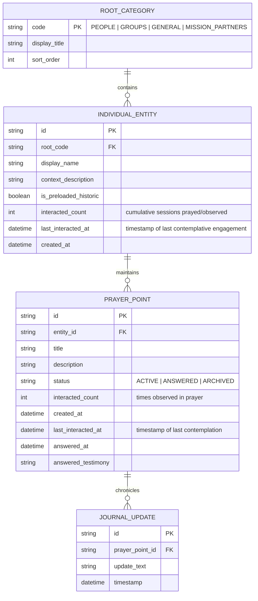

# Technical Decisions & Architecture Reference

**Document:** `planning/technical.md`  
**Status:** Approved Decisions & Open Questions Log  
**Application Title (Unofficial):** *Pray Without Ceasing* (1 Thessalonians 5:17)  
**Last Updated:** 2026-09-10  
**Platform Scope:** Mobile Only (Android initial; engineered for iOS portability)  
**Security Posture:** 100% Offline-First Local Persistence; Hardware-Secured Encrypted Vault  
**Cloud Infrastructure:** Zero-Cost Cloudflare Worker Serverless Proxy (Zero User Login / Zero API Key Required)  

---

## 1. Approved Technical Decisions

The following architectural decisions have been explicitly agreed upon and form the foundational technical boundaries for the system.

### 1.1 Data Hierarchy & Ontological Model
- **Ontological Model**: Four foundational roots:
  - **`People` (Root 1)**: Exclusively and strictly specific, distinct individual human relationships (e.g., spouse, parent, child, a single named friend/neighbor, and personal prayer points under *Me*—including personal trials, health, or sanctification occurring within a workplace or hospital).
  - **`Groups` (Root 2)**: Collectives, communities, and shared peer/work environments (e.g., work colleagues, office team, church congregation, small group, committee, ministry).
  - **`General` (Root 3)**: Broad topics, global prayer points, societal needs, and preloaded historic Reformed prayers.
  - **`Mission Partners` (Root 4)**: Supported missionary families, mission agencies, missionaries, and ministry partners (e.g., a missionary family on the field, a Bible translation agency, a church planting ministry).
- **Entity Model**:


- **Preloaded Reformed Content**:
  - Preloaded with historic Reformed, Protestant prayers:
    1. **The Lord's Prayer**
    2. **Classic Anglican Book of Common Prayer (BCP) Collects** (e.g., Collect for Peace, Collect for Grace, Collects for the Christian Year)
    3. **The Apostles' Creed**
  - Stored locally with `is_preloaded_historic = true` under the `GENERAL` root.
  - If no user-generated prayer points exist, the *Start praying* queue draws from this collection.
  - When user-generated points exist, a configuration flag (`blend_historic_prayers: boolean`) determines whether historic prayers are interleaved into the daily prayer rotation or accessed exclusively via directory browsing.

- **Client Configuration & Preferences Schema (`APP_CONFIG`)**:
  - Encrypted key-value or single-row table in SQLite storing local preferences:
    - `locale_dialect`: `"EN_AU_UK"` (Default) | `"EN_US"`. Governs application copy, liturgical texts, date nuances, and prompt dialect instructions.
    - `theme_mode`: `"MORNING_LIGHT"` (Default) | `"QUIET_NIGHT"`.
    - `text_scale`: `"LARGE"` (Default) | `"REGULAR"` | `"COMPACT"`.
    - `blend_historic_prayers`: Boolean (Default: `false`).

---

### 1.2 Persistence & Storage Architecture
- **Embedded Database**: **100% Offline Local Storage via SQLite with SQLCipher**.
- **Security & Key Management**:
  - Master database encryption key is derived and stored using hardware-backed platform security:
    - **Android**: Android Keystore system.
    - **iOS**: iOS Keychain Services (Secure Enclave).
  - Complete operational independence from cloud databases; zero user data is ever transmitted to a central database or remote sync server.

---

### 1.3 Zero-Leakage API Key Security Architecture & Serverless Proxy

#### 1.3.1 Threat Model & The Mobile Reverse-Engineering Reality
- **The Core Vulnerability**: Mobile application binaries (Android APK/AAB or iOS IPA) are fundamentally untrusted client environments. Any credential, API token, or secret string packaged inside the application bundle can be extracted within minutes using basic reverse-engineering tools:
  - Static byte inspection (`strings`, `jadx`, `apktool`).
  - Dynamic instrumentation (Frida, objection).
  - Network proxy interception (mitmproxy, Charles) if client communicates directly with upstream providers.
- **Architectural Imperative**: The OpenRouter API key must **never touch the mobile codebase, git repository, build environment, or client binaries**. Zero instances of the master key shall exist on client devices.

#### 1.3.2 Data Exposure & Plaintext Pipeline Boundaries
Because writing on the lined notepad is 100% offline-first while past points prompts and auto-titling leverage cloud inference, the architectural boundary between offline vaulting and external network transit is strictly defined:

| Feature / Flow | Network Requirement | Plaintext Exposure Boundary |
| :--- | :--- | :--- |
| **"Start praying"** (Passive contemplation queue + Read-Only Prompts) | **Online (Background async)** (Transit via Cloudflare Proxy) | Contemplation is offline-first. When viewing past points for an entity, past points are sent in batch to `POST /api/v1/suggest` to surface read-only prompts (strictly unlabelled in UI). Decrypted in device RAM; zero chat, zero questioning. |
| **Journal Management** (Collapsible menus across People, Groups, General, Mission Partners; browsing, editing, answered tracking) | **100% Offline** (Zero network calls for vault) / **Online (Background async)** for Entity Detail read-only prompts | When viewing an entity's past points in detail, past points are sent to `POST /api/v1/suggest` to surface read-only prompts (strictly unlabelled in UI). |
| **"Add prayer points"** (Direct Lined Notepad writing & saving) | **100% Offline** (Zero network calls; strictly no AI assistance) | Committed immediately to device RAM and encrypted local SQLite. Zero AI suggestions pane. |
| **Post-Commit Auto-Titling** (Branched AI Title Generator) | **Online (Async background)** | **Plaintext in memory** at: (1) Device RAM, (2) Cloudflare Worker runtime, (3) OpenRouter gateway, (4) Upstream model inference cluster. Theological validation exempt. |
| **Offline Fallback** (Local manual entry & snippet titling) | **100% Offline** (Zero network calls) | When offline, notepad saves locally, read-only prompts gracefully omit or show cached items, and auto-titling falls back to initial text snippet. |

#### 1.3.3 Two-Tier Zero-Leakage Architecture
The system isolates the API key behind an impenetrable serverless edge barrier, separating credential storage from client interaction:

```mermaid
graph TD
    subgraph Untrusted Client Zone (Mobile Devices)
        MobileClient["Mobile App Binary (APK / IPA)<br/>• Zero API Keys in Code<br/>• Zero OpenRouter References<br/>• Anonymous Device UUID in Keystore"]
    end

    subgraph Trust Boundary (Cloudflare Global Edge)
        Worker["Cloudflare Serverless Proxy<br/>($0.00 / month on Free Tier)"]
        Vault[("Cloudflare Encrypted Secrets Vault<br/>`wrangler secret put OPENROUTER_API_KEY`")]
        RateLimiter["Edge Quota & Rate Limiting Engine<br/>(Cache API / Ephemeral KV)"]
        PromptStorage["Authoritative Server-Side Prompt<br/>(Forces strictly prayer distillation)"]
    end

    subgraph Upstream Provider (Inference)
        OpenRouter["OpenRouter Gateway<br/>(Prepaid Hard Cap: $5.00)"]
    end

    MobileClient -->|"1. POST /api/v1/suggest<br/>(Batch Target Context + Device UUID + App Key)"| Worker
    Worker -->|"2. Read Secret at Runtime"| Vault
    Worker -->|"3. Enforce 20 req/day per UUID"| RateLimiter
    Worker -->|"4. Prepend Fixed System Prompt"| PromptStorage
    Worker -->|"5. POST /chat/completions<br/>Authorization: Bearer [KEY]"| OpenRouter
    OpenRouter -->|"6. Structured Suggestion Array JSON"| Worker
    Worker -->|"7. Clean Result (No Keys / No Raw Headers)"| MobileClient
```

#### 1.3.4 Detailed Security Controls
1. **Encrypted Vault Storage (`wrangler secret put`)**:
   - The master OpenRouter API key is injected directly into Cloudflare’s encrypted environment storage via the Cloudflare CLI:
     ```bash
     wrangler secret put OPENROUTER_API_KEY
     ```
   - Cloudflare encrypts secrets at rest and injects them only into the Worker's runtime execution memory (`env.OPENROUTER_API_KEY`).
   - The key is never visible in plaintext in configuration files (`wrangler.toml`), source code, or deployment manifests.
2. **Repository & CI/CD Isolation**:
   - The mobile application repository contains **zero** OpenRouter SDK dependencies, credentials, or URLs.
   - All `.env*` and local configuration files are enforced in `.gitignore`.
3. **Gateway Cloaking & Proxy Abuse Defense**:
   Even if an attacker sniffs network traffic from their own phone to identify the proxy URL (`https://prayer-proxy.workers.dev/api/v1/suggest`), they cannot abuse the underlying OpenRouter API key because of four proxy-level guardrails:
   - **Forced Schema & Server-Side Prompt**: The proxy accepts strictly:
     ```json
     {
       "target_name": "string (optional, masked, max 100 chars)",
       "root": "PEOPLE | GROUPS | GENERAL | MISSION_PARTNERS (required)",
       "group": "string | null (optional, max 100 chars)",
       "context_description": "string | null (optional, max 500 chars)",
       "recorded_points": [
         {
           "title": "string (required, max 100 chars)",
           "body": "string (required, max 1,000 chars)",
           "status": "ACTIVE | ANSWERED (required)"
         }
       ],
       "journal_updates": [
         {
           "text": "string (required, max 1,000 chars)"
         }
       ],
       "current_draft": "string | null (optional, max 1,500 chars)",
       "locale_dialect": "EN_AU_UK | EN_US (optional, default EN_AU_UK)"
     }
     ```
     The mobile application automatically packages all user recorded data on the target into this structured JSON payload in one go (not line by line). The proxy sanitizes the payload, strips caller-supplied system prompts, enforces its fixed ambient suggestion prompt (which strictly prohibits asking questions, chatting, or fabricating unstated details when existing data is limited), and forwards the stringified JSON payload as the model's user message. An attacker **cannot** use your proxy to write code, solve homework, or run arbitrary LLM queries.
   - **App-Level Pre-Shared Gateway Key (`X-Prayer-Gateway-Secret`)**: The proxy rejects any request lacking a high-entropy secret header configured at compile-time (`401 Unauthorized`), blocking casual scrapers and search bots.
   - **Multi-Tier Rate Limiting**:
     - **Per-Device Quota**: Maximum 20 suggestion sessions per 24 hours per anonymous installation UUID.
     - **Per-IP Rate Limit**: Maximum 30 requests per hour per IP.
     - **Global Daily Circuit Breaker**: Hard cap of 1,000 total requests/day across all 100 users combined.
4. **Hard-Capped Financial Blast Radius (\$5.00/Month)**:
   - Even in an unthinkable catastrophic compromise where an attacker bypasses rate limiting, the OpenRouter account operates strictly on a **prepaid balance of $5.00** with automatic top-ups disabled.
   - Financial risk is strictly bounded to $5.00 per month. Operational exposure cannot exceed the predefined budget.

#### 1.3.5 Deployed Cloudflare Worker Configuration Reference
- **Active Edge Endpoint**: `https://pray-proxy.reflex-game.workers.dev/`
- **Supported Endpoints**:
  - `POST /api/v1/suggest` (and `POST /api/v1/guide` compatibility): Ambient background suggestion generator (batch target context, 1–6 words per line, zero chat, zero questioning).
  - `POST /api/v1/title`: Lightweight post-commit auto-titling branch (exempt from theological validation).
  - `GET /health` (and `GET /`): Edge proxy health check and route discovery.
  - `OPTIONS`: Universal CORS preflight.
- **Worker Script Source**: Tracked directly in repository at [`api/worker.js`](file:///c:/Users/ianch/sourcecode/repos/Prayer/api/worker.js).
- **Gateway Authentication Header**: `X-Prayer-Gateway-Secret: prayer-app-secret-key-2026`
- **Active Upstream Model**: `nvidia/nemotron-3.5-lightning`
- **Reasoning Architecture & Two-Tier Pipeline**:
  - *Hidden Reasoning Disabled*: Configured with `reasoning: { enabled: false }` across all calls. Disabling internal unconstrained reasoning overhead eliminates ~3,900 tokens of hidden thinking bloat in Nemotron, reducing output tokens to ~140–250 tokens total and cutting edge-to-edge latency from 10+ seconds to ~1.2–1.6s.
  - *Two-Tier Pipeline Architecture (`api/worker.js`)*: Solves the tension between thoughtful, natural phrasing and strict, unyielding system prompt compliance:
    1. **Tier 1 — Creative & Thoughtful Drafter (`temperature: 0.7`, `top_p: 0.95`)**:
       - *Suggestion Endpoint (`/api/v1/suggest`)*: `max_tokens: 9000`. Generates natural, dignified, sober drafts of suggested prayer points based strictly on existing recorded content for the target. AI will not ask questions and will not chat.
       - *Title Endpoint (`/api/v1/title`)*: `max_tokens: 9000`. Brainstorms 2–3 plain, dignified title ideas in Title Case (2–4 words), rejecting both sterile clinical codes and cheesy clichés.
    2. **Tier 2 — Verification & Compliance Harness (Low Temperature: `0.1`)**:
       - *Suggestion Endpoint (`/api/v1/suggest`)*: `max_tokens: 9000`. Ingests the batch target data and Tier 1 draft, strictly enforcing:
         - **Prohibition of Questions & Chat**: Zero clarifying questions, zero conversational filler, zero chat.
         - **Prohibition of Direct Prayers**: Strips all second-person prayer language and direct address to God (*"Father..."*, *"Lord Jesus..."*), ensuring output is strictly objective prayer points.
         - **Line Brevity Ceilings**: Each line strictly between **1 and 6 words long**.
         - **Strict Non-Fabrication Invariant**: Shall never make up content if existing data is limited. Bounded strictly by recorded facts.
         - **Confessional Guardrails**: Reformed theology, Solus Christus, and Heidelberg Catechism Q&A 1 comfort grounding.
         - **Output Format**: Strictly valid JSON matching wire schema `{"suggestions": ["line 1", "line 2", ...]}`.
       - *Title Endpoint (`/api/v1/title`)*: `max_tokens: 9000`. Selects or refines the single best title under strict word ceilings (2–6 words), prefix stripping ("Pray for", etc.), and configured dialect (`EN_AU_UK` vs `EN_US`).
  - *Data Retention Policy*: Hard-coded `provider: { data_collection: "deny" }` guarantees OpenRouter routes exclusively through upstream providers that do not log, retain, or train on prayer requests.
- **Error Reflection Sanitization**: Upstream and internal error handlers suppress raw upstream error text (`errText` / `err.message`) to prevent accidental reflection of prayer text in HTTP error payloads.
- **Worker Observability**: Explicitly disabled (`observability: { enabled: false }` in `api/wrangler.jsonc`) to uphold the zero-telemetry and privacy mandate by preventing request payload log retention at the edge.
- **Live Verification Status**:
  - Worker deployment: **ONLINE** (edge latency ~300ms).
  - Gateway Authorization: **VERIFIED ACTIVE** (unauthorized calls return HTTP 401).
  - OpenRouter Secret Vaulting: **VERIFIED ACTIVE** (master API key securely injected by Cloudflare).
  - End-to-End Inference: **VERIFIED OPERATIONAL** (successfully parses batch target context into strictly formatted theological prayer suggestions JSON).

#### 1.3.6 Inference Cache Isolation & Zero Cross-Request Contamination
- **Prompt Caching Mechanics (KV Cache Reuse)**: Modern LLM providers (e.g., DeepSeek, Anthropic, Google) employ prompt caching by caching Key-Value (KV) tensors of exact token prefixes starting from token index 0. In this architecture:
  - The only shared prefix across requests is the static, immutable system prompt (`PROMPT_PERSONA` through `PROMPT_OUTPUT_SCHEMA`).
  - Once user input begins, the token sequence diverges. User A's prayer input is never part of the prefix for User B's request.
  - Transformer attention mechanisms strictly prevent generation for User B from attending to KV states outside User B's defined context window. Prompt caching cannot append, bleed, or inject past user inputs into new requests.
- **Stateless Edge Execution**: The Cloudflare Worker proxy is 100% stateless. Each request instantiates a discrete execution context with a freshly constructed `messages` array (`[{ role: "system", content: systemPrompt }, { role: "user", content: sanitizedInput }]`). No inter-request memory or global conversation arrays exist.
- **Zero HTTP Edge Response Caching**: The proxy operates strictly on `POST` requests and does not utilize Cloudflare's Cache API (`caches.default`) or `Cache-Control` storage headers. Responses are never cached at the edge or served to subsequent callers.

---

### 1.4 Ambient Suggestion Engine System Prompt & Interaction Guardrails

- **Strict Persona & Non-Conversational Tone**:
  - **No Chat & No Questions**: The AI assistant will **not** ask questions and will **not** be able to chat to. Conversational turn-taking, artificial empathy, pseudo-psychological validation, and chat dialogues are strictly forbidden.
  - **Objective Prayer Points, Never Scripted Prayers**: The engine must never compose actual prayers or address God directly (e.g., never output "Father God...", "Dear Lord...", "Lord Jesus...", "Thy will be done", or second-person invocations to God). Believers pray themselves; the engine strictly summarizes recorded burdens into concise suggested prayer points.
  - **Batch Target Context Ingestion**: All user recorded data on the target (existing active prayer points, answered points, notes, and context) is passed to the AI **in one go, not line by line**.
  - **Structured JSON Wire Schema**:
    ```json
    {
      "target_name": "string (optional, masked)",
      "root": "PEOPLE | GROUPS | GENERAL | MISSION_PARTNERS",
      "group": "string | null",
      "context_description": "string | null",
      "recorded_points": [
        { "title": "string", "body": "string", "status": "ACTIVE | ANSWERED" }
      ],
      "journal_updates": [
        { "text": "string" }
      ],
      "current_draft": "string | null",
      "locale_dialect": "EN_AU_UK | EN_US"
    }
    ```
  - **Ambient Output Format & Brevity Ceilings**:
    - Generates a JSON array of suggested lines: `{"suggestions": ["line 1", "line 2", ...]}`.
    - Each line is strictly between **1 and 6 words long**.
    - Displayed in a small bottom pane showing **1 to 5 lines at a time** in a scrollable list.
  - **Strict Anti-Fabrication Invariant (Grounding)**:
    - The lines produced by the AI shall **never make up content if existing data is limited**.
    - If user recorded data is sparse or minimal, the model is strictly constrained to the provided facts and must never extrapolate unstated medical crises, hospitalizations, emotional traumas, or speculative burdens.
  - **Scroll-Triggered Refresh**:
    - Scrolling within the suggestion list triggers a background API call to refresh or retrieve additional suggested points.
  - **Entity Privacy & Masking Mandate**: Entity names are masked on-device prior to transmission. Target entity binding is handled entirely locally on-device.
  - **Dialect & Orthography Fidelity**: Engine defaults to English (Australian / UK) orthography and phrasing (e.g., *saviour*, *honour*, *neighbour*). When US English is configured on the client, user context communicates this preference to ensure matching US orthography.

- **Modular Prompt Architecture & Cloudflare 5.1 kB Text Binding Limit**:
  - Cloudflare Workers enforce a strict **5 KiB (5,120 bytes)** ceiling per environment variable text binding.
  - The system prompt is decomposed into fine modules assembled sequentially under [`api/prompts/`](file:///c:/Users/ianch/sourcecode/repos/Prayer/api/prompts):
    1. **`PROMPT_PERSONA`** ([`api/prompts/PROMPT_PERSONA.txt`](file:///c:/Users/ianch/sourcecode/repos/Prayer/api/prompts/PROMPT_PERSONA.txt) — ~0.5 kB): Ambient suggestion identity, zero chat, zero questioning, non-therapeutic, objective point formulation.
    2. **`PROMPT_SUGGESTION_FLOW`** ([`api/prompts/PROMPT_SUGGESTION_FLOW.txt`](file:///c:/Users/ianch/sourcecode/repos/Prayer/api/prompts/PROMPT_SUGGESTION_FLOW.txt) — ~2.0 kB): Batch target context processing, 1–6 words per line, 1–5 lines visible, scroll refresh mechanics, and strict prohibition against making up content if data is limited.
    3. **`PROMPT_THEOLOGY`** ([`api/prompts/PROMPT_THEOLOGY.txt`](file:///c:/Users/ianch/sourcecode/repos/Prayer/api/prompts/PROMPT_THEOLOGY.txt) — ~1.3 kB): Christian, Protestant, Reformed & Calvinist identity, directing all prayer points exclusively to God in the name of Jesus Christ (rejecting saints/angels/ancestors), alignment with classical Reformed confessional principles, framing prayer points as humble biblical requests submitted to God's sovereign will (rejecting prosperity decrees, word-faith formulas, transactional bargaining, or manifesting), Heidelberg Catechism Q&A 1 comfort grounding, and strict prohibition against writing scripted prayers or addressing God directly.
    4. **`PROMPT_TAXONOMY_PRIVACY`** ([`api/prompts/PROMPT_TAXONOMY_PRIVACY.txt`](file:///c:/Users/ianch/sourcecode/repos/Prayer/api/prompts/PROMPT_TAXONOMY_PRIVACY.txt) — ~1.9 kB): Four roots (`PEOPLE`, `GROUPS`, `GENERAL`, `MISSION_PARTNERS`), on-device entity masking, personal prayer points under People even within workplace contexts.
    5. **`PROMPT_CARD_STYLE`** ([`api/prompts/PROMPT_CARD_STYLE.txt`](file:///c:/Users/ianch/sourcecode/repos/Prayer/api/prompts/PROMPT_CARD_STYLE.txt) — ~1.9 kB): Strict length ceiling of 1 to 6 words per suggested line, stripping redundant prefixes ("Pray for", "Ask God to"), punchy core nouns and verbs.
    6. **`PROMPT_OUTPUT_SCHEMA`** ([`api/prompts/PROMPT_OUTPUT_SCHEMA.txt`](file:///c:/Users/ianch/sourcecode/repos/Prayer/api/prompts/PROMPT_OUTPUT_SCHEMA.txt) — ~0.8 kB): UK/Australian vs US English dialect handling and JSON output schema `{"suggestions": ["string"]}`.
  - Full assembled reference is preserved in [`api/system_prompt.txt`](file:///c:/Users/ianch/sourcecode/repos/Prayer/api/system_prompt.txt).

---

### 1.5 UI Interaction & Devotional Engine Mechanics

- **Home Screen Presentation**:
  - A pristine, blank canvas partitioned into contiguous flat tiles with strictly three centered action buttons:
    1. `Start praying`
    2. `Open Journal`
    3. `Add prayer points`
  - Strictly zero hero headers, application title banners, wordmarks, or tutorial/explanatory labels. The three slabs occupy the viewport edge-to-edge. Swiping left also triggers the Journal (`People`, `Groups`, `General`, `Mission Partners`).
- **Passive Prayer Engine ("Start Praying" / Full-Screen Prayer Mode)**:
  - **Full-Screen Buttonless Architecture**: When in Prayer mode (`screen-pray`), the top navigation bar and bottom action dock are completely hidden (`display: none`). The interface features strictly zero buttons, zero card tiles, and zero grid borders.
  - **Typographic Presentation**: The screen renders exclusively a clean, solemn heading (`Praying for {entity.name}`), followed directly by the prayer points (`prayer-point-title` and `prayer-point-body`) with generous typographic breathing room on the edge-to-edge canvas.
  - **Gestural & Keyboard Navigation (Smartphone Swipe Primacy)**:
    - Native Touch Gestures: Horizontal swipe left/right transitions between topics; swiping down from the top edge exits back to the home screen. Primary navigation mode for mobile devotion.
    - Screen Touch Zones (Accessibility): Tapping the right 75% of the viewport advances to the next topic; tapping the left 25% returns to the previous topic; tapping top edge exits.
    - Keyboard: `ArrowRight` / `Space` / `PageDown` (Next), `ArrowLeft` / `PageUp` (Previous), `Escape` (Exit to Home).
  - **Design Principle: Strict Prohibition of Ordinal / Index Labels**: UI components, templates, and view models are strictly prohibited from generating, coding, or interpolating sequential counter labels (e.g., `Point 1`, `Point 2`, `Point ${idx + 1}`, `Point N of M`, `Item 1`). While database records retain internal primary keys (`id`) for relational integrity, all presentation layers must strictly suppress ordinal numbering. Prayer points are rendered solely as unnumbered, sacred prayer points featuring their substantive `title` and `description`.
  - **Principle of Minimal Contextual Data Exposure**: UI components, templates, and view models must strictly adhere to contextual data economy. Just because an entity or session model possesses rich backend metadata (e.g., `id`, `root`, `interacted_count`, `last_interacted_at`, total count of points, active count, queue indices) does not mean it should be exposed in presentation views. The frontend shall render solely the minimal data points demanded by the immediate devotional task, keeping view models lean and free from administrative leakage.
  - **Balanced Queue Curation & Anti-Neglect Algorithm**:
    - To ensure balanced intercession across all relational spheres, SQLite query ordering balances topics dynamically:
      ```sql
      SELECT e.* FROM INDIVIDUAL_ENTITY e
      WHERE EXISTS (
        SELECT 1 FROM PRAYER_POINT p 
        WHERE p.entity_id = e.id AND p.status IN ('ACTIVE', 'HISTORIC')
      )
      ORDER BY 
        e.last_interacted_at IS NOT NULL ASC, -- Never-interacted topics first
        e.last_interacted_at ASC,             -- Oldest interacted topics next
        e.interacted_count ASC,               -- Least interacted topics next
        RANDOM();                             -- Tie-breaker
      ```
    - Viewing/advancing past a topic silently increments `e.interacted_count = e.interacted_count + 1`, updates `e.last_interacted_at = CURRENT_TIMESTAMP`, and synchronizes `p.last_interacted_at` across its constituent points.
  - **Expandable Answered Prayer Section**: Answered prayer points for that entity are retrieved and sequestered in a collapsed hairline tile (`Answered (N)`). Tapping toggles expansion, revealing answered items with soft strikethrough for thanksgiving without intruding upon active intercession.
  - **Read-Only Prompts on Past Points (Strictly Unlabelled in UI)**: When contemplating an entity/topic, all recorded past points (active and answered) are sent in batch to `POST /api/v1/suggest`. The API returns 3–5 concise, grounded prompts displayed in an austere, **strictly read-only** planar card/section beneath active points. The prompts are strictly unlabelled in the UI (never headed or badged as "Petitions" or "Prompts"). Responses are cached per entity ID so swiping between topics does not trigger redundant network calls.
  - **100% Read-Only & Uncluttered**: Zero buttons, checkmarks, editing controls, or settings sliders during prayer.
  - **Self-Paced & Open-Ended**: Each screen is a complete topic. Users advance through topics at their own pace and exit whenever they wish.
- **Adding Engine ("Add Prayer Points")**:
  - **Mandatory Step 0: Target Entity Resolution (Upfront Selection / Creation)**:
    - Because every prayer point in the database maintains a foreign key `entity_id` linking to `INDIVIDUAL_ENTITY`, adding begins with selecting an existing person/group or creating a new one.
    - If initiated from an entity view in the Journal, the target entity is pre-bound.
    - If initiated from the main menu, an edge-to-edge entity picker allows selecting an existing entity or tapping a contiguous *"New Person / Group"* tile to quickly input a name and select `People` or `Groups`.
  - **Integrated Lined Notepad & Pure Unmediated Capture (Post-Entity Selection)**:
    - **Zero Title Field & Direct Access**: The intermediary "Direct Entry" button is completely removed. Upon entity selection, the UI renders strictly an integrated lined notepad pre-bound to the person or group.
    - **Authentic Notepad Ruled Lines & Mathematical Line-Locking**: Text sits strictly *inside* the ruled lines without baseline drift or glyph slicing across all font scales and display densities. Enforced via `TextLayoutResult` integration (`onTextLayout`), extracting exact pixel line boundaries (`layout.getLineTop(0)` and `layout.getLineBottom(i)`), zero font padding (`includeFontPadding = false`), centered line-height styling, dynamically computed line height (`(fontSize * 1.9f).sp`), full-height viewport rules (`BoxWithConstraints`), hairline stroke (`0.75dp`), and unified single-canvas scrolling (`drawBehind` and `BasicTextField` sharing the same `Modifier.verticalScroll` Box).
    - **Strictly No AI Assistance in Adding Mode**: The lined notepad canvas occupies the primary vertical viewport. There is strictly no ambient suggestion pane, no AI buttons, and zero AI generation during entry.
    - **Auto Bullet-Point List Engine**: The text pad automatically formats entries as bulleted lists. Initializing with a bullet prefix (`• `), `Enter` (newline) inserts `\n• ` and advances the cursor. Backspacing over an empty bullet clears the bullet cleanly.
    - **Immediate Local Commit**: Tapping **Save to [Name]** (or the header Save action) immediately executes `INSERT INTO PRAYER_POINT (entity_id, body, status, created_at)` into local SQLite. 100% offline-first.
    - **Branched AI Title Generation (Post-Committal)**: After local committal, an asynchronous background task dispatches the prayer point body to the branched AI title generator (`POST /api/v1/title`). The model generates a concise 2–6 word title and updates the local record (`UPDATE PRAYER_POINT SET title = ? WHERE id = ?`).
    - **Theological Validation Exemption**: This branch performs solely the simple task of generating a concise title from the user's committed text; theological validation is not required.
    - **Offline Fallback**: In offline scenarios, the record uses an initial clean snippet (first 3–5 words) as a temporary label until network connectivity allows the background title generator to populate the permanent title.
- **Saved Prayer Point Editing & Permanent Deletion Engine**:
  - **Single-Click Activation**: In the Entity Detail view, tapping any saved prayer point once immediately opens the prayer point editor.
  - **Read-Only Past Points Prompts in Entity Detail (Strictly Unlabelled in UI)**: In `JournalView.ENTITY_DETAIL`, an entity's past recorded points are sent in batch to `POST /api/v1/suggest`. The returned prompts are displayed in a dedicated, **strictly read-only** card below the saved prayer points list (strictly unlabelled in the UI), with cached responses per entity.
333:   - **Editable Properties**:
    - `title`: Fully editable text input, allowing believers to customize or refine auto-generated titles.
    - `body`: Fully editable textarea with the auto bullet-point list engine.
    - `status`: State toggle between `ACTIVE` and `ANSWERED` (with optional thanksgiving note).
  - **Persistence Operations**:
    - *Save Changes*:
      ```sql
      UPDATE PRAYER_POINT 
      SET title = :title, body = :body, status = :status, updated_at = CURRENT_TIMESTAMP 
      WHERE id = :id;
      ```
    - *Permanent Deletion*:
      ```sql
      DELETE FROM PRAYER_POINT WHERE id = :id;
      ```
  - **Entity Lifecycle, Management & Cascading Deletion Engine**:
    - **Entity Mutability (`updateEntity`)**: Believers have complete authority to update entity records (`displayName`, `rootCode`, and `contextDescription`):
      ```sql
      UPDATE INDIVIDUAL_ENTITY 
      SET display_name = :displayName, root_code = :rootCode, context_description = :contextDescription 
      WHERE id = :id;
      ```
      This enables direct sphere shifting between `People` and `Groups` (e.g. reclassifying a collective ministry or group into an individual relationship or vice versa) without losing relational history or associated prayer points.
    - **Permanent Cascading Deletion (`deleteEntity`)**:
      ```sql
      DELETE FROM PRAYER_POINT WHERE entity_id = :id;
      DELETE FROM INDIVIDUAL_ENTITY WHERE id = :id;
      ```
      Requires explicit confirmation via a stark, planar confirmation tile (*"Delete this person/group and all associated prayer points? This cannot be undone."*). Hard deletion cascades through foreign keys to completely purge the entity and all of its associated prayer points from local storage.
  - **Long-Press Responsiveness & Planar Contextual Menus**:
    - **Pointer Event Handling via `combinedClickable`**: Standard Compose `Surface(onClick = ...)` consumes touch pointer events and lacks long-click handlers. Interactive surfaces are decoupled to use `Modifier.combinedClickable(onClick = ..., onLongClick = ...)` with `@OptIn(ExperimentalFoundationApi::class)`.
    - **Tactile Haptic Feedback**: Every recognized long-press event immediately fires `LocalHapticFeedback.current.performHapticFeedback(HapticFeedbackType.LongPress)` before surfacing contextual options.
    - **Entities (People & Groups)**: Long-press surfaces planar contextual dialog offering:
      1. `+ Add prayer point` (pre-bound shortcut directly to lined notepad)
      2. `Edit name & category` (dialog to rename and shift between People and Groups)
      3. `Delete` (triggers stark cascading deletion confirmation)
    - **Individual Prayer Points**: Long-press surfaces contextual actions:
      1. Quick status toggle (`Mark as Answered` / `Mark as Active`)
      2. `Edit prayer point` (opens full lined editor)
      3. `Delete` (triggers prayer point deletion confirmation)
    - **Sanctuary Prayer Mode Touch Layering**: Inside `SanctuaryPrayerScreen`, ambient accessibility tap zones (left 25% / right 75% advance overlay) are positioned behind the central prayer card `Column` in the Compose `Box` hierarchy. This prevents ambient overlays from intercepting touch gestures, allowing prayer points to directly capture clicks and long-presses for quick status toggling without breaking contemplative focus.
- **Surface & Geometry Token Specifications**:
  - `border_radius`: `0px` universal across all components (buttons, prayer cards, text inputs, dialogs, sheets, and badges). Strictly zero curved edges or rounded corners (`FlatSquareShape = RoundedCornerShape(0.dp)`).
  - `surface_elevation`: Structured planar elevation hierarchy (`elevationNone = 0.dp`, `elevationSubtle = 1.dp`, `elevationCard = 2.dp`, `elevationFloating = 4.dp`, `elevationModal = 8.dp`) providing tactile depth and visual separation while preserving orthogonal, sharp-cornered geometry.
  - `layout_pattern`: Orthogonal planar layout with subtle structural borders (`borderSubtle = 0.5.dp`, `borderStrong = 1.dp`) and defined card margins (`cardMargin = 16.dp`).
  - `edge_style`: Pure orthogonal rectangles (100% rectilinear geometry).
- **Material Design 3 (M3) Compliance & Spacing Rhythm**:
  - **Material 3 Foundation with 0dp Geometry**: The native Android application is built on Jetpack Compose Material 3 (`androidx.compose.material3:material3`). To reconcile Material 3 compliance with liturgical solemnity, all M3 shape tokens (`extraSmall`, `small`, `medium`, `large`, `extraLarge`) are explicitly configured with `FlatSquareShape = RoundedCornerShape(0.dp)`.
  - **Material 3 Component Hierarchy**:
    - Root architecture: M3 `Scaffold` hosts top-level content and manages insets alongside a global `SnackbarHost` providing reverent, non-intrusive feedback for database saves and updates.
    - Top navigation: M3 `TopAppBar` (`minHeight = 56.dp`) with standard `IconButton` actions (`ArrowBack`, `Close`, `Settings`, `Home`).
    - Form inputs: M3 `OutlinedTextField` (`shape = FlatSquareShape`) with animated floating labels, active focus rings, and high-contrast monochrome color schemes replacing raw `BasicTextField`.
    - Buttons & Slabs: M3 `Button`, `OutlinedButton`, and `Surface` with bounded ripple and minimum 48dp touch heights.
    - Card surfaces: M3 `OutlinedCard` with 0dp corners, 0.5dp hairline borders, and 24dp internal padding.
    - Status & option selectors: Single-choice button groups with animated color state transitions (`animateColorAsState`).
  - **Formal 8dp Spacing Grid Tokens (`PrayerSpacing`)**:
    - Centralized in `au.prayer.app.ui.theme.PrayerSpacing`: `extraSmall = 4.dp`, `small = 8.dp`, `medium = 16.dp`, `large = 24.dp`, `extraLarge = 32.dp`, `huge = 48.dp`, `minTouchTarget = 48.dp`, `primaryActionHeight = 56.dp`, `topAppBarHeight = 56.dp`, `sanctuaryBottom = 72.dp`, `cardMargin = 16.dp`, and elevation tokens (`elevationNone = 0.dp`, `elevationSubtle = 1.dp`, `elevationCard = 2.dp`, `elevationFloating = 4.dp`, `elevationModal = 8.dp`).
  - **Edge-to-Edge & Foldable Display Insets**: Full edge-to-edge rendering via `enableEdgeToEdge()` and Compose `Modifier.safeDrawingPadding()`, guaranteeing content avoids camera cutouts, status bars, and navigation pills, specifically calibrated for Samsung Galaxy Flip aspect ratios (21.9:9 / 22:9).
- **Devotional Motion & Animation Mechanics**:
  - **Staggered Launch Sequence**: Home screen action slabs glide into view with subtle staggered fade-and-settle animations (0ms, 60ms, 120ms delays, `FastOutSlowInEasing`).
  - **Prayer Book Page-Turn Navigation**: Advancing or returning through prayer topics in `SanctuaryPrayerScreen` utilizes directional `AnimatedContent` with `slideInHorizontally` / `slideOutHorizontally` combined with soft crossfades and `FastOutSlowInEasing` (350ms duration), simulating the tactile turn of a page in an Anglican psalter or Book of Common Prayer.
  - **Hierarchical Screen Transitions**: Navigation between Home, Journal, and Adding utilizes directional slide transitions with synchronized fades (`slideInHorizontally` + `fadeIn` / `slideOutHorizontally` + `fadeOut` with `tween(320, easing = FastOutSlowInEasing)`). Entering Sanctuary Prayer uses a reverent crossfade paired with subtle vertical settling (`slideInVertically` from 24dp).
  - **List Item Animations**: Dynamic insertions, updates, and reordering in Journal lists use `Modifier.animateItem()` for fluid visual continuity.
  - **Candidate Cards Materialization**: AI-generated prayer points glide into view using staggered `AnimatedVisibility` (fade-in + slide-up).
  - **Animated Guidance Progress**: AI inference states display M3 `LinearProgressIndicator` accompanied by animated status transitions ("Attuning...", "Distilling thoughts...", "Formulating prayer points...") via `AnimatedContent`.
  - **Expandable Content**: Answered prayer sections and Journal sub-views expand smoothly using `AnimatedVisibility` (`expandVertically` / `fadeIn`).
  - **Interactive State Animations**: Status toggles (Active $\leftrightarrow$ Answered) and settings selections animate colors smoothly via `animateColorAsState`.
- **Austere Copy & Zero Explanatory Text Standard**:
  - The UI strictly forbids instructional sub-captions, introductory prompts, or descriptive tooltips under buttons or headers.
  - Controls feature strictly functional, stark terminology (e.g., *Start praying*, *Open Journal*, *Add prayer points*, *Save*, *Cancel*, *Journal*, *Settings*).
- **Sequestered Settings Architecture (`APP_CONFIG`)**:
  - Zero settings, display switches, or configuration toggles are permitted on the home screen or active prayer interface.
  - All configurable parameters (`locale_dialect`, `theme_mode`, `text_scale`, `blend_historic_prayers`) are isolated inside a dedicated Settings panel reached exclusively via deliberate navigation from the Journal.
- **Data Model to Devotional UI Terminology Mapping Standard**:
  Frontend components, view models, and string bundles must strictly map relational schema entities to approved devotional language:
  - `INDIVIDUAL_ENTITY` / `entity_id`: Rendered in UI headers as **`Praying for {entity.name}`**, in selection prompts as **`Who are you praying for?`**, and in listings as clean names alone. Strictly never rendered as *"Target"* or *"Entity"*.
  - `PRAYER_POINT`: Rendered as unnumbered prayer points with substantive `title` and `description`. Strictly never prefixed with *"Point 1"*, *"Item 1"*, or primary keys.
  - Database Commits (`INSERT INTO PRAYER_POINT`): Rendered on action buttons as **`Save to {entity.name}`** or **`Save prayer point`** (never *"Save to Entity Vault"*).
  - Clarification Actions: Clarifying prompt action is **`Continue`**; bypass action is **`Skip to prayer points`**.
  - `STATUS = 'ANSWERED'`: Rendered as **`Answered`** with soft strikethrough; optional notes are stored and labeled as **`Thanksgiving note`**.
  - `APP_CONFIG` parameters: Rendered respectively as **`Theme`**, **`Text Size`**, **`Language`**, and **`Historic Prayers`**.

- **Last-In, First-Out (LIFO) Back Stack Architecture (`LifoBackStack<T>`)**:
  - **Reactive Navigation Stack**: Navigation across top-level screens and nested modal views is managed by a lightweight, reactive LIFO back stack (`au.prayer.app.ui.navigation.LifoBackStack<T>`).
  - **Core Primitives**:
    - `push(screen)`: Appends screen to the head of the stack.
    - `pop(): Boolean`: Removes the current top screen, returning `true` if popped or `false` if at root.
    - `popToRoot()`: Unwinds all pushed layers back to the root entry.
    - `replace(screen)`: Atomically substitutes the top screen without increasing stack depth.
    - `clearAndSet(screen)`: Resets stack with a new root.
    - `canPop: Boolean` & `current: T`: Reactive Compose state for instant UI binding.
  - **Multi-Tier Context Preservation**: Top-level application routes (`ScreenState`) and nested sub-views (`JournalView` in `JournalScreen`, `LogStep` in `LogPrayerScreen`) maintain independent, coordinated back stacks. When adding a prayer point from an entity detail view (`ScreenState.LogPrayer(entityId)`), popping returns directly to that entity's detail view in the Journal rather than collapsing to the root Home menu.
  - **Unified Back Handling**: Every screen binds both the Android platform back mechanism (`BackHandler(enabled = backStack.canPop)`) and the tactile edge-swipe gesture to `backStack.pop()`.

---

### 1.6 Smartphone Touch & Gesture Engine Architecture

To guarantee fluid, native smartphone responsiveness without relying on heavy third-party gesture libraries, the application specifies a lightweight, deterministic `TouchGestureController`:

1. **Touch Recognition Pipeline & Discrimination Thresholds**:
   - **Captured Events**: `touchstart`, `touchmove`, `touchend`, `touchcancel` (mirrored by pointer event handlers for desktop mouse emulation).
   - **Horizontal Intent Discrimination**:
     - Horizontal Delta: $\Delta X = X_{end} - X_{start}$
     - Vertical Delta: $\Delta Y = Y_{end} - Y_{start}$
     - Ratio Threshold: $|\Delta X| \ge 1.5 \times |\Delta Y|$ guarantees that diagonal or vertical scrolls do not trigger horizontal swipe actions accidentally.
     - Distance Threshold: Minimum $|\Delta X| \ge 40\text{px}$ (or $40\text{dp}$) to register a deliberate horizontal swipe.
     - Velocity Window: Registered within $\le 400\text{ms}$ or displacement $\ge 80\text{px}$.
2. **Contextual Gesture Mapping**:
   - **Full-Screen Prayer Canvas (`screen-pray`)**:
     - $\Delta X \le -40\text{px}$ (Swipe Left): Dispatches `nextPrayerTopic()`, advances queue index, records silent interaction, and resets viewport scroll to top.
     - $\Delta X \ge +40\text{px}$ (Swipe Right): Dispatches `prevPrayerTopic()`.
     - $\Delta Y \ge +60\text{px}$ with $Y_{start} \le 150\text{px}$ (Swipe Down from top): Dispatches `exitPrayerMode()` to return to Home.
     - Universal Edge-Swipe Right ($X_{start} \le 25\text{dp}$, $\Delta X \ge 50\text{dp}$): Dispatches `exitPrayerMode()` to return smoothly to Home.
    - **Prayer Point Card & List Item Gestures**:
      - Rightward Swipe ($\Delta X \ge +60\text{px}$): Triggers quick status mutation (`UPDATE PRAYER_POINT SET status = CASE WHEN status = 'ACTIVE' THEN 'ANSWERED' ELSE 'ACTIVE' END`), emitting a soft haptic pulse (`navigator.vibrate(15)`).
      - Leftward Swipe ($\Delta X \le -60\text{px}$): Exposes planar deletion confirmation dialogue.
      - Single Tap / Click: Opens full prayer point editor.
      - Long-Press (Touch Duration $\ge 400\text{ms}$ within displacement radius $\le 20\text{px}$): Emits tactile haptic pulse and opens planar contextual action dialog (`FlatSquareShape`, 0dp radius, hairline borders).
    - **Entity (Person / Group) Item Gestures**:
      - Single Tap / Click: Opens entity detail view or selects entity in Add flow.
      - Long-Press (Touch Duration $\ge 400\text{ms}$ within displacement radius $\le 20\text{px}$): Emits tactile haptic pulse and surfaces planar management menu (Add prayer point, Edit name & category, Permanent cascading deletion).
    - **Universal Edge-Swipe Back Navigation (`Modifier.edgeSwipeRight`)**:
     - Edge Threshold: $X_{start} \le 25\text{dp}$ from the left display boundary.
     - Displacement Threshold: $\Delta X \ge +50\text{dp}$.
     - Directional Filtering: $|\Delta X| \ge 1.5 \times |\Delta Y|$ suppresses vertical list scroll interference.
     - Pointer Interception: Implemented via Compose `pointerInput` and `awaitEachGesture`, ensuring touches outside the $25\text{dp}$ edge margin immediately exit without intercepting or consuming normal list scrolling and button click events.
     - Action: Automatically dispatches `backStack.pop()` or `onExit()` across `SanctuaryPrayerScreen`, `JournalScreen`, and `LogPrayerScreen`.
   - **Home Screen Canvas (`screen-home`)**:
     - $\Delta X \le -50\text{px}$ (Swipe Left): Transitions directly into `screen-journal`.

---

### 1.7 AI API Testing Prohibition & Offline Validation Architecture

To conserve API token usage, eliminate external latency, and maintain strict control over external model requests, all live AI API test suites, benchmarks, stress runners, and test datasets have been completely excised from the repository.

- **Prohibition Directive**: The agent and developer must never execute automated requests, load tests, or benchmark scripts against the AI API/OpenRouter edge proxy.
- **Offline Validation**: Doctrinal integrity, confessional boundaries, and schema compliance are verified purely through offline mechanisms:
  1. *Prompt Engineering & Architectural Guardrails*: Authoritative, compiled rules embedded in [`api/system_prompt.txt`](file:///c:/Users/ianch/sourcecode/repos/Prayer/api/system_prompt.txt) and two-tier pipeline sanitization in [`api/worker.js`](file:///c:/Users/ianch/sourcecode/repos/Prayer/api/worker.js).
  2. *Android Offline Unit Tests*: Comprehensive JVM unit tests in [`TheologicalGuardrailsTest.kt`](file:///c:/Users/ianch/sourcecode/repos/Prayer/android/app/src/test/java/au/prayer/app/TheologicalGuardrailsTest.kt) and [`PrayerApiClientTest.kt`](file:///c:/Users/ianch/sourcecode/repos/Prayer/android/app/src/test/java/au/prayer/app/PrayerApiClientTest.kt) testing serialisation, parsing, and boundary strings offline without network invocation.

---

### 1.8 Full-Spec Reference Prototype & Automated UI Layout Testing Framework

To ensure that specifications from `beliefs.md`, `BRD.md`, `technical.md`, and `UX.md` are provably testable and executable prior to native mobile implementation, the repository maintains a full-specification reference prototype and automated test harness under [`planning/`](file:///c:/Users/ianch/sourcecode/repos/Prayer/planning):
1. **Full-Specification Interactive Prototype ([`planning/prototype.html`](file:///c:/Users/ianch/sourcecode/repos/Prayer/planning/prototype.html))**:
   - **Local Schema & Relational Integrity**: In-memory and `localStorage`-backed persistence mirroring the `ROOT_CATEGORY`, `INDIVIDUAL_ENTITY`, `PRAYER_POINT`, and `APP_CONFIG` SQLCipher tables.
   - **TouchGestureController**: Full mobile swipe engine enforcing horizontal discrimination ratio ($|\Delta X| \ge 1.5 \times |\Delta Y|$), distance thresholds ($\ge 40\text{px}$ / $\ge 60\text{px}$), and swipe-down exit.
   - **Typing-First Adding Pathways**: Title-free Lined Notepad with auto bullet-point list engine, advance-on-Next to condensed target entity selector with top root sphere dropdown (`People`, `Groups`, `General`, `Mission Partners`), 1-tap save with instant Undo toast feedback, and asynchronous post-commit auto-titling to `/api/v1/title`; Prayer Assistant distillation with on-device entity masking, plain English clarifying inquiry, unconditional skip to candidate points, and strictly 2 candidate cards with high-level telegraphic scannable structure.
   - **Passive Sanctuary Mode**: Full-screen buttonless immersion with pure typographic layout, expandable answered section, and anti-neglect queue balancing.
2. **In-Browser Automated Spec & Layout Validator ([`planning/test_runner.html`](file:///c:/Users/ianch/sourcecode/repos/Prayer/planning/test_runner.html))**:
   - Zero-dependency, browser-executable test suite running 100+ assertions across geometry, contrast, typography scaling, anti-neglect ordering, gestural navigation, and negative lexicon compliance.
3. **Automated Headless Playwright Test Battery ([`planning/tests/`](file:///c:/Users/ianch/sourcecode/repos/Prayer/planning/tests))**:
   - **Multi-Viewport Mobile Coverage**: Automatically validates layouts across standard mobile viewports:
     - `Mobile-Standard-390x844` (iPhone 14/15)
     - `Mobile-Compact-360x740` (Galaxy S)
     - `Mobile-Large-428x926` (iPhone Pro Max)
   - **Test Suites**:
     - [`layout_geometry.spec.js`](file:///c:/Users/ianch/sourcecode/repos/Prayer/planning/tests/layout_geometry.spec.js): Verifies universal 0px border-radius, 0px margins/gaps, 1px contiguous hairline seams, zero drop shadows, Morning Light vs. Quiet Night tokens, and 3-tier text scaling.
     - [`gesture_engine.spec.js`](file:///c:/Users/ianch/sourcecode/repos/Prayer/planning/tests/gesture_engine.spec.js): Verifies swipe-left advance, swipe-right return, diagonal gesture rejection ($|\Delta X| < 1.5 |\Delta Y|$), swipe-down dismissal, and home-to-journal swipe.
     - [`devotional_flows.spec.js`](file:///c:/Users/ianch/sourcecode/repos/Prayer/planning/tests/devotional_flows.spec.js): Verifies sanctuary mode, title-free Direct Entry auto-bullets, Prayer Assistant flow, and prayer point editing/permanent deletion.
     - [`anti_neglect_queue.spec.js`](file:///c:/Users/ianch/sourcecode/repos/Prayer/planning/tests/anti_neglect_queue.spec.js): Verifies anti-neglect queue sorting priority, silent metric incrementation, and historic prayers zero-state fallback.
     - [`lexicon_contract.spec.js`](file:///c:/Users/ianch/sourcecode/repos/Prayer/planning/tests/lexicon_contract.spec.js): Verifies zero forbidden terms (`target`, `entity`, `ticket`, `commit`, `sqlite`), zero ordinal numbers (`Point 1`, `Item 1`), minimal contextual data exposure, and dialect selection.
     - [`test_runner.spec.js`](file:///c:/Users/ianch/sourcecode/repos/Prayer/planning/tests/test_runner.spec.js): Automated headless end-to-end execution of `test_runner.html`, verifying all 25 in-browser test assertions across 10 architectural suites directly inside sandboxed Chromium.
   - **Execution & Results**: Run via `npm test` inside `planning/tests/`. Current pass rate: **75/75 passed (100.0%)** across all 3 mobile viewports.

---

### 1.9 Production Native Android Automated Test Suite (`android/app/src/test/`)

The native Android client maintains a comprehensive JUnit 4 test battery located under [`android/app/src/test/java/au/prayer/app/`](file:///c:/Users/ianch/sourcecode/repos/Prayer/android/app/src/test/java/au/prayer/app), enforcing liturgical, architectural, cryptographic, and theological invariants across the JVM codebase:
- **`AntiNeglectQueueTest.kt`** (8 tests): Validates the anti-neglect queue comparator contract mirroring SQL (`last_interacted_at IS NOT NULL ASC, last_interacted_at ASC, interacted_count ASC`), never-interacted priority, tie-breaking, preloaded historic Reformed prayer seeds (all 4 collects + Lord's Prayer + Creed), silent interaction counters, and historic queue blending.
- **`DevotionalFlowsTest.kt`** (9 tests): Validates Step 0 entity taxonomy spheres (`PEOPLE`, `GROUPS`, `GENERAL`), offline fallback title generation edge cases (empty strings, whitespace, single words, 2–4 words verbatim, 5+ word truncation, bullet stripping), auto-bullet list indentation and empty bullet deletion, candidate prayer points schema ($\le 25$ words telegraphic shorthand, scannable phrasing without a rigid clause template, zero `w/` or `/w`), entity renaming and category sphere transitions (`PEOPLE` $\leftrightarrow$ `GROUPS`), and prayer point editing/reactivation/quick-toggle lifecycles.
- **`GestureEngineTest.kt`** (13 tests): Validates horizontal swipe left/right topic progression, upper-screen zone boundary discrimination for swipe-down exit ($Y_{start} \le 150\text{px}$), rejection of mid-screen vertical swipes to preserve scrolling, mathematical 1.5 horizontal-to-vertical discrimination boundary, list card swipe actions (right to toggle answered, left to reveal delete), sub-threshold rejection, universal edge-swipe back navigation ($X_{start} \le 25\text{px}, \Delta X \ge 50\text{px}$), and long-press touch evaluation (duration $\ge 400\text{ms}$ with displacement $\le 20\text{px}$).
- **`LayoutGeometryTest.kt`** (8 tests): Validates universal 0dp geometry (`FlatSquareShape`), Morning Light and Quiet Night high-contrast color tokens, three-tier typography scale tokens (`LARGE > REGULAR > COMPACT`), line-height breathing room proportions, formal 8dp grid spacing tokens (`PrayerSpacing`: 4dp, 8dp, 16dp, 24dp, 32dp, 48dp, 56dp, 72dp), Material 3 Shape & ColorScheme bindings, text staying strictly within bounds without horizontal clipping across all mobile viewports (360dp, 390dp, 412dp, 428dp) and accessibility zoom levels (1.0x to 2.0x), multi-clause description soft-wrapping (2 to 15 bounded lines), and Lined Notepad ruled line-height spacing (`fontSize * 1.9f`) preventing glyph collision or slicing.
- **`LexiconContractTest.kt`** (5 tests): Enforces strict negative lexicon verification on `strings.xml` preventing clinical/engineering terms (`target`, `entity`, `ticket`, `commit to`, `sqlite`, `database`, `pipeline`) and deprecated terms (`petition`, `petitions`, `guide me`, `log prayer`), regex pattern scanning prohibiting ordinal numbering (`Point 1`, `Item 1`, `1 of 5`), approved liturgical terminology presence, and `LocaleDialect` dialect standards (`EN_AU_UK` and `EN_US`).
- **`PrayerApiClientTest.kt`** (6 tests): Validates wire format serialization for `GuideRequest` (`initial_reflection`, `root`, `group`, `clarifying_question`, `user_response`, `request_more`), deserialization of `GuideResponse` and candidate prayer points, graceful handling of unknown JSON keys, `TitleRequest` / `TitleResponse` roundtrip serialization, and offline fallback title generator truncation rules.
- **`TheologicalGuardrailsTest.kt`** (7 tests): Enforces confessional Reformed boundaries: prohibition of direct scripted prayers or second-person invocations addressed to God in AI outputs, exclusion of saint/angel/ancestor intercession (*Solus Christus*), rejection of Word-Faith decrees and prosperity rhetoric, candidate card brevity ceilings (2–6 words title, $\le 25$ words telegraphic description, scannable phrasing without a rigid clause template), exclusion of `w/` or `/w`, prohibition against inventing unstated medical crises (cancer, ICU), and Heidelberg Catechism Q1 comfort grounding.
- **`DataModelsTest.kt`** (7 tests): Validates domain model defaults and copy immutability across `IndividualEntity`, `PrayerPoint`, `TopicWithPoints`, `AppConfig`, `RootCode`, `PrayerStatus`, `LocaleDialect`, `ThemeMode`, and `TextScale`.
- **`LifoBackStackTest.kt`** (6 tests): Validates reactive LIFO back stack push, pop, popToRoot, replace, canPop boundary conditions, multi-tier navigation sub-stack state preservation, and zero-depth protections.
- **Execution & Invariant**: Executed via `.\gradlew.bat test` inside `android/`. **69/69 tests passing (100.0%)** across 9 test suites in debug and release unit test configurations.

---

## 2. Open-Ended Technical Questions & Decisions Awaiting Input

The following areas remain intentionally open for future architectural refinement:

### 2.1 Cross-Platform Core Technology Selection
- **Status**: Approved
- **Decision**: **Native Android with Jetpack Compose & Kotlin** located under `android/` for the production mobile client, optimized for sideloading onto Samsung Galaxy Flip devices. Core domain entities and SQLCipher schema are maintained in strict alignment for future iOS (SwiftUI) parity.
- **Persistence Framework**: SQLite with SQLCipher wrapped in Android Room, with database encryption keys derived and stored using hardware-backed Android Keystore.
- **Networking Framework**: OkHttp / Ktor connecting to the Cloudflare Worker proxy (`https://pray-proxy.reflex-game.workers.dev/`) with compile-time gateway authentication (`X-Prayer-Gateway-Secret`).
- **Target Deployment**: Sideloadable signed APK generated directly to Google Drive (`G:\My Drive\myApps\Prayer.apk`).

### 2.2 OpenRouter Default Model Selection
- **Status**: Approved
- **Active Model**: `nvidia/nemotron-3.5-lightning` orchestrated via a Two-Tier LLM pipeline in `api/worker.js`:
  - **Tier 1 (Creative & Thoughtful Drafter)**: `temperature: 1.0`, `top_p: 0.95`, `max_tokens: 9000`, `reasoning: { enabled: false }`. Solicits natural, sober, non-robotic generation with varied vocabulary for questions, candidate points, and titles without cheesy or overly poetic melodrama.
  - **Tier 2 (Verification & Compliance Harness)**: `temperature: 0.1`, `max_tokens: 9000`, `reasoning: { enabled: false }`. Strictly enforces Reformed confessional boundaries, mobile brevity ceilings (2–6 words for titles, $\le$ 20–25 words for descriptions, telegraphic scannable structure), single root invariants, and valid JSON wire format.
  - Disabling internal reasoning eliminates ~3,900 tokens of unconstrained CoT overhead while `max_tokens: 9000` provides zero truncation constraints. Net generation latency is ~1.2–1.6s.

### 2.3 Offline Encrypted Backup Mechanics
- **Status**: Open
- **Options Under Consideration**:
  1. **Passphrase-Protected AES-256 Archive**: User chooses a passphrase; app dumps an encrypted `.prayerbackup` file directly to Android Downloads / iOS Files.
  2. **Plain JSON / Markdown Export**: Simple unencrypted text dump for users wanting personal local archiving.
