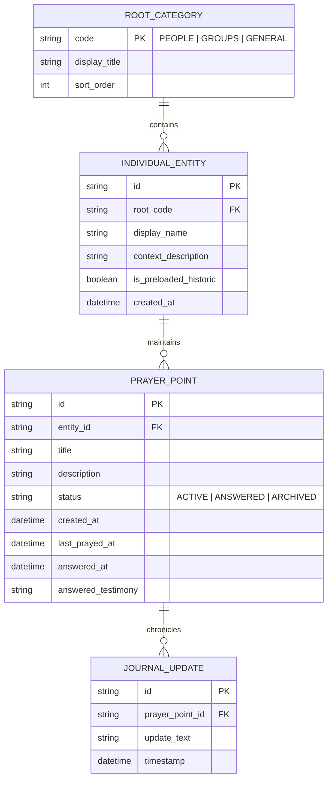

# Technical Decisions & Architecture Reference

**Document:** `technical.md`  
**Status:** Approved Decisions & Open Questions Log  
**Last Updated:** 2026-09-07  
**Platform Scope:** Mobile Only (Android initial; engineered for iOS portability)  
**Security Posture:** 100% Offline-First Local Persistence; Hardware-Secured Encrypted Vault  
**Cloud Infrastructure:** Zero-Cost Cloudflare Worker Serverless Proxy (Zero User Login / Zero API Key Required)  

---

## 1. Approved Technical Decisions

The following architectural decisions have been explicitly agreed upon and form the foundational technical boundaries for the system.

### 1.1 Data Hierarchy & Ontological Model
- **Ontological Architecture**: Three foundational roots:
  - **`People` (Root 1)**: Exclusively and strictly specific, distinct individual human relationships (e.g., spouse, parent, child, a single named friend/neighbor, and personal petitions under *Me*—including personal trials, health, or sanctification occurring within a workplace or hospital).
  - **`Groups` (Root 2)**: Collectives, communities, and shared peer/work environments (e.g., work colleagues, office team, church congregation, small group, committee, ministry).
  - **`General` (Root 3)**: Broad topics, global petitions, societal needs, and preloaded historic Reformed prayers.
- **Entity Model**:


- **Preloaded Reformed Content**:
  - Preloaded with historic Reformed, Protestant prayers:
    1. **The Lord's Prayer**
    2. **Classic Anglican Book of Common Prayer (BCP) Collects** (e.g., Collect for Peace, Collect for Grace, Collects for the Christian Year)
    3. **The Apostles' Creed**
  - Stored locally with `is_preloaded_historic = true` under the `GENERAL` root.
  - If no user-generated prayer points exist, the *Start praying* queue draws from this collection.
  - When user-generated points exist, a configuration flag (`blend_historic_prayers: boolean`) determines whether historic prayers are interleaved into the daily prayer rotation or accessed exclusively via directory browsing.

- **Client Configuration & Preferences Schema (`APP_CONFIG`)**:
  - Encrypted key-value or single-row table in SQLite storing local preferences:
    - `locale_dialect`: `"EN_AU_UK"` (Default) | `"EN_US"`. Governs application copy, liturgical texts, date nuances, and prompt dialect instructions.
    - `theme_mode`: `"QUIET_NIGHT"` (Default) | `"MORNING_LIGHT"`.
    - `batch_size`: Integer `1` to `5` (Default: `1`).
    - `blend_historic_prayers`: Boolean (Default: `false`).

---

### 1.2 Persistence & Storage Architecture
- **Embedded Database**: **100% Offline Local Storage via SQLite with SQLCipher**.
- **Security & Key Management**:
  - Master database encryption key is derived and stored using hardware-backed platform security:
    - **Android**: Android Keystore system.
    - **iOS**: iOS Keychain Services (Secure Enclave).
  - Complete operational independence from cloud databases; zero user data is ever transmitted to a central database or remote sync server.

---

### 1.3 Zero-Leakage API Key Security Architecture & Serverless Proxy

#### 1.3.1 Threat Model & The Mobile Reverse-Engineering Reality
- **The Core Vulnerability**: Mobile application binaries (Android APK/AAB or iOS IPA) are fundamentally untrusted client environments. Any credential, API token, or secret string packaged inside the application bundle can be extracted within minutes using basic reverse-engineering tools:
  - Static byte inspection (`strings`, `jadx`, `apktool`).
  - Dynamic instrumentation (Frida, objection).
  - Network proxy interception (mitmproxy, Charles) if client communicates directly with upstream providers.
- **Architectural Imperative**: The OpenRouter API key must **never touch the mobile codebase, git repository, build environment, or client binaries**. Zero instances of the master key shall exist on client devices.

#### 1.3.2 Data Exposure & Plaintext Pipeline Boundaries
Because **both logging pathways** leverage AI assistance—`Record a prayer point` uses AI for intelligent database filing, and `"Guide me"` uses AI for articulation and distillation—the architectural boundary between offline vaulting and external network transit is strictly defined:

| Feature / Flow | Network Requirement | Plaintext Exposure Boundary |
| :--- | :--- | :--- |
| **"Start praying"** (Passive contemplation queue) | **100% Offline** (Zero network calls) | Physically unreadable outside the device; decrypted only in device RAM from SQLCipher vault. |
| **Directory & Ledger Management** (Browsing, editing, answered tracking) | **100% Offline** (Zero network calls) | Physically unreadable outside the device; local SQLite only. |
| **"Record a prayer point"** (AI Intelligent Filing) | **Online** (Transit via Cloudflare Proxy) | **Plaintext in memory** at: (1) Device RAM, (2) Cloudflare Worker runtime, (3) OpenRouter gateway, (4) Upstream model inference cluster. |
| **"Guide me"** (AI Distillation & Articulation) | **Online** (Transit via Cloudflare Proxy) | **Plaintext in memory** at: (1) Device RAM, (2) Cloudflare Worker runtime, (3) OpenRouter gateway, (4) Upstream model inference cluster. |
| **Offline Logging Fallback** (Manual folder/entity picker) | **100% Offline** (Zero network calls) | Activated when offline or manually selected; never leaves the device. |

#### 1.3.3 Two-Tier Zero-Leakage Architecture
The system isolates the API key behind an impenetrable serverless edge barrier, separating credential storage from client interaction:

```mermaid
graph TD
    subgraph Untrusted Client Zone (Mobile Devices)
        MobileClient["Mobile App Binary (APK / IPA)<br/>• Zero API Keys in Code<br/>• Zero OpenRouter References<br/>• Anonymous Device UUID in Keystore"]
    end

    subgraph Trust Boundary (Cloudflare Global Edge)
        Worker["Cloudflare Serverless Proxy<br/>($0.00 / month on Free Tier)"]
        Vault[("Cloudflare Encrypted Secrets Vault<br/>`wrangler secret put OPENROUTER_API_KEY`")]
        RateLimiter["Edge Quota & Rate Limiting Engine<br/>(Cache API / Ephemeral KV)"]
        PromptStorage["Authoritative Server-Side Prompt<br/>(Forces strictly prayer distillation)"]
    end

    subgraph Upstream Provider (Inference)
        OpenRouter["OpenRouter Gateway<br/>(Prepaid Hard Cap: $5.00)"]
    end

    MobileClient -->|"1. POST /api/v1/guide<br/>(Sanitized input + Device UUID + App Key)"| Worker
    Worker -->|"2. Read Secret at Runtime"| Vault
    Worker -->|"3. Enforce 20 req/day per UUID"| RateLimiter
    Worker -->|"4. Prepend Fixed System Prompt"| PromptStorage
    Worker -->|"5. POST /chat/completions<br/>Authorization: Bearer [KEY]"| OpenRouter
    OpenRouter -->|"6. Structured Distillation JSON"| Worker
    Worker -->|"7. Clean Result (No Keys / No Raw Headers)"| MobileClient
```

#### 1.3.4 Detailed Security Controls
1. **Encrypted Vault Storage (`wrangler secret put`)**:
   - The master OpenRouter API key is injected directly into Cloudflare’s encrypted environment storage via the Cloudflare CLI:
     ```bash
     wrangler secret put OPENROUTER_API_KEY
     ```
   - Cloudflare encrypts secrets at rest and injects them only into the Worker's runtime execution memory (`env.OPENROUTER_API_KEY`).
   - The key is never visible in plaintext in configuration files (`wrangler.toml`), source code, or deployment manifests.
2. **Repository & CI/CD Isolation**:
   - The mobile application repository contains **zero** OpenRouter SDK dependencies, credentials, or URLs.
   - All `.env*` and local configuration files are enforced in `.gitignore`.
3. **Gateway Cloaking & Proxy Abuse Defense**:
   Even if an attacker sniffs network traffic from their own phone to identify the proxy URL (`https://prayer-proxy.workers.dev/api/v1/guide`), they cannot abuse the underlying OpenRouter API key because of four proxy-level guardrails:
   - **Forced Schema & Server-Side Prompt**: The proxy accepts strictly:
     ```json
     {
       "initial_reflection": "string (required, max 1,500 chars)",
       "root": "PEOPLE | GROUPS | GENERAL | null (optional)",
       "group": "string | null (optional, max 100 chars)",
       "clarifying_question": "string | null (optional, max 500 chars)",
       "user_response": "string | null (optional, max 1,000 chars)",
       "request_more": false
     }
     ```
     The mobile application automatically packages its local devotional state into this structured JSON payload. The proxy sanitizes the payload, strips caller-supplied system prompts, enforces its fixed theological distillation system prompt, and forwards the stringified JSON payload as the model's user message. An attacker **cannot** use your proxy to write code, solve homework, or run arbitrary LLM queries.
   - **App-Level Pre-Shared Gateway Key (`X-Prayer-Gateway-Secret`)**: The proxy rejects any request lacking a high-entropy secret header configured at compile-time (`401 Unauthorized`), blocking casual scrapers and search bots.
   - **Multi-Tier Rate Limiting**:
     - **Per-Device Quota**: Maximum 20 distillation sessions per 24 hours per anonymous installation UUID.
     - **Per-IP Rate Limit**: Maximum 30 requests per hour per IP.
     - **Global Daily Circuit Breaker**: Hard cap of 1,000 total requests/day across all 100 users combined.
4. **Hard-Capped Financial Blast Radius (\$5.00/Month)**:
   - Even in an unthinkable catastrophic compromise where an attacker bypasses rate limiting, the OpenRouter account operates strictly on a **prepaid balance of $5.00** with automatic top-ups disabled.
   - Financial risk is strictly bounded to $5.00 per month. Operational exposure cannot exceed the predefined budget.

#### 1.3.5 Deployed Cloudflare Worker Configuration Reference
- **Active Edge Endpoint**: `https://pray-proxy.reflex-game.workers.dev/`
- **Worker Script Source**: Tracked directly in repository at [`worker.js`](file:///c:/Users/ianch/sourcecode/repos/Prayer/worker.js).
- **Interactive CLI Testing Client**: Tracked at [`interactive_guide.ps1`](file:///c:/Users/ianch/sourcecode/repos/Prayer/interactive_guide.ps1) for terminal-based multi-turn distillation testing.
- **Gateway Authentication Header**: `X-Prayer-Gateway-Secret: prayer-app-secret-key-2026`
- **Active Upstream Model**: `nvidia/nemotron-3.5-lightning`
- **Reasoning Architecture**: High-efficiency, fast inference model; configured with `temperature: 0.2`, `max_tokens: 2500`, `response_format: { type: "json_object" }`, and `reasoning: { effort: "low" }`. Delivers ultra-responsive generation and reliable JSON structuring.
- **Upstream Data Retention Policy**: Hard-coded `provider: { data_collection: "deny" }` to guarantee OpenRouter routes exclusively through upstream providers that do not log, retain, or train on prayer requests.
- **Error Reflection Sanitization**: Upstream and internal error handlers suppress raw upstream error text (`errText` / `err.message`) to prevent accidental reflection of prayer text in HTTP error payloads.
- **Worker Observability**: Explicitly disabled (`observability: { enabled: false }` in `wrangler.jsonc` or `[observability] enabled = false` in `wrangler.toml`) to uphold the zero-telemetry and privacy mandate by preventing request payload log retention at the edge.
- **Live Verification Status**:
  - Worker deployment: **ONLINE** (edge latency ~300ms).
  - Gateway Authorization: **VERIFIED ACTIVE** (unauthorized calls return HTTP 401).
  - OpenRouter Secret Vaulting: **VERIFIED ACTIVE** (master API key securely injected by Cloudflare).
  - End-to-End Inference: **VERIFIED OPERATIONAL** (successfully parses unstructured input into strictly formatted theological prayer distillation JSON).

#### 1.3.6 Inference Cache Isolation & Zero Cross-Request Contamination
- **Prompt Caching Mechanics (KV Cache Reuse)**: Modern LLM providers (e.g., DeepSeek, Anthropic, Google) employ prompt caching by caching Key-Value (KV) tensors of exact token prefixes starting from token index 0. In this architecture:
  - The only shared prefix across requests is the static, immutable system prompt (`PROMPT_PERSONA` through `PROMPT_OUTPUT_SCHEMA`).
  - Once user input begins, the token sequence diverges. User A's prayer input is never part of the prefix for User B's request.
  - Transformer attention mechanisms strictly prevent generation for User B from attending to KV states outside User B's defined context window. Prompt caching cannot append, bleed, or inject past user inputs into new requests.
- **Stateless Edge Execution**: The Cloudflare Worker proxy is 100% stateless. Each request instantiates a discrete execution context with a freshly constructed `messages` array (`[{ role: "system", content: systemPrompt }, { role: "user", content: sanitizedInput }]`). No inter-request memory or global conversation arrays exist.
- **Zero HTTP Edge Response Caching**: The proxy operates strictly on `POST` requests and does not utilize Cloudflare's Cache API (`caches.default`) or `Cache-Control` storage headers. Responses are never cached at the edge or served to subsequent callers.

---

### 1.4 "Guide Me" System Prompt & Interaction Guardrails

- **Strict Persona & Tone Specification**:
  - **Not a Therapy Bot**: The model must never mimic a human counselor, pastor, or friend. Zero artificial empathy, zero emotional coddling, and zero conversational filler.
  - **Objective Petitions, Never Scripted Prayers**: The engine must never compose actual prayers or address God directly (e.g., never output "Father God...", "Dear Lord...", "Lord Jesus...", "Thy will be done", or second-person invocations to God). Believers pray themselves; the engine strictly summarizes the petition, burden, or thanksgiving into an objective prayer point.
  - **Structured JSON Prompt Contract & App Auto-Conversion**: The mobile app automatically structures its session state and user input into a standardized JSON payload transmitted over the wire:
    ```json
    {
      "initial_reflection": "string",
      "root": "PEOPLE | GROUPS | GENERAL | null",
      "group": "string | null",
      "clarifying_question": "string | null",
      "user_response": "string | null",
      "request_more": false
    }
    ```
    This JSON string forms the model's user message. The model parses the JSON payload directly, eliminating ad-hoc multiline text delimiters.
  - **Pre-Specified Root & Group Bypass**: When `root` (and optionally `group`) is prespecified by the user (e.g., when logging is triggered from within an existing person or group view), the engine does **not** infer or suggest categories ("a suggestion is not needed"). It sets `suggested_root: null` and `suggested_group: null` on output cards and shapes petitions strictly to the prespecified context. When `root` is `null`, category inference operates normally.
  - **Strictly 2 Suggestions Invariant & One-Time Expansion**: The candidate generation step must always produce strictly and exactly 2 candidate prayer points per turn—never 1, and never 3. The client permits a strictly one-time request for 2 additional suggestions (`request_more: true`, hard ceiling of 4 lifetime suggestions per session).
  - **Open-Ended Inquiries & Actionable Clarity**: Clarifying questions must be strictly open-ended, prompting the user to supply their own data and intent, rather than proposing leading options or guessing theological outcomes. If a clear actionable point is not obvious from the user's reflection, the engine **must never generate candidate prayer points**; it must set `skip_question: false` and formulate strictly ONE concise question (6–12 words) in plain, natural English (`candidate_prayer_points: []`), avoiding bureaucratic templates. It distinguishes between internal emotional states (asking plainly what is causing the feeling, e.g., *"What is making you feel anxious right now?"*) and external entities/topics (asking plainly what is happening, e.g., *"What is going on with your boss that you'd like to pray about?"*), or performing concise burden triage (*"Which of these is weighing on you most heavily right now?"*).
  - **Prohibition Against Presuming Unstated Burdens**: Prayer points must strictly ground in user-supplied facts. The engine must never invent or assume medical illnesses, hospitalizations, cancer, or crises unless explicitly stated by the user.
  - **One Question at a Time**: The engine is constrained to ask exactly one question per turn, capped at a maximum of 2 question turns before producing candidate points.
  - **Unconditional Question Skipping**: The user can skip any question asked by the app at any point. Skipping guarantees that no more questions will be asked during that session; the engine immediately proceeds to candidate prayer point generation (`skip_question: true`, `clarifying_question: null`). The app sets `user_response: "skip"` in the JSON payload.
  - **Entity Privacy & Masking Mandate**: Entity names are masked on-device prior to transmission. Consequently, entity name suggestions from the AI are strictly not required and omitted from the inference schema. Target entity binding is handled entirely locally on-device.
  - **Dialect & Orthography Fidelity**: Engine defaults to English (Australian / UK) orthography and phrasing (e.g., *saviour*, *honour*, *neighbour*). When US English is configured on the client, user context communicates this preference to ensure matching US orthography.

- **Finer Modular Prompt Architecture & Cloudflare 5.1 kB Text Binding Limit**:
  - Cloudflare Workers enforce a strict **5 KiB (5,120 bytes)** ceiling per environment variable text binding.
  - To eliminate truncation risks while maximizing architectural clarity and maintainability, the system prompt is decomposed into **6 fine modules with meaningful semantic names**, assembled sequentially to leverage LLM **Primacy Attention Mechanics** (positioning operational inquiry rules ahead of doctrinal content), located under [`prompts/`](file:///c:/Users/ianch/sourcecode/repos/Prayer/prompts):
    1. **`PROMPT_PERSONA`** ([`prompts/PROMPT_PERSONA.txt`](file:///c:/Users/ianch/sourcecode/repos/Prayer/prompts/PROMPT_PERSONA.txt) — ~0.5 kB): Core non-therapeutic identity, neutral tone, zero pleasantries, sole role to enquire and articulate, and the First Principle ("Enquire first. If a clear actionable point is not obvious, ask a question—never guess, speculate, or invent unstated circumstances").
    2. **`PROMPT_INQUIRY_FLOW`** ([`prompts/PROMPT_INQUIRY_FLOW.txt`](file:///c:/Users/ianch/sourcecode/repos/Prayer/prompts/PROMPT_INQUIRY_FLOW.txt) — ~2.0 kB): Turn-taking control logic, mandatory inquiry when actionable points are not obvious, plain English emotion vs entity phrasing models, Turn 2 hard turn ceiling, unconditional skip bypass, burden triage for multiple competing crises, and one-time request handling for 2 additional suggestions.
    3. **`PROMPT_THEOLOGY`** ([`prompts/PROMPT_THEOLOGY.txt`](file:///c:/Users/ianch/sourcecode/repos/Prayer/prompts/PROMPT_THEOLOGY.txt) — ~1.3 kB): Christian, Protestant, Reformed & Calvinist identity, directing all petitions exclusively to God, in the name of Jesus Christ (rejecting saints/angels/ancestors), alignment with classical Reformed confessional principles, framing petitions as humble biblical requests submitted to God's sovereign will (rejecting prosperity decrees, word-faith formulas, transactional bargaining, or manifesting), Heidelberg Catechism Q&A 1 comfort grounding, unbeliever petitions focused on repentance and faith in Christ, and strict prohibition against writing scripted prayers or addressing God directly.
    4. **`PROMPT_TAXONOMY_PRIVACY`** ([`prompts/PROMPT_TAXONOMY_PRIVACY.txt`](file:///c:/Users/ianch/sourcecode/repos/Prayer/prompts/PROMPT_TAXONOMY_PRIVACY.txt) — ~1.9 kB): Single root/group invariant, on-device entity masking, personal petitions under People even within workplace contexts, and ontological definitions for `PEOPLE`, `GROUPS`, and `GENERAL`.
    5. **`PROMPT_CARD_STYLE`** ([`prompts/PROMPT_CARD_STYLE.txt`](file:///c:/Users/ianch/sourcecode/repos/Prayer/prompts/PROMPT_CARD_STYLE.txt) — ~1.9 kB): Strictly and exactly 2 candidate points per generation, strict length ceilings (Title: strictly 2–6 words, targeting 2–4; Description: hard limit of maximum 20–25 words in concise telegraphic shorthand), preferred 2-to-3 clause semicolon pattern for mobile readability, no redundant prefixes ("Pray for", "Ask God to"), strict prohibition against assuming unstated medical burdens, strict exclusion of `w/` or `/w` abbreviations, and diverse telegraphic shorthand examples (work trial, gospel witness, physical recovery).
    6. **`PROMPT_OUTPUT_SCHEMA`** ([`prompts/PROMPT_OUTPUT_SCHEMA.txt`](file:///c:/Users/ianch/sourcecode/repos/Prayer/prompts/PROMPT_OUTPUT_SCHEMA.txt) — ~0.8 kB): UK/Australian vs US English dialect handling and conditional JSON output schema for inquiry vs candidate point generation.
  - The worker proxy dynamically assembles these modules in sequence at runtime, falling back to monolithic bindings if configured.
  - Full assembled reference is preserved in [`system_prompt.txt`](file:///c:/Users/ianch/sourcecode/repos/Prayer/system_prompt.txt).

---

### 1.5 UI Interaction & Devotional Engine Mechanics

- **Home Screen Presentation**:
  - A clean, blank canvas with two centered text buttons:
    1. `Start praying`
    2. `Log prayer points`
  - Swiping left triggers the structural directory branch (`People`, `Groups`, `General`).
- **Passive Prayer Engine ("Start Praying")**:
  - Direct queue instantiation with zero pre-filters.
  - Full-screen card focus with user-configurable batch sizes: **1, 2, 3, 4, or 5 prayer items visible at a time**.
  - **100% Read-Only**: No buttons, checkmarks, or editing controls. Swiping past an item automatically commits an updated `last_prayed_at` timestamp to local SQLite.
  - **Self-Paced & Open-Ended**: Each screen is a separate prayer. Users proceed at their own pace and exit whenever they wish.
- **Logging Engine ("Log Prayer Points")**:
  - Two discrete paths:
    1. `Record a prayer point` (direct capture with intelligent AI filing: immediate empty text pad for known petitions; uses AI to classify and infer the target root category—`People`, `Groups`, or `General`—and optional group context for one-tap confirmation without multi-turn questioning; entity names are masked on-device and bound locally without AI entity suggestions, falling back to manual picker if offline).
    2. `"Guide me"` (structured 3-step articulation pipeline: Prompt $\rightarrow$ Open-ended distillation $\rightarrow$ Candidate review displaying strictly 2 candidate points per turn with *Save*, *Suggest 2 more* [one-time action], *Back*, and *Cancel*). The user may skip any question the app asks at any point, resulting in no further questions being asked for that session and proceeding immediately to candidate prayer point review; entity names are masked on-device and bound locally.
- **Surface & Geometry Token Specifications**:
  - `border_radius`: `0px` universal across all components (buttons, prayer cards, text inputs, dialogs, sheets, and badges). Strictly zero curved edges or rounded corners.
  - `surface_elevation`: Flat tiles (`elevation: 0`, `box-shadow: none`). Zero skeuomorphic depth, gradients, or drop shadows.
  - `layout_pattern`: Planar tessellation. Adjacent items (e.g., batched prayer cards 1–5, suggestion pairs, or directory entries) abut directly along 1px crisp hairline borders (`#333333` in Quiet Night, `#E0E0E0` in Morning Light), forming an interlocking geometric mosaic.
  - `edge_style`: Pure orthogonal rectangles (100% rectilinear geometry).
- **Settings & Dialect Preferences**:
  - Provides instant toggles for theme mode, card batch size (1–5 items), blending historic prayers into the daily queue, and locale/dialect selection.
  - Defaults to **English (Australian / UK)**, with a dedicated config option for **US English**. Modifying this option switches client string tables immediately and prefixes distillation requests with the user's dialect setting.

---

### 1.6 Engine Stress-Testing & Theological Benchmark Suite

To ensure continuous compliance with theological guardrails, root categorization rules, and mobile card brevity constraints, the repository maintains a 100-request benchmark suite located under [`test/`](file:///c:/Users/ianch/sourcecode/repos/Prayer/test):
- **Primary Dataset**: [`test/prayer_requests_stress_test.json`](file:///c:/Users/ianch/sourcecode/repos/Prayer/test/prayer_requests_stress_test.json) containing exactly 100 diverse, multi-perspective prayer requests.
- **Documentation & Execution**: [`test/README.md`](file:///c:/Users/ianch/sourcecode/repos/Prayer/test/README.md) cataloging evaluation criteria, schema structure, single-item runner, and full battery execution via [`test/run_stress_test.py`](file:///c:/Users/ianch/sourcecode/repos/Prayer/test/run_stress_test.py).
- **Live Response Vault**: [`test/stress_test_responses.json`](file:///c:/Users/ianch/sourcecode/repos/Prayer/test/stress_test_responses.json) storing complete wire response payloads, timing, and analytical metrics across all 100 test items.
- **Evaluation & Benchmark Reports**:
  - [`test/BENCHMARK_RESULTS.md`](file:///c:/Users/ianch/sourcecode/repos/Prayer/test/BENCHMARK_RESULTS.md): Comprehensive 100-item system-level evaluation scorecard and full catalog.
  - [`test/AI_GENERATED_TEXT_REPORT.md`](file:///c:/Users/ianch/sourcecode/repos/Prayer/test/AI_GENERATED_TEXT_REPORT.md): Dedicated qualitative and linguistic quality report focusing on AI-generated text, telegraphic syntax, theological reframing, and clarifying question analysis.
  - *Transport & Availability*: 100/100 (100.0%) HTTP 200 OK.
  - *JSON Schema Integrity*: 100/100 (100.0%) valid JSON matching distillation output schema.
  - *Cardinality Invariant*: 100.0% compliance (strictly 0 or 2 candidates per turn; zero cases of 1 or 3).
  - *Title Brevity Ceiling*: 99.4% (175/176 cards) adhering to 2–4 words and 100.0% adhering to the approved 2–6 word ceiling (mean: 2.88 words).
  - *Description Brevity Ceiling*: 100.0% (176/176 cards) adhering to telegraphic shorthand $\le$ 20–25 words (mean: 17.25 words, range: 11–23 words).
  - *Theological Guardrail Redirection*: 100% compliance across all negative boundaries (refusal of Word-Faith decrees, elimination of saint/angel/ancestor invocations, and stripping of works-righteousness bargaining).
  - *Objective Petitions Invariant*: 100% compliance with zero scripted prayers or second-person invocations addressed directly to God.
- **Coverage Dimensions**:
  1. *Theological Guardrails & Negative Boundaries*: Invariant testing of *Solus Christus* (rejecting saint/angel/ancestor intercession), *Sola Gratia* (eliminating works-righteousness bargaining and karma), God's absolute sovereignty (rejecting Word-Faith decrees and manifestation), and Heidelberg Catechism Q1 comfort.
  2. *Ontological Root Categorization*: Calibrated distribution across `PEOPLE` (58%), `GENERAL` (22%), and `GROUPS` (20%).
  3. *Wordiness Tiers*: Input lengths spanning Ultra-Short (5–9 words), Short (10–25 words), Medium (26–70 words), Long (71–150 words), and Extreme Wall of Text (151–253 words).
  4. *Dialect & Tone*: Comprehensive coverage across Australian/UK English, US English, and Global South cultural contexts.
  5. *Mobile Brevity Compliance*: Programmatic verification that output titles strictly respect 2–6 words (targeting 2–4) and descriptions adhere to telegraphic shorthand capped at 20–25 words.

---

## 2. Open-Ended Technical Questions & Decisions Awaiting Input


The following areas remain intentionally open for future architectural refinement:

### 2.1 Cross-Platform Core Technology Selection
- **Status**: Open
- **Options Under Consideration**:
  1. **Kotlin Multiplatform (KMP)**: Shared domain, SQLite (SQLCipher), and network client shared between Android (Compose) and iOS (SwiftUI).
  2. **Rust / C Core Domain**: Low-level domain and encryption vault exposed via FFI to native Kotlin and Swift.
  3. **Dual Native Implementations**: Pure native Android (Kotlin) and pure native iOS (Swift) sharing only schema and API contracts.

### 2.2 OpenRouter Default Model Selection
- **Status**: Approved
- **Active Model**: `nvidia/nemotron-3.5-lightning` (Configured with `temperature: 0.2`, `max_tokens: 2500`, `response_format: { type: "json_object" }`, and `reasoning: { effort: "low" }`).

### 2.3 Offline Encrypted Backup Mechanics
- **Status**: Open
- **Options Under Consideration**:
  1. **Passphrase-Protected AES-256 Archive**: User chooses a passphrase; app dumps an encrypted `.prayerbackup` file directly to Android Downloads / iOS Files.
  2. **Plain JSON / Markdown Export**: Simple unencrypted text dump for users wanting personal local archiving.
